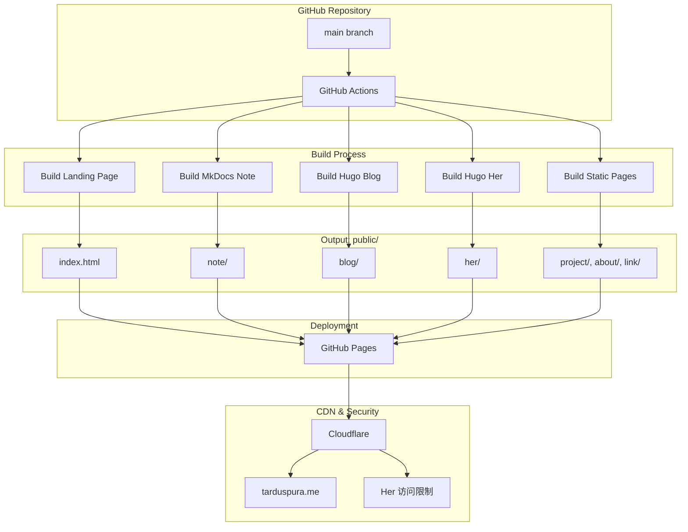
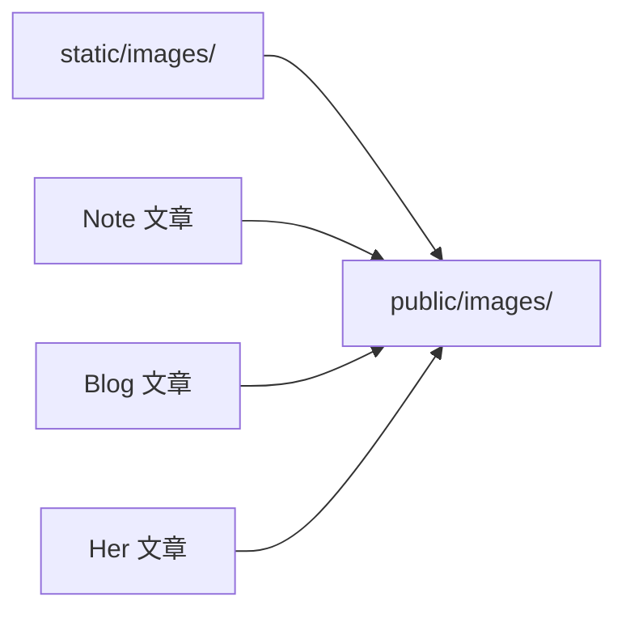

# 设计文档

## 概述

本设计文档描述 tarduspura.me 个人网站重构的技术架构和实现方案。重构将现有的单一 Hugo 站点拆分为多个独立子站点，通过统一的 Landing Page 进行导航，实现技术栈分离和更好的用户体验。

核心设计理念：
- 简约现代的视觉风格
- 技术栈按需选择（Hugo/MkDocs）
- 统一域名下的多站点架构
- 保持内容迁移的完整性

## 架构

### 整体架构

```
tarduspura.me/
├── index.html          # Landing Page（独立静态页面）
├── note/               # MkDocs 构建的笔记站点
├── blog/               # Hugo 构建的博客站点
├── her/                # Hugo 构建的私人板块
├── project/            # 静态项目展示页
├── about/              # 静态关于页面
├── link/               # 静态友链页面
└── images/             # 共享图片资源目录
```

### 技术栈选择

| 板块 | 框架 | 主题/方案 | 理由 |
|------|------|-----------|------|
| Landing Page | 纯 HTML/CSS/JS | 自定义设计 | 简约现代，完全可控 |
| Note | MkDocs | Material for MkDocs | 原生 LaTeX 支持，文档体验优秀 |
| Blog | Hugo | hugo-paper 或 hugo-theme-stack | 温和阅读风格，适合长文 |
| Her | Hugo | 与 Blog 共用主题 | 保持一致性，便于维护 |
| Project/About/Link | Hugo 或静态 HTML | 简单页面模板 | 内容简单，无需复杂框架 |

### 部署架构



## 组件与接口

### 1. Landing Page 组件

Landing Page 是一个独立的静态 HTML 页面，不依赖任何框架。

```
landing-page/
├── index.html          # 主页面
├── css/
│   └── style.css       # 样式文件
├── js/
│   └── main.js         # 交互脚本（可选）
└── assets/
    ├── avatar.jpg      # 头像图片（用户自定义）
    └── background.jpg  # 背景图片（用户自定义）
```

页面结构：
```html
<body>
  <div class="hero">
    <div class="background"></div>
    <div class="content">
      
      <h1>Tardus Pura</h1>
      <p class="tagline">A sophomore @ZJU</p>
      <nav class="nav-links">
        <a href="/note">Note</a>
        <a href="/blog">Blog</a>
        <a href="/project">Project</a>
        <a href="/her">Her</a>
        <a href="/about">About</a>
        <a href="/link">Link</a>
      </nav>
      <div class="social-links">
        <a href="https://github.com/tarduspura">GitHub</a>
        <a href="mailto:tarduspura@gmail.com">Email</a>
      </div>
    </div>
  </div>
</body>
```

### 2. Note 系统（MkDocs）

```
note-site/
├── mkdocs.yml          # MkDocs 配置
├── docs/
│   ├── index.md        # 笔记首页
│   ├── Article/        # 文章类笔记
│   ├── Courses/        # 课程笔记
│   ├── Tech/           # 技术笔记
│   └── Others/         # 其他笔记
└── overrides/          # 主题自定义（可选）
```

MkDocs 配置要点：
```yaml
site_name: Tardus Pura's Notes
site_url: https://tarduspura.me/note
theme:
  name: material
  features:
    - search.suggest
    - search.highlight
    - navigation.tabs
    - navigation.sections

markdown_extensions:
  - pymdownx.arithmatex:  # LaTeX 支持
      generic: true
  - pymdownx.highlight
  - pymdownx.superfences

extra_javascript:
  - javascripts/mathjax.js
  - https://polyfill.io/v3/polyfill.min.js?features=es6
  - https://cdn.jsdelivr.net/npm/mathjax@3/es5/tex-mml-chtml.js

plugins:
  - search:
      lang: zh
```

### 3. Blog 系统（Hugo）

```
blog-site/
├── config.toml         # Hugo 配置
├── content/
│   ├── _index.md       # 博客首页
│   ├── touch/          # Touch 栏目（原 travel）
│   │   ├── _index.md
│   │   ├── destination/
│   │   ├── hike/
│   │   └── rock/
│   └── idea/           # Idea 栏目（原 contemplate）
│       ├── _index.md
│       ├── art/
│       ├── create/
│       └── learn/
├── static/
│   └── images/         # 博客图片
└── themes/
    └── paper/          # 推荐主题
```

### 4. Her 系统（Hugo）

```
her-site/
├── config.toml
├── content/
│   ├── _index.md
│   ├── location/
│   ├── restaurant/
│   └── things/
├── static/
│   └── images/
└── themes/
    └── paper/          # 与 Blog 共用主题
```

### 5. 静态页面（Project/About/Link）

这些页面内容简单，可以作为 Blog 站点的一部分，或独立为静态 HTML 页面。

推荐方案：集成到 Blog 站点中作为独立页面
```
blog-site/content/
├── project.md          # 项目页面
├── about.md            # 关于页面
└── link.md             # 友链页面
```

## 数据模型

### 内容迁移映射

| 原路径 | 新路径 | 目标站点 |
|--------|--------|----------|
| content/posts/ | docs/ | Note (MkDocs) |
| content/travel/ | content/touch/ | Blog (Hugo) |
| content/contemplate/ | content/idea/ | Blog (Hugo) |
| content/her/ | content/ | Her (Hugo) |
| content/projects/ | content/project.md | Blog (Hugo) |
| content/about.md | content/about.md | Blog (Hugo) |
| content/links.md | content/link.md | Blog (Hugo) |

### 图片资源处理

当前图片存放在 `static/images/` 目录，迁移策略：

1. 共享图片目录：将 `static/images/` 复制到最终输出的根目录
2. 图片引用路径更新：
   - 原路径：`/images/xxx.jpg`
   - 新路径：`/images/xxx.jpg`（保持不变，通过部署配置实现）



### Front Matter 格式

Hugo 文章 Front Matter：
```yaml
---
title: "文章标题"
date: 2025-01-01T00:00:00+08:00
draft: false
categories: ["Touch"]
tags: ["旅行", "户外"]
---
```

MkDocs 文章 Front Matter：
```yaml
---
title: 文章标题
date: 2025-01-01
---
```

## 正确性属性

*正确性属性是一种应该在系统所有有效执行中保持为真的特征或行为——本质上是关于系统应该做什么的形式化陈述。属性作为人类可读规范和机器可验证正确性保证之间的桥梁。*

### Property 1: 内容迁移完整性

*对于任意* 源目录中的内容文件，迁移后目标目录中应存在对应的文件，且文件内容（除路径引用外）保持一致。

**验证: 需求 2.3, 3.3, 3.4, 4.1**

### Property 2: 图片引用完整性

*对于任意* 文章中引用的图片路径，该图片文件应存在于输出目录中，且路径可正确解析。

**验证: 需求 6.1, 6.2, 6.3, 6.4**

### Property 3: 导航链接有效性

*对于任意* Landing Page 或站点导航中的链接，点击后应能访问到有效的目标页面（HTTP 200）。

**验证: 需求 1.5, 1.8, 8.2, 8.4**

### Property 4: LaTeX 公式渲染

*对于任意* 包含 LaTeX 公式的笔记文章，构建后的 HTML 页面应包含正确的 MathJax/KaTeX 渲染标记。

**验证: 需求 2.2, 2.5**

### Property 5: 搜索功能有效性

*对于任意* 存在于站点中的文章标题关键词，搜索该关键词应返回包含该文章的结果列表。

**验证: 需求 7.4**

## 错误处理

### 构建错误

| 错误类型 | 处理方式 |
|----------|----------|
| MkDocs 构建失败 | 输出详细错误日志，终止部署流程 |
| Hugo 构建失败 | 输出详细错误日志，终止部署流程 |
| 图片文件缺失 | 警告日志，继续构建但标记问题文件 |
| Front Matter 格式错误 | 错误日志，跳过该文件并继续 |

### 部署错误

| 错误类型 | 处理方式 |
|----------|----------|
| GitHub Actions 失败 | 发送通知，保留上一次成功部署 |
| 域名解析失败 | 检查 Cloudflare DNS 配置 |
| 404 错误 | 检查路由配置和文件路径 |

### 内容迁移错误

| 错误类型 | 处理方式 |
|----------|----------|
| 图片路径无效 | 生成报告列出所有无效引用 |
| 文件编码问题 | 统一转换为 UTF-8 |
| Front Matter 缺失 | 自动生成默认 Front Matter |

## 测试策略

### 单元测试

- 测试内容迁移脚本的路径转换逻辑
- 测试图片引用提取和更新逻辑
- 测试 Front Matter 解析和生成

### 属性测试

使用 Python 的 Hypothesis 库进行属性测试：

1. **内容迁移完整性测试**
   - 生成随机文件结构
   - 执行迁移脚本
   - 验证所有文件正确迁移
   - **Feature: personal-website-refactor, Property 1: 内容迁移完整性**

2. **图片引用完整性测试**
   - 生成包含随机图片引用的 Markdown 文件
   - 执行构建流程
   - 验证所有图片引用可解析
   - **Feature: personal-website-refactor, Property 2: 图片引用完整性**

3. **导航链接有效性测试**
   - 提取所有导航链接
   - 验证每个链接返回有效响应
   - **Feature: personal-website-refactor, Property 3: 导航链接有效性**

### 集成测试

- 完整构建流程测试
- 多站点协同部署测试
- Cloudflare 配置验证

### 手动测试

- 视觉设计审查
- 移动端响应式测试
- 跨浏览器兼容性测试
- LaTeX 公式渲染效果检查

