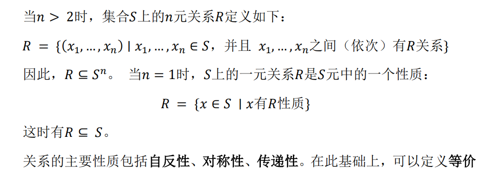
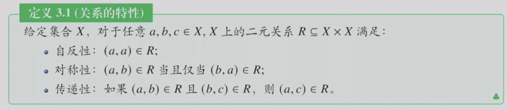
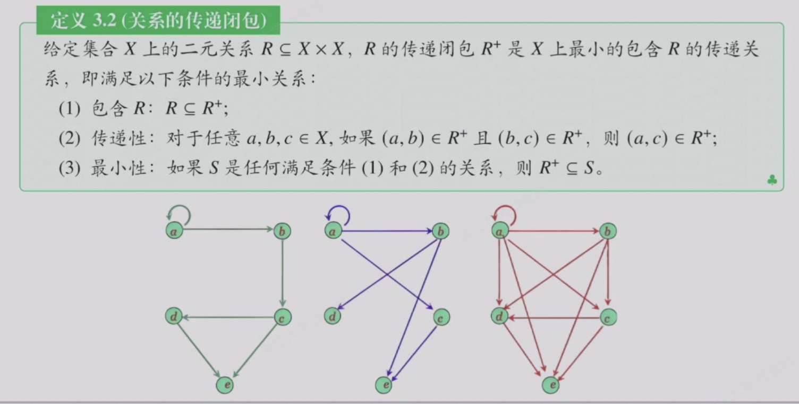
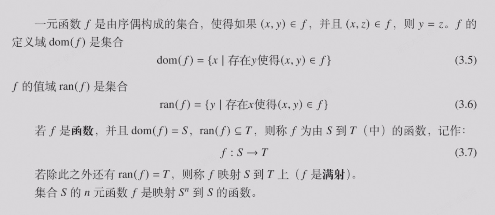
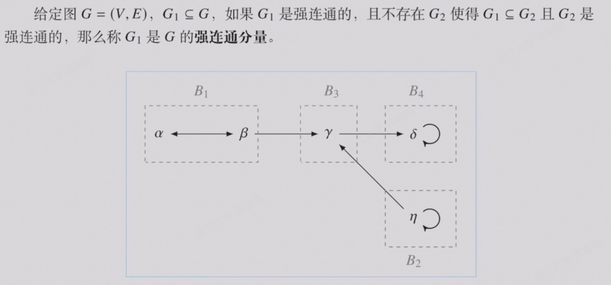
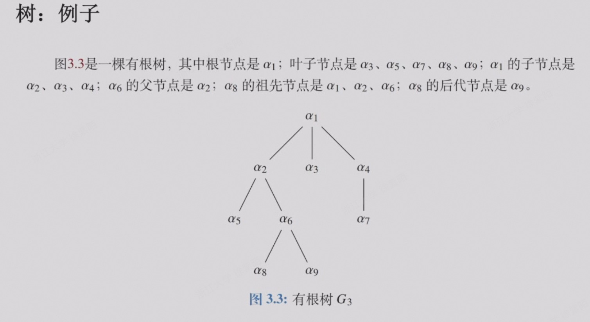

## 1.集合论基础

### 1.1 基本概念

- 集合包含的全体成员称为它的**外延**
- 集合包含的全体成员所具有的共同性质称为它的**内涵**

- 其他关键词：子集、幂级、空集、蕴含(单向箭头)...

### 1.2 集合族中的集合

给定一个集合族 $\mathcal{S}$ （由集合构成的集合），对于任意 *S* $\in$ $\mathcal{S}$

- 最大的集合：可能没有，若有则唯一，包含其他所有成员集合
- 最小的集合：可能没有，若有则唯一，被其他所有成员集合包含
- 极大的集合：没有成员集合包含他
- 极小的集合：他不包含任何成员集合

### 1.3 集合的补、并、交、差

- 简单概念，了解即可

### 1.4 关系和函数

- 有序偶
    - (a,b) = (c,d) 当且仅当a=c and b=d

- 集合间的笛卡尔积：n个集合的笛卡尔积可以写成n元组的集合

- 集合 $S_1, S_2... S_n$ 的笛卡尔积 $S_1 x S_2 x ... x S_n$ 的定义如下：
    - $S_1 x S_2 x ... x S_n$ = ${(x_1,...,x_n) | x_1 \in S_1, and ..., and x_n \in S_n}$

- S 的 n 次笛卡尔积记作 $S^n$

- 在笛卡尔积这个概念的基础上定义**关系**和**函数**

- 关系具有以下三个特性：

- 传递闭包 transitive closure
    - 从图的视角来看，传递闭包是**最小的、包含原图的、覆盖给定集合X的强连通分量**

- 等价关系：集合X上的二元关系 $\mathcal{R} \in \mathcal{x} X \mathcal{x}$ 是一个等价关系，当且仅当其具有自反性、对称性和传递性

- 等价类：关于 R 下 a 的等价类，记作 [a]，定义为 $[a] = {x \in \mathcal{X} | (x,a) \in \mathcal{R}}$

- 划分：我们说 ${X_1,...,X_n}$ 是 X 的一个划分，当且仅当：每个 $X_i , i \in {1,...,n}$ 不为空，任意两个分量的交集都为空，并且 $X_1 \cup ... \cup X_n$ = X

- 函数

- 不动点：一个点经过某函数的**映射后仍然回到自身**，这个点就是该函数的不动点

## 2.图论基础

### 2.1 基本概念

- 图是一个二元组：G = (V,E)，V 是顶点的集合，$E \subseteq V X V$ 是边的集合

- **完全图**：每两个顶点之间都有边

- 有向边：当边 $e = (v_i,v_j)$ 为顶点的有序对时，称其为有向边，$v_i, v_j$ 分别为起点和终点

- 有/无向图：所有边都有/无方向
    - 混合图：顾名思义，既有有向边也有无向边

- 子图：边和顶点都包含，就是子图
    - 真子图：在这个条件下，且和原图不同
    - 生成子图：点集相等，边存在包含关系。相当于在原图上擦去一些边
    - 导出子图：$V_1 \subseteq V_2$ 且 $E_1 = E_2 \cap (V_1 x V_1)$。相当于在原图上擦去一些点，并擦除包含这些点的边。

- 途径：$v_0e_1v_1e_2...e_nv_n$ 称为从顶点 $v_0 到 v_n$ 的途径
    - 闭途径：起末点相等
    - 迹：所有边均不相同的途径
    - 路：经过的任意两个顶点互异的迹
        - 任意两个顶点间有路，则**可达**
    - 环：闭合的路（首尾不考虑）

- 强连通图：任意两个顶点双向可达

- 强连通分量

- 树：无向无环图

## 课前练习

- 关于形式化的描述：

- 三大流派：
    - 符号主义：
        - 智能就是**对符号的运算和逻辑推理**。它假设人类的思维过程可以被形式化为一系列符号操作和逻辑规则。
        - 早期依赖**专家系统**来实现
        - 可解释性强
        - 难以处理模糊信息
    - 连接主义（仿生学派、亚符号主义）：
        - 智能由大规模并行的类似神经元的连接产生，模仿人类大脑的物理结构，通过调整神经网络的连接权重来学习知识
        - 泛化能力强，可解释性弱，训练耗时耗能
    - 行为主义：
        - 智能不需要复杂的内部表征，而是在与环境的互动中逐渐进化出来的

- 可靠性与完备性