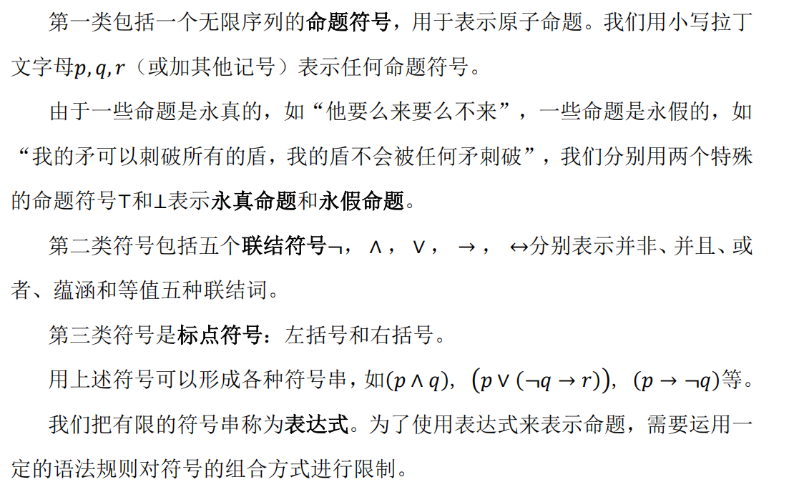

## 1.基本概念

- 命题：具有**真值**的句子，用来表示事实
    - 简单命题：含有联结词
    - 复合命题：不含有联结词

- 联结词：用于**连接**命题，生成新命题。可分为**一元**、**二元**

- 命题逻辑：在**抽象的命题实体**中，研究**知识表示**和**推理规律**的逻辑学分支

- 研究内容：
    - 基本要素：命题、联结词
    - 语言与解释：命题语言及对其的解释
    - 推理机制：语义蕴含和形式推演
    - 计算：相关算法与计算复杂性

## 2.命题与联结词

### 2.1 联结词的分类

- 自然语言中的联结词从**逻辑含义**上可归为5类

    - 否定词：并非（一元）
    - 合取词：并且
    - 析取词：或
    - 蕴含词：如果...那么...
        - 实质蕴含：只有条件正确、推出的结果错误，整个表达式才错误
    - 等值词：当且仅当

## 3.命题语言

### 3.1 符号

- 命题逻辑中所需要的符号或符号串包含以下三种：

- **表达式**：有限的符号串

- 命题公式：遵循特定语法规则的表达式
    - 原子命题：命题符号
    - 复合命题：命题符号 + 联结符号