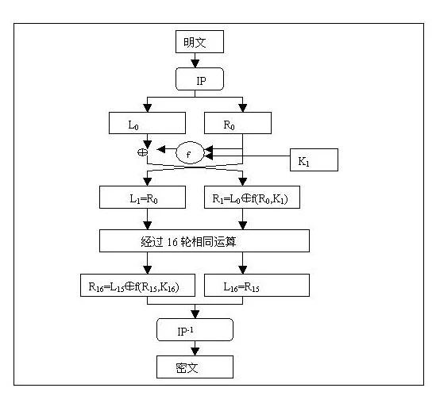
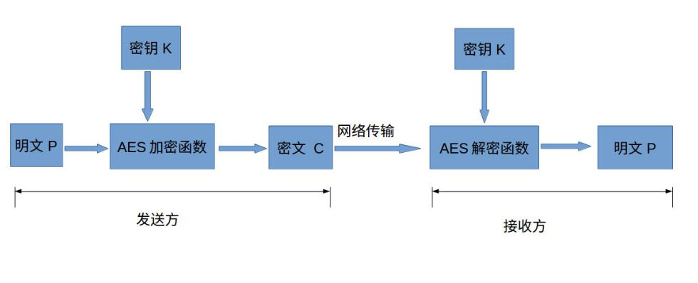
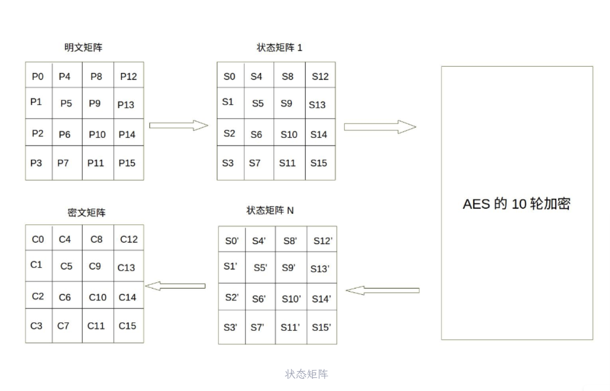
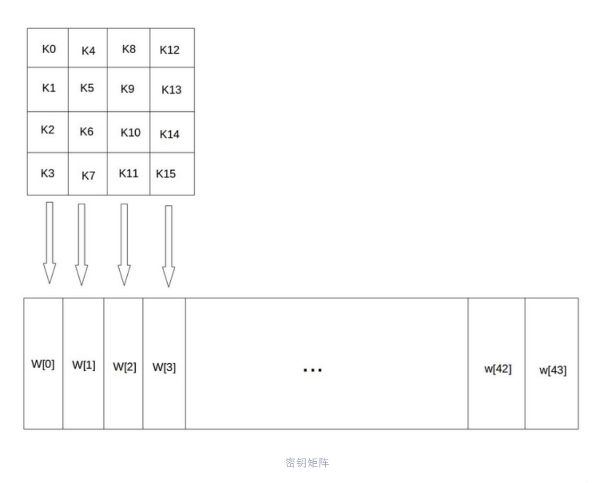
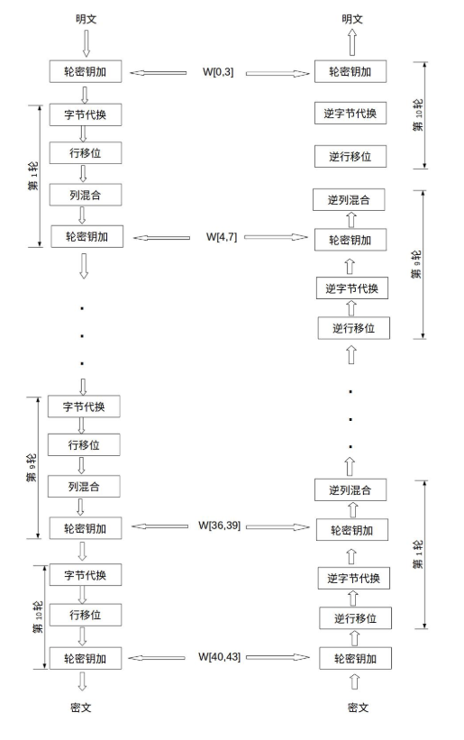
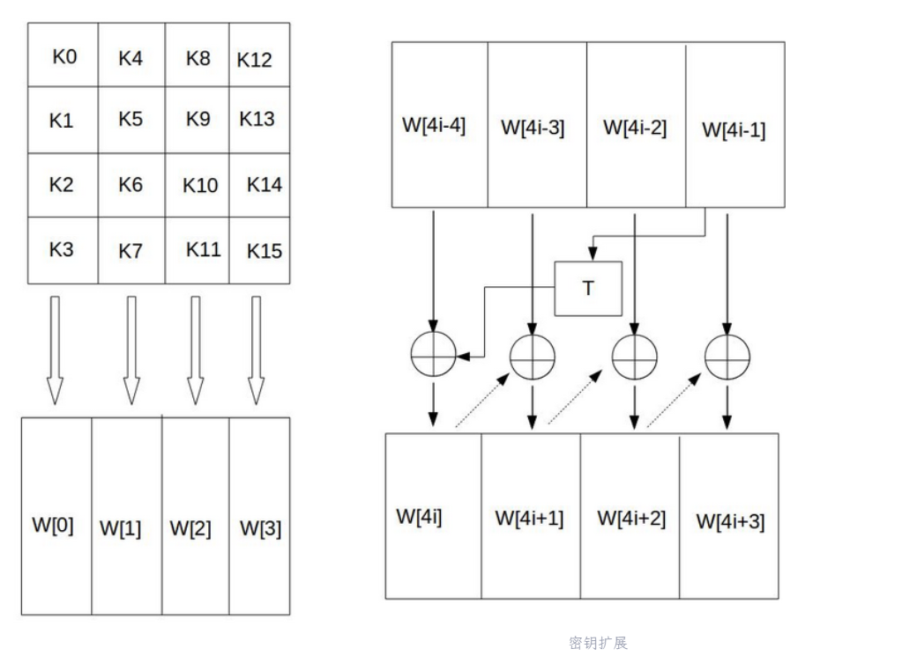
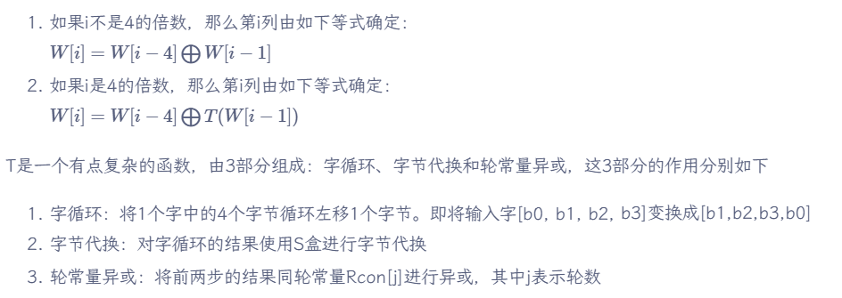
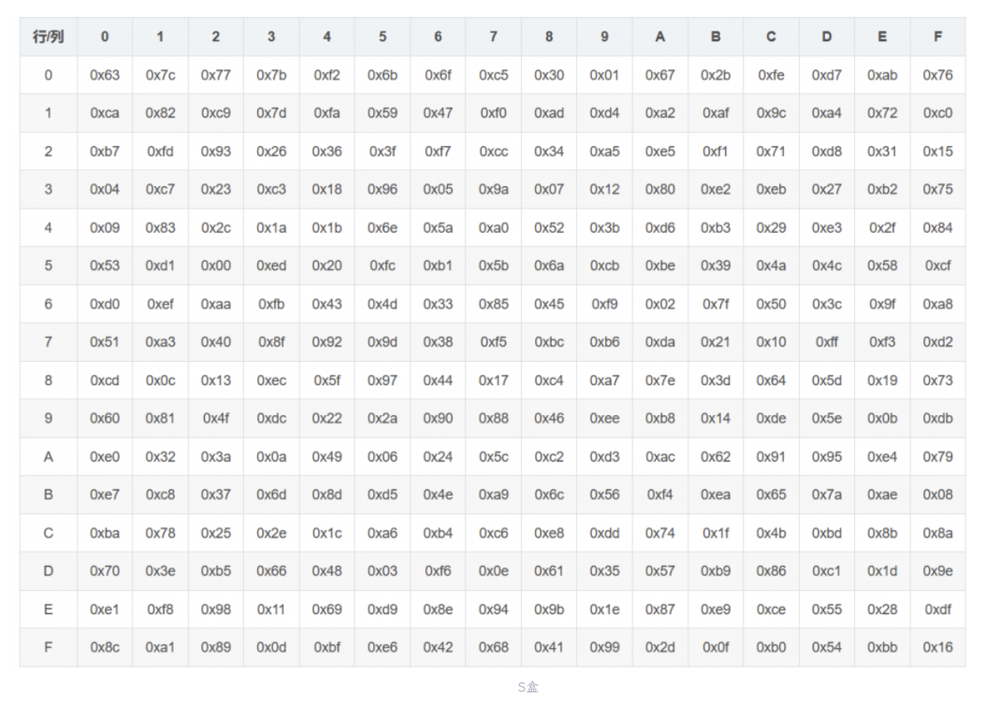
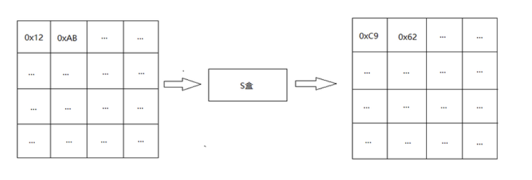
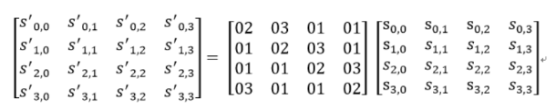

## 1.DES

- Data Excryption Standard(美国数据加密标准)
- 1972年美国IBM公司研制的**对称密码体制加密算法**
- 加密方法
    1.明文按64位进行分组，密钥长64位（实际上是56位，8的倍数位是校验值，是的每个密钥都有奇数个1）
    2.分组后的明文组和密钥按位替换或交换形成密文组

    具体加密方法如下：
    

    - IP(Initial Permutation)：简单的位置重排（比如第58位换到第1位），只是为了打乱输入模式，不具有加密强度。
    - Split：$L_0$ 为左32位，$R_0$ 为右32位。
        - 16 Rounds of Feistel：
            \[
            \begin{aligned}
            L_i &= R_{i-1} \\
            R_i &= L_{i-1} \oplus f(R_{i-1}, K_i)
            \end{aligned}
            \]
        - f(·)
            - 接收：32位R寄存器数据，48位**子密钥 K**
            - 输出：经过四个步骤输出一个32位结果
            - 步骤1：E扩展置换(Expansion P-box)：32位R寄存器扩展为48位
            - 步骤2：Key Mixing：48位数据异或48位key
            - 步骤3：S盒替换(S-box Substitution)：引入唯一的**非线性因素**
                - a.48位数据被分成每组6位的8组
                - b.对于每组，取首尾二进制数组成行号，中间四个组成的二进制数为列号
                - c.从S-box中取出对应行列号的4位数据
                - d.8个数据组成32位的输出
            - 步骤4：P盒替换(Straight P-box)：将S盒输出的32位数据进行位置重新排列，进一步扩散S盒的输出  

    - $IP^(-1)$：按照初始置换，逆向变化，得到最终的密文。

- DES的安全性来自于
    - Confusion：来自S-box的非线性混淆
    - Diffusion：通过16轮的迭代和位移，让明文的任何1位变化都能影响到密文的多个位

## 2.AES

- Advanced Encryption Standard
- **Rijndael**加密法([Vincent Rijmen](https://en.wikipedia.org/wiki/Vincent_Rijmen), [
Joan Daemen](https://en.wikipedia.org/wiki/Joan_Daemen))
- 经过五年的甄选，AES由美国国家标准与技术研究院(NIST)于2001年11月26日发布于FIPS PUB 197，并在2002年5月26日成伪有效的标准
- AES是一种分组加密法，明文的每个分组为16字节，即128位，密钥长度可以使用128、192或256位。密钥长度越长，加密的轮数越多，加密的强度越高

- 加密、解密流程

| AES | 密钥长度（32位比特字） | 分组长度（32位比特字） | 加密轮数 |
| --- | --- | --- | --- |
| AES-128 | 4 | 4 | 10 |
| AES-192 | 6 | 4 | 12 |
| AES-256 | 8 | 4 | 14 |

- 下面以 AES-128 为例子来展示 AES 加密的全流程

### 2.1 准备

- AES的加密公式为C = E(K,P)
- 在加密函数E中，会分10轮执行一个轮函数，前9次操作是一样的，只有第10次略有不同
- AES的核心就是实现一轮中的所有操作

- 明文矩阵填充

    - AES的处理单位是字节，128位的输入明文分组P和输入密钥K都被分成16个字节

    - 一般地，明文分组用字节为单位的正方形矩阵描述，称为**状态矩阵**。在算法的每一轮中，状态矩阵的内容不断发生变化，最后的结果作为密文输出。矩阵中字节的排列顺序为从上到下、从左至右
    

- 密钥矩阵填充
    
    - 128位密钥也用字节为单位的矩阵表示，矩阵的每一列是一个32位比特字。
    - 通过密钥编排函数该密钥矩阵被扩展成一个44个字组成的序列W[0],W[1], … ,W[43],该序列的前4个元素W[0],W[1],W[2],W[3]是原始密钥，用于加密运算中的初始密钥加密;
    - 后面40个字分为10组，每组4个字（128比特）分别用于10轮加密运算中的轮密钥加。后面10组密钥通过初始密钥进行密钥扩展得到。

    

### 2.2 加解密流程

#### 2.2.1 添加回合密钥 AddRoundKey

- 矩阵中的每一个字节都与**本次回合密钥**做XOR运算 

- 密钥扩展

#### 2.2.2 字节代换 SubBytes

- AES的字节代换通过一个简单的查表操作来进行**非线性运算**
- AES定义了一个S盒和一个逆S盒，分别用来进行加密和解密操作

#### 2.2.3 行移位 ShiftRows

- 简单的左循环移位操作

- 当密钥长度为128比特时，状态矩阵的第n行左移n字节，n $\in$ (0,1,2,3)

- 经过shiftrows之后，矩阵中每一列都由输入矩阵中的每个不同列中的元素组成

#### 2.2.4 列混合 MixColumns

- 矩阵元素的乘法和加法都是定义在基于GF(2^8)上的二元运算,并不是通常意义上的乘法和加法

- 3,4两个步骤为 AES 密码系统提供了**扩散性**

