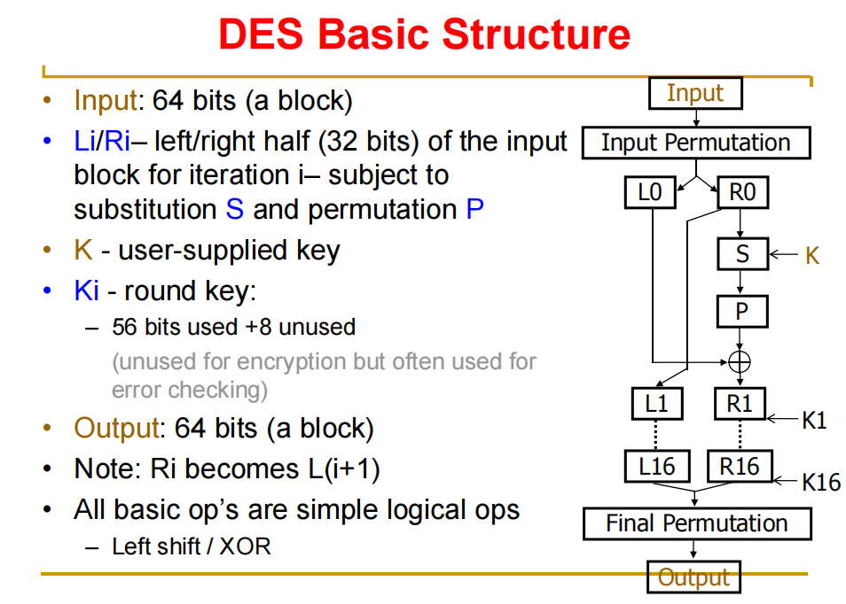
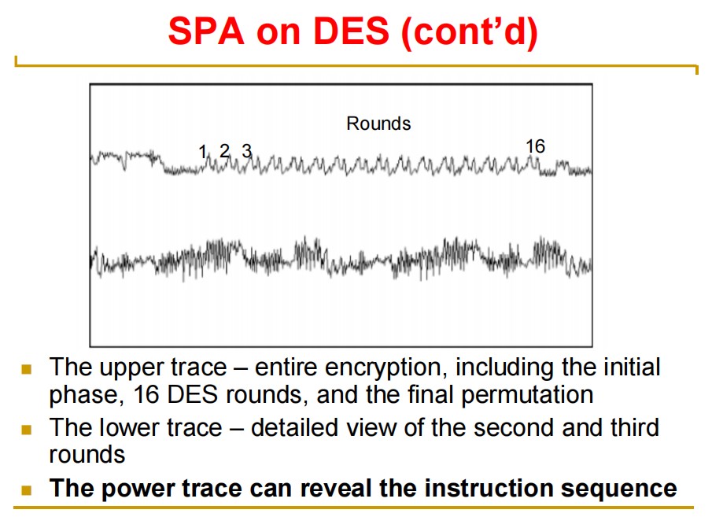

## 2.侧信道攻击

### 2.1 侧信道攻击定义

### 2.2 侧信道攻击分类

- Simple Attacks
    - 通过**少量**物理迹线把观测到的侧信道信息**直接**映射到被攻击设备的操作
    - 所需要的数据量比较小
    - 信噪比要求很高
    - 算法最好要有明显的**条件分支**

- Differential Attacks 
    - 差分侧信道攻击
    - 通过采集**大量**物理迹线，并利用**统计学方法**将与特定中间值相关的微弱信号从噪声中提取出来
    - 数据量大，对信噪比要求不高

### 2.3 Simple Power Analysis (SPA)

- Proposed by **Paul Kocher**, 1996

- 监控**设备的能耗**来**推理**设备的**数据和操作**

- 例子：smart cards 上的 SPA on DES
    - DES 回顾
    

    - SPA
    

### 2.4 Differential Power Analysis (DPA)

- SPA 关注 **variable instruction flow**
- DPA 关注 **data-dependence**
    - 不同的运算数需要不同的能耗

- 运用场景
    - smart cards：每一次运行一个操作，所以 SPA 是有效的
    - FPGA：**并行计算**。只能使用DPA
    
- 核心公式：DPA 可以使用在任何包含 $\beta = S(\alpha \oplus K)$ 的算法当中
    - $\alpha$：已知信息
    - K：我们希望破解的秘密（比如某一轮的子密钥）
    - $\oplus$：XOR
    - S：S-Box。极大提高了密钥猜测的区分度（差一点经过 S-Box 就会被放大成差很多）
    - $\beta$：泄漏源

- 基本方法：DPA 的本质是统计学攻击
    - 猜测密钥
    - 构建功耗模型，并基于假设的密钥，计算对应的中间值 $\beta$，并估算该值产生功耗的大小
    - 与示波器实际采集到的 *$W_i$* 进行相关性分析