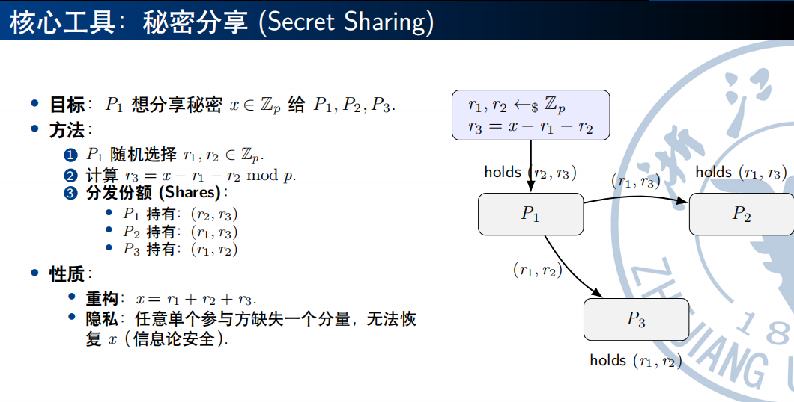
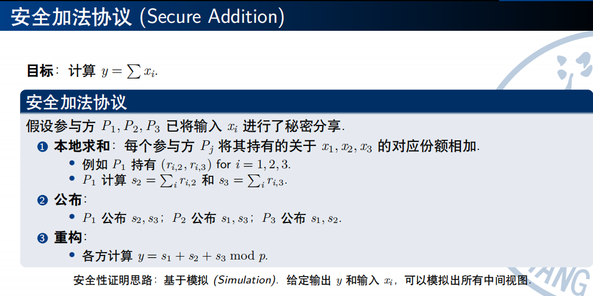
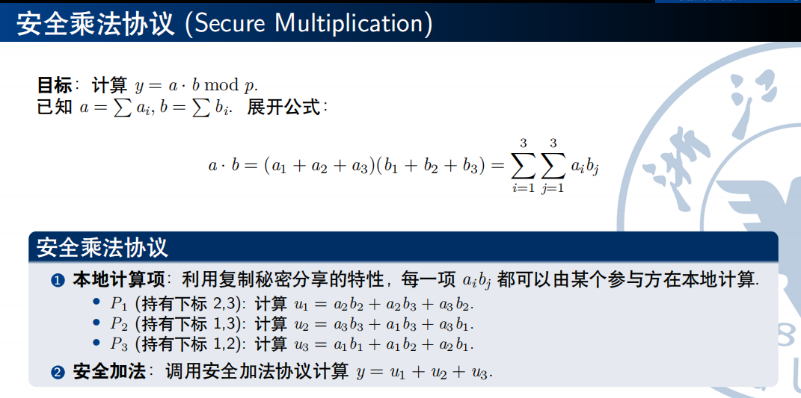
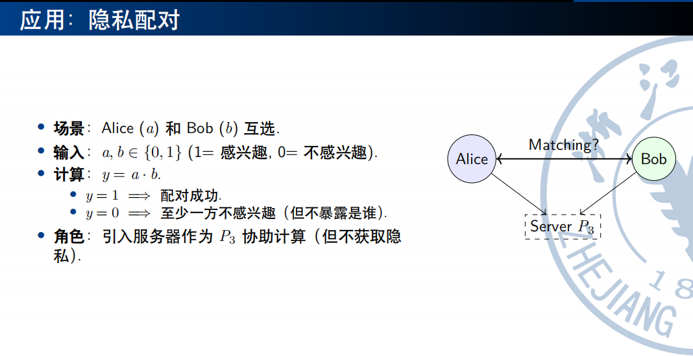

# 1.MPC（安全多方计算）概览

## 1.1 核心问题

- 一组互不信任的参与方 $P_1, \dots, P_n$，各自持有隐私输入 $x_i$，希望在不泄露隐私的前提下协同计算函数 $y=f(x_1, \dots, xn)$

- 理想世界(Trusted Third Party, TTP)
    - 参与方将 $x_i$发送给可信第三方 *T*
    - *T* 计算并发布y
    - 缺点在于：单点故障，不显示

- 现实世界
    - 去中心化
    - Correctness：输出的y正确
    - Privacy：除了y，不泄露任何 $x_i$ 信息

## 2 核心工具：秘密分享(Secret Sharing)

### 2.1 目标
- $P_1$ 想分享秘密 $x \in \mathcal{Z}_p$ 给 $P_1$，$P_1$，$P_1$

### 2.2 方法

## 3 例子

### 3.1 Secure Addition

### 3.2 Secure Multiplication

!!! abstract "Tips"
- 注意这里得到的u1，u2，u3无法继续进行安全乘法。因为每个P都只持有结果的一个分片，所以无法得到交叉项（比如u1*u2）
- 为了解决这一点需要经过参与者之间的通信（顺时针通信）

### 3.3 应用：隐私配对 

## 4 恶意模型

### 4.1 输入替换

- Input Substitution
- 行为：比如上面的例子中Alice总是输入 a=1 来试探Bob
- **无法通过协议防止**，只能通过博弈论或外部机制解决

### 4.2 违背协议

- Protocol Deviation
- 行为：比如在安全加法协议中，发送错误的份额，或则和计算错误的结果
- 解决方法：一致性检查(Consistency Check)
    - P2和P3可以互相验证来自P1的数据是否一致
- 这种增强后的模型为**恶意安全**(Malicious Security)

## 5 通用解决方案

### 5.1 通用性

- $\mathcal{Z}_p$ 上的加法 + 乘法 = 完备集
- 可以用上一步计算的秘密份额**安全**地计算下一步
- **任何函数**都可以表示为加法和惩罚电路 ===> 我们可以安全计算任何函数

### 5.2 局限性
- **安全乘法协议**不能检测违背协议的行为
- 只考虑了三个参与方的情况
- 假设了不会有任何两个参与方的串通行为
- 假设参与方可以安全地通信
...

