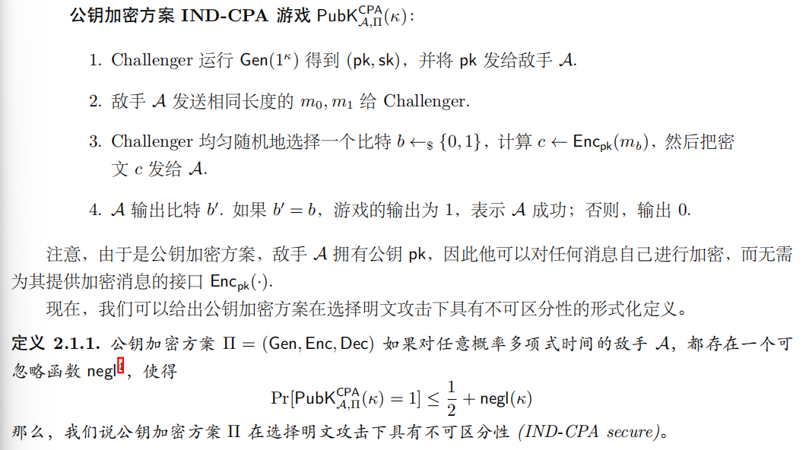
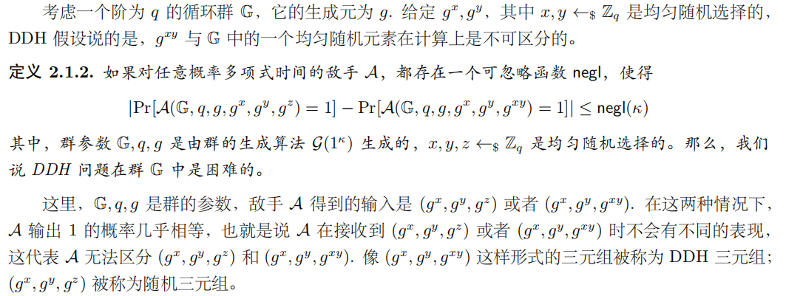
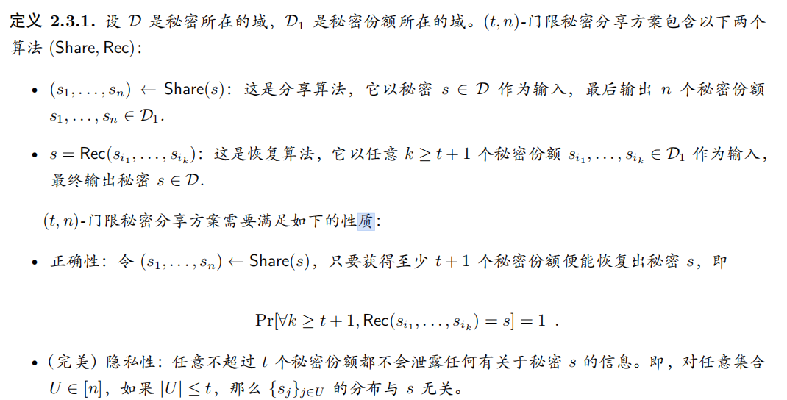

## 1.现代密码学三大原则

- 传统密码学：“艺术”与“直觉”
- 现代密码学：严谨的科学范式（可证明安全）
    - 形式化：安全和威胁模型都需要明确的形式化定义
    - 精确的假设：比如大整数分解、DLP(Discrete Logarithm Proclem, 有限域上的离散对数问题)
    - 严格的安全性证明：基于归约(Reduction)的证明
        - 归约：用A的安全性来证明B的安全性
        - 证明方法是：
            - 假设B不安全
            - 攻击者拿可以破解B的安全性的黑盒算法来攻击A
            - 如果攻击成功则与A的安全性矛盾，所以假设不成立，B是安全的

### 1.1 形式化的定义(Formal Definitions)

- 安全保证
    - ~~不能恢复明文~~
    - 敌手无法从密文中获得关于明文的**任何信息**
- 威胁模型(Threat Model)
    - Ciphertext-only
    - Known-plaintext：已知部分明文密文对
    - CPA：可获得加密oracle
    - CCA：可获得加密oracle和解密oracle

#### 1.1.1 基于游戏的安全性定义

- IND-CPA: indistinguishability under Chosen-Plaintext Attack

- 公钥加密方案 IND-CPA 游戏：

  

### 1.2 精确的假设

- 大多数现代密码方案都不是无条件安全的，他们的安全性证明必须依赖于一些**未经证明的假设**
- 既然假设是不可避免的，那何必基于某假设来证明安全性？为什么不直接假设方案本身是安全的？
    - 1.一个被研究多年未被攻破的假设要比新的、任意的假设更可靠
    - 2.，我们喜欢关于一个**干净**的数学问题的难度的假设，而不是一个复杂方案满足了复杂安全性定义的假设，简单的假设更利于理解和研究

- 例子：DDH 假设的精确定义

### 1.3 严格的安全性证明
!!! abstract Tips
    - Elgamal 的例子单独写在笔记的第 3 课

## 2.基本术语和符号

!!! abstract Tips
    - 这一节主要是在统一后面证明中会反复出现的语言：什么叫“很小的失败概率”，什么叫“高效敌手”，以及什么叫“两个分布看起来一样”。
    - 后面的安全性证明基本都在比较两个世界：真实世界和理想世界。如果敌手无法区分它们，我们就说协议是安全的。

- 常用记号：
    - MPC：安全多方计算（Secure Multi-Party Computation）
    - PPT：概率多项式时间算法（Probabilistic Polynomial Time），也就是“高效算法”
    - $[n]=\{1,2,\dots,n\}$
    - $x \leftarrow_{\$} D$：从集合 / 分布 $D$ 中均匀随机选取 $x$
    - $|X|$：集合 $X$ 的大小

### 2.1 可忽略函数

- 可忽略函数 $negl(\cdot)$：趋近于 0 的速度比**任何正多项式的倒数**都要快的函数。

- 形式化地说，对任意正多项式 $poly(\cdot)$，都存在整数 $N>0$，使得对所有 $x>N$：

$$
negl(x)<\frac{1}{poly(x)}
$$

- 直觉：
    - $\frac{1}{x}$、$\frac{1}{x^2}$ 还不够小，因为它们本身就是多项式倒数。
    - $2^{-x}$ 这类指数级下降的函数通常是可忽略的。
    - 在密码学中，敌手成功概率如果只是一个可忽略函数，就可以理解成“理论上可能发生，但安全参数足够大时现实中可以忽略”。

### 2.2 安全参数

- 安全参数通常记作 $\kappa$、$\lambda$ 或 $n$，用来控制协议的安全等级。

- 它会影响两个东西：
    - 参与方和敌手的运行时间：通常要求是关于安全参数的多项式时间。
    - 敌手成功概率：希望敌手攻破协议的概率至多是 $negl(\kappa)$。

- 例子：
    - 对称加密中的密钥长度可以看作安全参数。
    - $\kappa$ 越大，协议越安全，但计算和通信开销也通常会更大。

!!! abstract 总结
    - 安全参数就是密码协议里的“安全强度旋钮”：调大之后敌手更难成功，但系统也会更重。

### 2.3 统计距离

- 设 $X_1$ 和 $X_2$ 是定义在同一取值范围 $D$ 上的两个随机变量，它们的统计距离为：

$$
\delta(X_1,X_2)=\frac{1}{2}\sum_{d\in D}|\Pr[X_1=d]-\Pr[X_2=d]|
$$

- 直觉：
    - 统计距离衡量两个分布在所有可能取值上的“概率差异总量”。
    - $\delta(X_1,X_2)=0$：两个分布完全一样。
    - $\delta(X_1,X_2)$ 很小：即使敌手拥有无限计算能力，也很难从样本中看出差别。

- 在安全证明中的作用：
    - 如果真实世界视图和理想世界视图的统计距离为 0，就是**完美安全**。
    - 如果统计距离可忽略，就是**统计安全**。

### 2.4 不可区分性

- 设 $X_1(\kappa)$ 和 $X_2(\kappa)$ 是关于安全参数 $\kappa$ 的两个分布。如果对任意敌手 $A$，都有：

$$
|\Pr[A(X_1(\kappa))=1]-\Pr[A(X_2(\kappa))=1]|\le negl(\kappa)
$$

则称 $X_1$ 和 $X_2$ 不可区分，记作：

$$
X_1 \approx X_2
$$

- 根据敌手能力不同，可以分成三类：

| 类型 | 记号 | 敌手能力 | 含义 |
| --- | --- | --- | --- |
| 计算不可区分 | $X_1 \overset{comp}{\approx} X_2$ | PPT 敌手 | 高效敌手区分不了 |
| 统计不可区分 | $X_1 \overset{stat}{\approx} X_2$ | 无限计算能力 | 区分优势至多可忽略 |
| 完美不可区分 | $X_1 \overset{perf}{=} X_2$ | 无限计算能力 | 两个分布完全相同 |

!!! abstract 和安全证明的关系
    - 计算安全：敌手算不出来差别。
    - 信息论安全：敌手就算无限算力也看不出差别。
    - 之后证明协议安全时，经常就是证明“真实世界视图”和“理想世界视图”不可区分。

## 3.基础原语

!!! abstract Tips
    - 基础原语可以看作后续 MPC 协议的“积木”。
    - 秘密分享负责拆分秘密，哈希 / PRG / 加密 / MAC / 承诺 / OT 则分别提供随机性、隐私性、完整性、绑定性和选择性传输等能力。

### 3.1 门限秘密分享

- 我们主要讨论 $(t,n)$-门限秘密分享：即一个秘密 $s$ 被分成 $n$ 个秘密份额之后：
    - 任意不超过 $t$ 个份额不会泄露任何关于 $s$ 的信息。
    - 任意至少 $t+1$ 个份额可以恢复出秘密 $s$。

- 一个门限秘密分享方案包含两个算法：
    - 分享算法：$(s_1,\dots,s_n)\leftarrow Share(s)$
    - 恢复算法：$s=Rec(s_{i_1},\dots,s_{i_k})$，其中 $k\ge t+1$

- 需要满足两条性质：
    - **正确性**：至少 $t+1$ 个份额一定能恢复出原秘密。
    - **隐私性**：任意不超过 $t$ 个份额的分布和秘密 $s$ 无关。

!!! abstract 秘密分享对于 MPC 的重要性
    - 秘密分享可以把“知道最终秘密”变成“每个人只知道一个关于秘密的随机份额”。
    - 这样就可以让参与方在不暴露输入的情况下，对份额做计算，最后再恢复结果。

### 3.2 哈希函数与随机谕示机

- Hash functions 可以将较大的域映射到较小的范围。**密码学的**哈希函数 H 还具有以下性质：
    - **抗原像性**（preimage-resistance）：给定 $y$，很难找到 $x'$ 使得 $H(x')=y$。
    - **抗第二原像性**（2nd-preimage resistance）：给定 $x$，很难找到另一个 $x'\ne x$，使得 $H(x)=H(x')$。
    - **抗碰撞性**（collision resistance）：很难找到任意两个不同输入 $x\ne x'$，使得 $H(x)=H(x')$。

- 随机谕示机（Random Oracle, RO）是一个理想化模型：
    - 所有人都能调用同一个公开函数 $H:\{0,1\}^*\rightarrow\{0,1\}^{\kappa}$。
    - 如果某个输入 $x$ 第一次被查询，$H$ 随机生成一个 $r_x$ 并记录。
    - 如果 $x$ 之前被查过，就返回之前记录的同一个 $r_x$。

!!! abstract Attention
    - 随机谕示机把哈希函数想象成一个**真正随机但又保持一致**的函数。
    - 实际中通常用 SHA256 等哈希函数来实例化 RO，但真实哈希并不等于真正随机函数，所以 RO 模型更像一种很有用的启发式模型。

### 3.3 伪随机数生成器

- 伪随机数生成器（PseudoRandom Generator, PRG）是一个**高效的确定性算法**：
    - 输入：短的真随机种子 $s\in\{0,1\}^{\kappa}$
    - 输出：更长的伪随机串 $G(s)\in\{0,1\}^{\ell(\kappa)}$

- 它要满足两点：
    - **扩展性**：$\ell(\kappa)>\kappa$，输出比输入更长。
    - **伪随机性**：$G(s)$ 和真正均匀随机串 $r\leftarrow_{\$}\{0,1\}^{\ell(\kappa)}$ 对任意 PPT 敌手都计算不可区分。

$$
\left|
\Pr_{s\leftarrow_{\$}\{0,1\}^{\kappa}}[A(G(s))=1]
-
\Pr_{r\leftarrow_{\$}\{0,1\}^{\ell(\kappa)}}[A(r)=1]
\right|\le negl(\kappa)
$$

- 直觉：PRG 用少量真随机数“拉长”出大量看起来随机的比特。

### 3.4 对称加密

- 对称加密中，加密密钥和解密密钥相同。一个对称加密方案包含三个算法：

$$
\Pi=(Gen,Enc,Dec)
$$

- 具体来说：
    - $k\leftarrow Gen(1^\kappa)$：生成密钥。
    - $c\leftarrow Enc_k(m)$：用密钥 $k$ 加密明文 $m$。
    - $m/\bot\leftarrow Dec_k(c)$：用同一个密钥 $k$ 解密密文 $c$，失败则输出 $\bot$。

- 正确性：

$$
Dec_k(Enc_k(m))=m
$$

- IND-CPA 安全直觉：
    - 敌手可以选择明文并看到对应密文。
    - 最后敌手给出两个等长消息 $m_0,m_1$，挑战者随机加密其中一个。
    - 如果敌手除了瞎猜之外没有明显优势，就说明加密方案在选择明文攻击下安全。

!!! abstract Tips
    - 对称加密主要提供**隐私性**，但它本身不保证消息没有被篡改。

### 3.5 消息认证码

- 加密保证的是隐私性，但不保证完整性。消息认证码（Message Authentication Code, MAC）用于保证：
    - 消息确实来自知道密钥的人。
    - 消息在传输过程中没有被篡改。

- 一个 MAC 方案包含三个算法：
    - $k\leftarrow Gen(1^\kappa)$：生成密钥。
    - $t\leftarrow Mac_k(m)$：为消息 $m$ 生成标签 $t$。
    - $0/1\leftarrow Ver_k(m,t)$：验证标签是否合法。

- 正确性：

$$
Ver_k(m,Mac_k(m))=1
$$

- 信息论一次性 MAC 的安全性直觉：
    - 敌手可以先看到一个消息 $m'$ 的合法标签 $t'$。
    - 之后它想伪造另一个不同消息 $m\ne m'$ 的合法标签。
    - 如果伪造成功概率可忽略，就认为 MAC 安全。

- 教材中的一次性 MAC 构造：
    - 消息空间和标签空间都是 $\mathbb{Z}_p$。
    - 密钥为 $(a,b)\leftarrow\mathbb{Z}_p^2$。
    - 标签为：$Mac_{a,b}(m)=a\cdot m+b \pmod p$。
    - 验证时检查：$a\cdot m+b \equiv t \pmod p$。

### 3.6 承诺

- 承诺（Commitment）可以理解成**“先把秘密锁进信封，之后再打开”**。

- 承诺方案中有两个参与方：
    - 承诺者：持有消息 $m$，生成承诺 $c$。
    - 接收者：先看到 $c$，之后通过打开信息验证 $c$ 是否确实对应 $m$。

- 一个承诺方案包含三个算法：
    - $ck\leftarrow Gen(1^\kappa)$：生成承诺密钥。
    - $(c,d)\leftarrow Com_{ck}(m)$：生成承诺 $c$ 和打开信息 $d$。
    - $b=Ver_{ck}(c,m,d)$：验证承诺能否打开为消息 $m$。

- 需要满足三条性质：
    - **正确性**：诚实生成的承诺一定可以被正确打开。
    - **隐藏性**：接收者只看承诺 $c$ 时，不能知道里面承诺的是哪个消息。
    - **绑定性**：承诺者不能把同一个承诺 $c$ 打开成两个不同消息。

- 常见构造：
    - 基于哈希的承诺：$c=H(m||r)$，打开时公布 $m,r$。
    - Pedersen 承诺：$c=g^m h^r$，打开时公布 $m,r$。

!!! abstract Summary
    - 隐藏性保护承诺者，绑定性约束承诺者。

### 3.7 茫然传输

- 茫然传输（Oblivious Transfer, OT）是一个两方协议：
    - 发送方持有两个消息 $x_0,x_1$。
    - 接收方持有选择比特 $b\in\{0,1\}$。
    - 协议结束后，接收方只得到 $x_b$。

- OT 的两个隐私要求：
    - 接收方不知道另一条消息 $x_{1-b}$。
    - 发送方不知道接收方选择的是 $b=0$ 还是 $b=1$。

- 理想功能 $\mathcal{F}_{OT}$：
    - 接收方 $P_r$ 把 $b$ 发给 $\mathcal{F}_{OT}$。
    - 发送方 $P_s$ 把 $x_0,x_1$ 发给 $\mathcal{F}_{OT}$。
    - $\mathcal{F}_{OT}$ 把 $x_b$ 发给接收方，把 $\bot$ 发给发送方。

!!! abstract 重要性
    - OT 是安全计算里非常核心的基础原语。
    - 很多通用 MPC 协议可以从 OT 出发构造，所以它经常被称作 MPC 的“基本砖块”之一。
