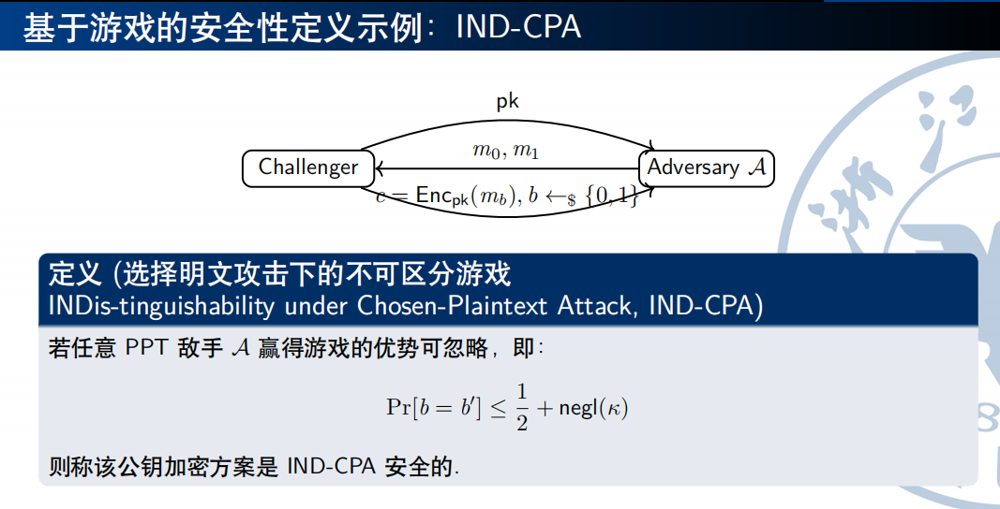

# 1.现代密码学三大原则

- 传统密码学：“艺术”与“直觉”
- 现代密码学：严谨的科学范式
    - 形式化：安全和威胁模型都需要明确的形式化定义
    - 精确的假设：比如大整数分解、DLP(Discrete Logarithm Proclem, 有限域上的离散对数问题)
    - 严格的安全性证明：基于归约(Reduction)的证明
        - 归约：用A的安全性来证明B的安全性
        - 证明方法是：
            - 假设B不安全
            - 攻击者拿可以破解B的安全性的黑盒算法来攻击A
            - 如果攻击成功则与A的安全性矛盾，所以假设不成立，B是安全的

## 1.1 形式化的定义(Formal Definitions)

- 安全保证
    - ~~不能恢复明文~~
    - 敌手无法从密文中获得关于明文的**任何信息**
- 威胁模型(Threat Model)
    - Ciphertext-only
    - Known-plaintext：已知部分明文密文对
    - CPA：可获得加密oracle
    - CCA：可获得加密oracle和解密oracle

### 1.1.1 基于游戏的安全性定义

- IND-CPA: indistinguishability under Chosen-Plaintext Attack

  

## 1.2 