## 1.离散对数问题(Discrete Logarithm Problem)

- 在一个**循环群**中，已知底数和结果，**求指数的计算难度**远远大于已知底数和指数正向计算结果

$\mathcal{g}$ ：generic（通用的）, polynomial-time的生成一个群的算法

### 1.1 群(Group)

- 由一个集合*G*和一个二元运算 ·（通常为乘法或加法）组成
- 并满足以下四条公理：
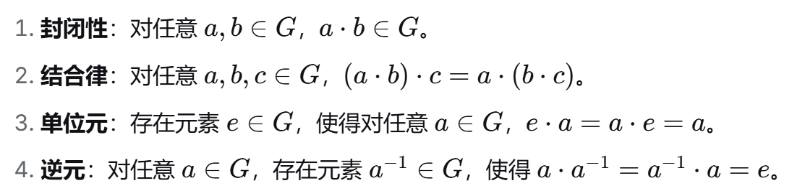

- 例子
    - 整数加法群($\mathcal{Z},+$)
    - 模p乘法群

### 1.2 循环群(Cyclic Group)

- *G*是一个循环群当且仅当
    - 1.*G*满足群的性质
    - 2.存在 *g* $\in$ *G*，使得群中的**每一个**元素都可以写成 *g* 若干次作用（乘法、加法...）的结果

- 其中*g*被称为生成元 (generator)

- 存在生成元的群称为循环群，循环群**至少**存在一个生成元

### 1.3 阶数(Order)

- 群的阶数：等于群中的元素个数

- 元素的阶数
    - 对于元素 a $\in$ *G* ，假设 a 与自己作用 m 次得到 e（单位元），把 m 称为元素 a 的阶数

- 在一个有限群中，任意元素的阶都能整除群的阶

### 1.4 DLP

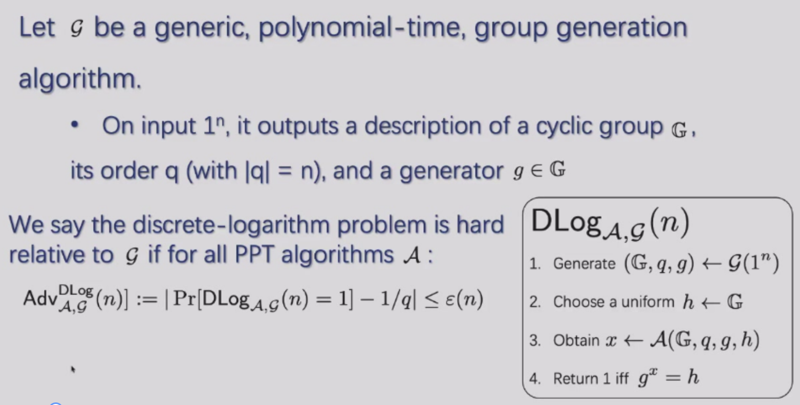

## 2.DH Key Exchange(Diffie-Hellman)

### 2.1 DHKE定义

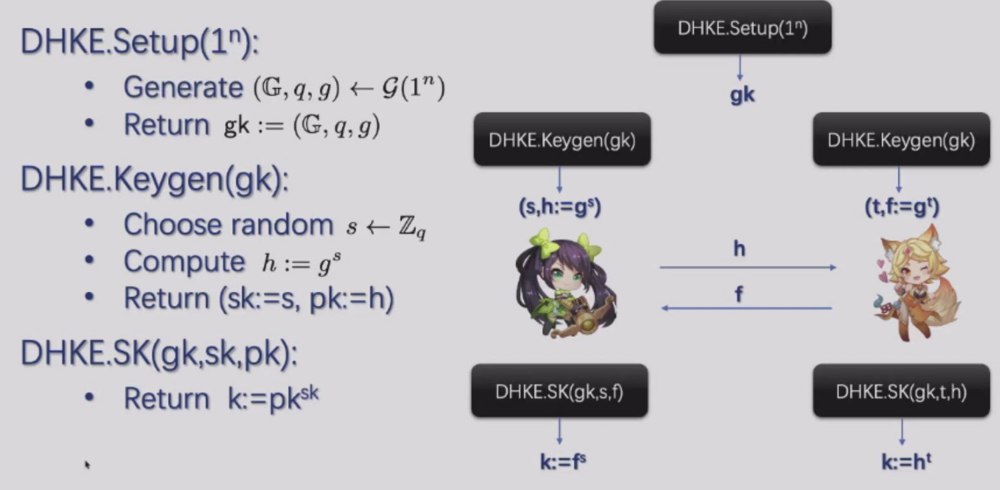

- Setup($1^n$)
    - 生成一个阶为大素数q的循环群 $\mathcal{G}$，以及该群的一个生成元*g*
    - 得到一个公开参数 *$g_k$*

- Keygen($g_k$)
    - 左右两方各自随机选择一个私钥 $\in \mathcal{Z}_p$ 
    - 各自计算公钥
    - 交换公钥

- SK(gk,sk,pk)
    - 双方都拿自己的私钥和对方交换过来的公钥做幂律运算，得到一个共享的密钥k

- NIKE协议：Non-Iteractive Ker Exchaneg, 非交互式密钥交换
    - 两人之间交换密钥不需要同时在线，发送信息之前不需要握手确认
    - 例子就是上方的DHKE

### 2.2 DHKE的安全性

- Is DHKE **what-secure** under **X** assumption

- 我们的任务
    - 对安全的形式化定义
    - 决定X假设
    - 提供一个从X假设到what-secure安全性的归约证明

#### 2.2.1 KR安全

- Key Recovery security

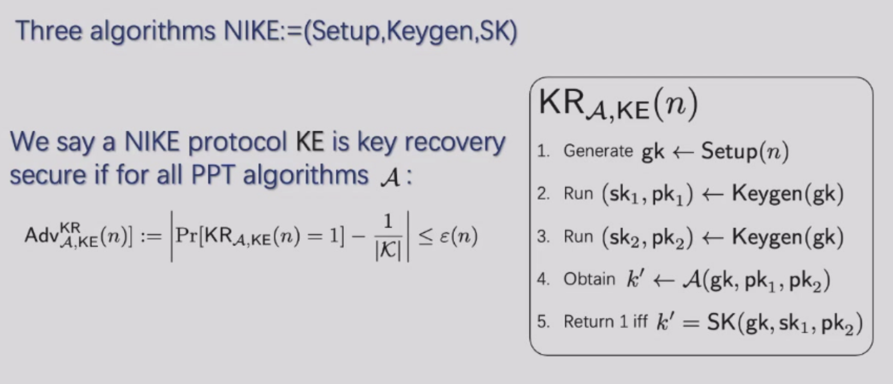

- 衡量的是攻击者通过公开的gk和两个公钥推算出共享密钥的概率是否可忽略

#### 2.2.2 CDH假设

- Computational Diffie-Hellman Assumption

- 该假设认为：在某些特定的循环群中，给定两个公钥，想要计算出它们对应的共享密钥在数学上是不可行的。

- CDH假设保障了DHKE的KR安全性

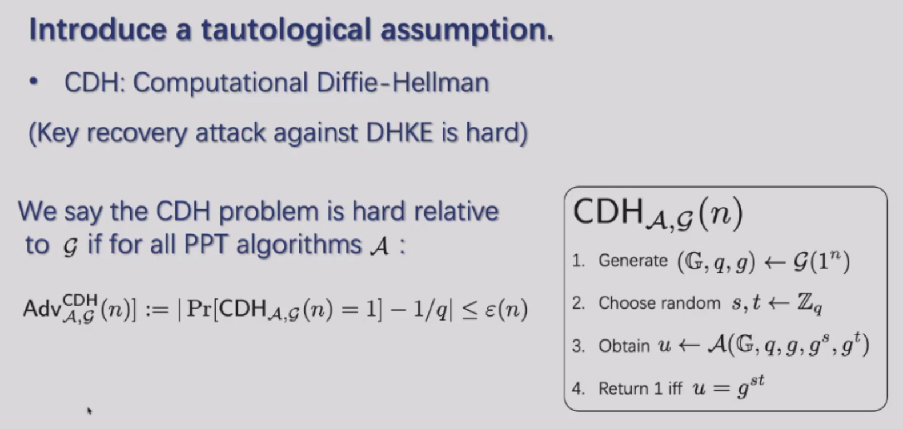

!!! abstract "Summary"
    - 离散对数假设(DL)：问题最难，假设最强。攻击者目标：给定 $g^a$，求出 a。
    - CDH假设：难度中等，假设强度中等。给定 $g^a$, $g^b$，求出 $g^{ab}^$。
    - 判定DH假设(DDH)：最容易，假设最弱。给定 $g^a$, $g^b$ 和一个 *Z*，判断 Z 与 $g^{ab}$ 是否相等，或仅是随机值。

### 2.3 CDH和DL之间的关系

- 定理：if CDH problem is hard relative to $\mathcal{g}$ then DL problem is also hard relative to $\mathcal{g}$

- Proof
    - 我们使用归约证明：如果DL是easy的，那么CDH也是easy的

- 为了达到充分的安全性，攻击者不能仅仅是无法猜出共享密钥k的具体值，攻击者还不能获得关于k的任何信息

### 2.4 实际应用

- 生成的共享密钥k可以用来做one-time-pad

### 2.5 DDH假设

- IND-Security
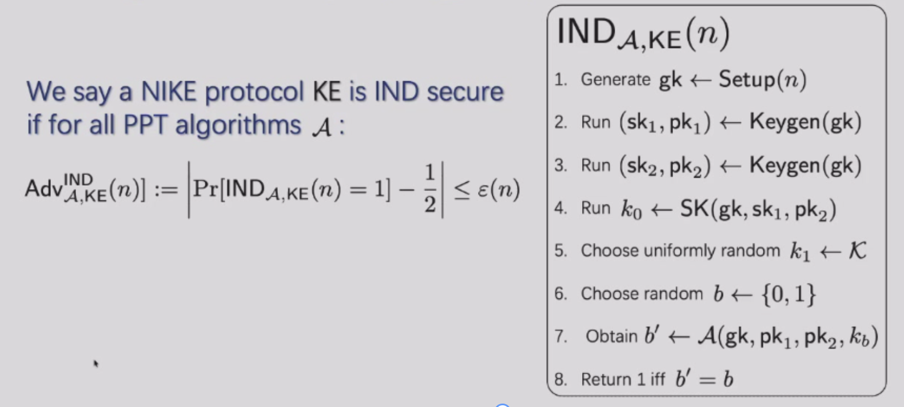

- DDH: Decisional Diffie-Hellman
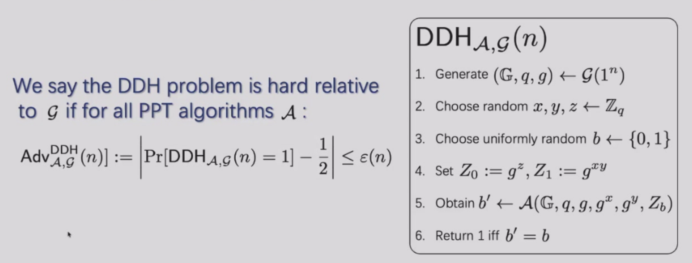

## 3.Elgamal

### 3.1 基本思想

- 基于Diffir-Hellman交换思想建立的非对称加密方案

- 其将DHKE协议转变成了一个可以直接给某人发送加密消息的系统
    - DHKE + one-time-pad

### 3.2 具体实现

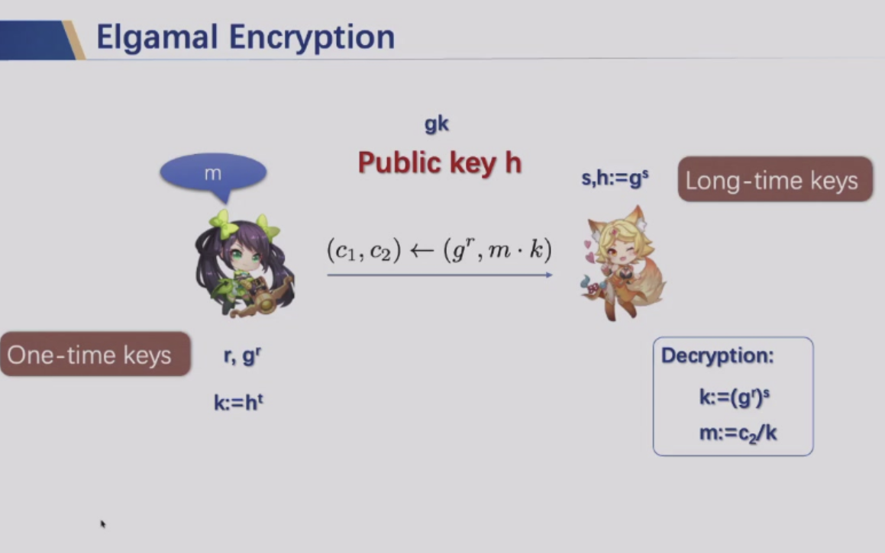

- 参与者设定
    - 妲己作为接收者
        - 生成长期密钥
        - 私钥s保密
        - 公钥 $h = g^s$

    - 孙尚香想发送m给妲己

- 加密流程
    - 发送者**随机选择**一个临时私钥r
    - 计算临时公钥 $c_1 = g^r$
    - 发送者通过临时公钥和接受者的长期公钥生成共享密钥
        - $k = h^r = (g^s)^r = g^(sr)^$
    - $c_2 = m·k$
    - 发送密文对 $(c_1,c_2)$

- 解密流程
    - 恢复共同密钥
        - $k = (c_1)^s = (g^r)^s = g^(rs)^$
    - 提取消息
        - m = $c_2$ / k

### 3.3 Elgamal的安全性

#### 3.3.1 直觉

- Elgamal = DH + one-time-pad
- 因为后者具有完美安全，所以 Elgamal 的安全性和 DH 的安全性相当

#### 3.3.2 IND-CPA Security

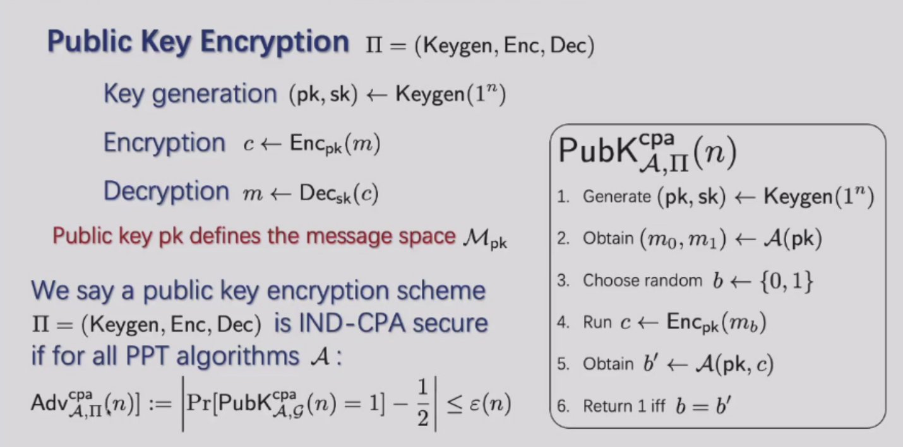

- **判断**：ELgamal 是 IND-CPA 安全的

- Theorem：the DDH problem is hard relative to $\mathcal{g}$ is **equivalent** to the Elgamal encryption scheme is IND-CPA secure

- proof

    - 第一部分证明：
    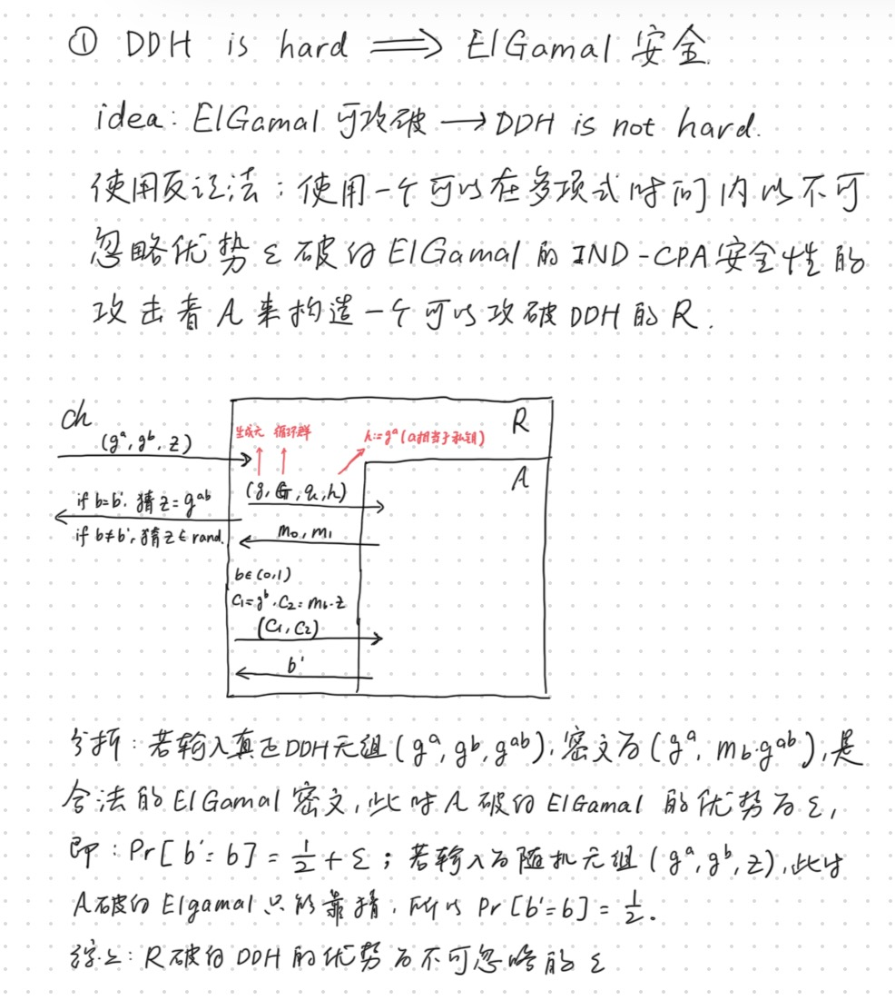

    - 第二部分证明：
        - 假设有一个可以解决DDH的算法 $\mathcal{D}$ ，我们利用它来分辨ElGamal的密文
    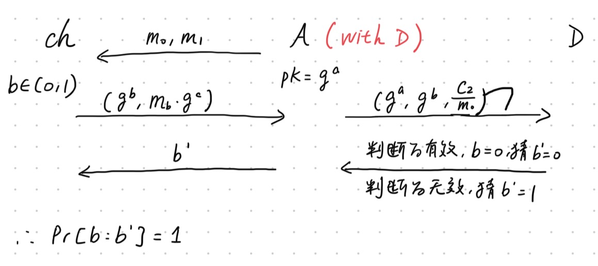

