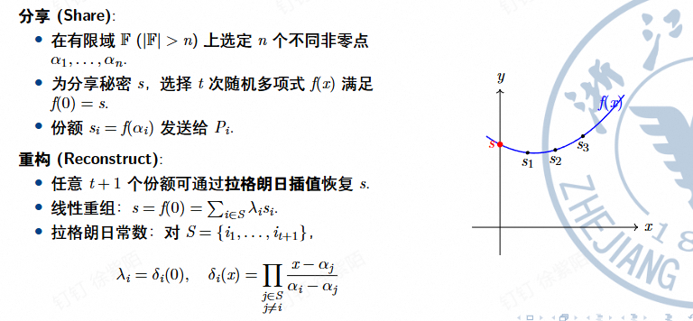

## 1.协议概览与假设

- 目标：构建一个**通用的安全多方计算协议**，实现**信息论**意义下的**完美隐私性**

- 基本设定：
    - 参与方数量：$P_1,...,P_n$ 共 n 个参与方
    - 安全门限：t < n/2（诚实的参与者占到多数）
    - 敌手模型：**半诚实**(Semi-honest) / 被动安全(Passive Security)
        - 敌手严格遵循协议执行步骤
        - 但会收集信息试图推断隐私
    - 通信：假设存在点对点安全信道

## 2.Shamir 秘密分享(SSS)

### 2.1 概述

- 门限秘密分享(Threshold Secret Sharing)
    - 一种密码学方案
    - 直觉：它将一个秘密分成**多个分片**(shares)，并将这些分片分发给**多个参与者**。要重新组装出原始的秘密，需要收集预先定义的最少数量分片，这被称为**门限值**(threshold)
    - 机密性：只要分片数量少于门限值，对秘密就保持一无所知的状态（甚至不是知道一点）

- Shamir Secrect Sharing
    - 达成 TSS 最经典、最优雅的算法
    - 由 Adi Shamir（RSA中的S）在 1979 年提出

- 两大安全优势
    - 1.信任去中心化
    - 2.容错性高（存在门限值）

### 2.2 SSS 的运作原理

- 建模：我们假设秘密值是 S，参与者数量为 n，门限值为 t，我们希望当收集的分片数量小于等于 t 的时候，无法得到关于 S 的任何信息，当分片数量大于等于 t+1 的时候可以计算出 S。

- 特殊情况：t = 1，即获取 S 至少需要两个人，任意一个人无法获取 S

- 一种拉格朗日插值法的实现方式：

