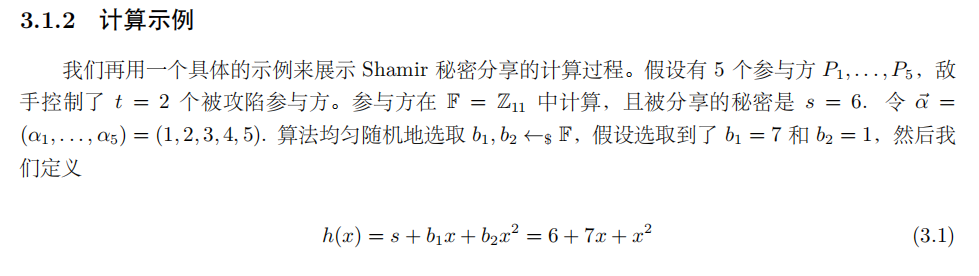
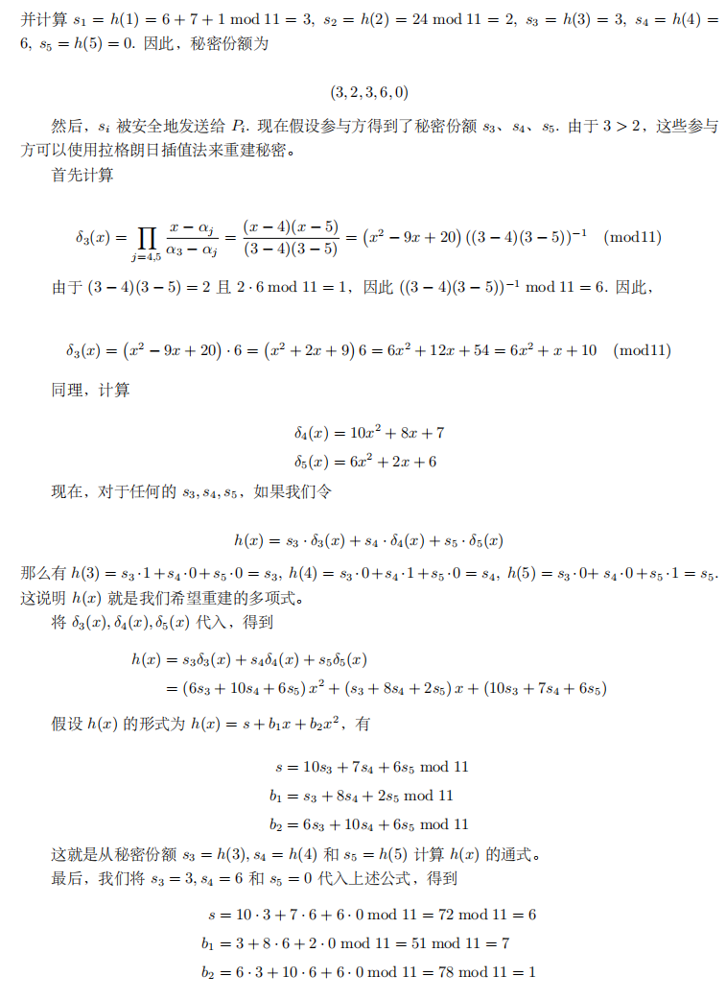
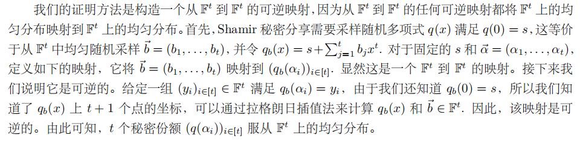

## 1.协议概览与假设

- 目标：构建一个**通用的安全多方计算协议**，实现**信息论**意义下的**完美隐私性**

- 基本设定：
    - 参与方数量：$P_1,...,P_n$ 共 n 个参与方
    - 安全门限：t < n/2（诚实的参与者占到多数）
    - 敌手模型：**半诚实**(Semi-honest) / 被动安全(Passive Security)
        - 敌手严格遵循协议执行步骤
        - 但会收集信息试图推断隐私
    - 通信：假设存在点对点安全信道

## 2.Shamir 秘密分享(SSS)

### 2.1 概述

- 门限秘密分享(Threshold Secret Sharing)
    - 一种密码学方案
    - 直觉：它将一个秘密分成**多个分片**(shares)，并将这些分片分发给**多个参与者**。要重新组装出原始的秘密，需要收集预先定义的最少数量分片，这被称为**门限值**(threshold)
    - 机密性：只要分片数量少于门限值，对秘密就保持一无所知的状态（甚至不是知道一点）

- Shamir Secrect Sharing
    - 达成 TSS 最经典、最优雅的算法
    - 由 Adi Shamir（RSA中的S）在 1979 年提出

- 两大安全优势
    - 1.信任去中心化
    - 2.容错性高（存在门限值）

### 2.2 SSS 的运作原理

- 建模：我们假设秘密值是 S，参与者数量为 n，门限值为 t，我们希望当收集的分片数量小于等于 t 的时候，无法得到关于 S 的任何信息，当分片数量大于等于 t+1 的时候可以计算出 S。

- 特殊情况：t = 1，即获取 S 至少需要两个人，任意一个人无法获取 S

- 一种**拉格朗日插值法**的实现方式：

- 直观地说，我们通过 t+1 个横坐标不同的点来确定一个唯一的至多 t 次的多项式，而拉格朗日插值法给出了该多项式的构造方式。

- 设 *q(x)* 是 F 上至多 t 次的多项式，$(a_1,...,a_{t+1})$ 各不相同，则：
$
q(x) = \sum_{i=1}^{t+1} q(a_i)δ_i(x)
$

其中，$δ_i(x)$ 是 t 次多项式，满足 $δ_i(a_i) = 1$ 且 $δ_i(a_j) = 0,\forall j \neq i$，换言之，$δ_i(x)$ 的定义如下：
$
δ_i(x) = \prod_{1 \leq j \leq t+1,j \neq i} \frac{x-a_j}{a_i-a_j}
$

- 我们来看一下这个公式为什么成立
    - 1.首先，每个 $δ_i$ 是 t 个单项式的乘积，是 t 次多项式，q(x) 是 t 次多项式相加得到的结果，最多也就是 t 次。
    - 2.其次，我们注意到 $δ_i(x)$ 满足 $δ_i(a_i) = 1$ 且 $δ_i(a_j) = 0, \forall j \neq i$，故 q(x) 在所有 $a_i$ 处取的值都是 $q(a_i)$。
    - 3.最后，我们还要说明，q(x) 是唯一的。我们考虑一个多项式：$q(x) - \sum_{i=1}^{t+1} q(a_i)δ_i(x)$，$1 \leq i \leq t+1$ 时，这个多项式的值为 0，并且 t+1 显然比这个多项式的次数更大，只有零多项式满足：值为 0 的位置比它的次数更多，所以 $q(x) - \sum_{i=1}^{t+1} q(a_i)δ_i(x)$ 一定是零多项式，即 $q(x) = \sum_{i=1}^{t+1} q(a_i)δ_i(x)$

- 对于拉格朗日插值法构造出的多项式 q(x)，令 x=0，我们有：
$$
q(x) = \sum_{i=1}^{t+1} q(a_i)δ_i(0)
$$
令 $r_i = δ_i(0)$，我们得到一组向量 $\vec{r} = {r_1,..,r_{t+1}}$，可以将所有阶数至多为 t 的多项式 q(x) 在 0 处的取值表示为 $q(a_i)$ 的线性组合：
$$
q(x) = \sum_{i=1}^{t+1} q(a_i)r_i
$$
$\vec{r} = {r_1,..,r_{t+1}}$ 被称为重组向量。其中 **$r_i$ 只依赖 $a_1,...a_{t+1}$ 这些公开的节点值得系数，与秘密 s 和多项式 q(x) 本身无关**。这意味着重组向量是公开信息，任何人都可以提前算好。

- 举个例子：

- 可以看到恢复了原有的多项式系数。如果不需要恢复完整的多项式而只是想计算得到秘密 s，那么直接使用 3,4,5 各自对应的重组向量计算就可以。

### 2.3 SSS 的性质

- 性质1：任何 t+1 组或更多的秘密份额可以重建秘密 s。
    -方法就是使用**拉格朗日插值法**，恢复一个 t 次的多项式 $q_s(x)$，并得到 $q_s(0) = s$。

- 性质2：任意 t 组或更少的秘密份额都无法得到关于 s 的信息
    - 即：t 个（或更少）份额，**在统计上**与 s 无关

- 性质2的证明方法：构造可逆映射

- 目标是证明份额向量 $(q_b(\alpha_i))_{i \in [t]}​$ 均匀分布。均匀分布意味着**不提供关于 s 额外的信息**
- 因为份额是 $q_b$ 作用在 $\alpha_i$ 上的结果，关系较复杂，直接证明份额均匀分布很难
- 所以我们的角度转换为：因为我们已知 b 是均匀分布的（随机采样），能不能把这个均匀性传递给份额，所以我们构造映射 $\varphi$，并尝试说明 $\varphi$ 是双射。
- 证明方法是根据 t 个份额加上 (0,s) 这个点算出唯一的一个 t 次向量，从而可以逆向映射回随机采样的 b，这就可以说明 $\varphi$ 是双射。

