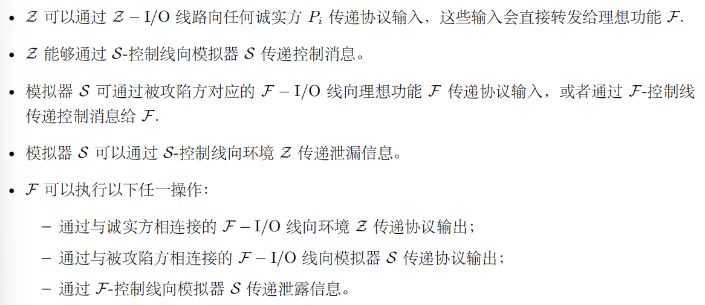
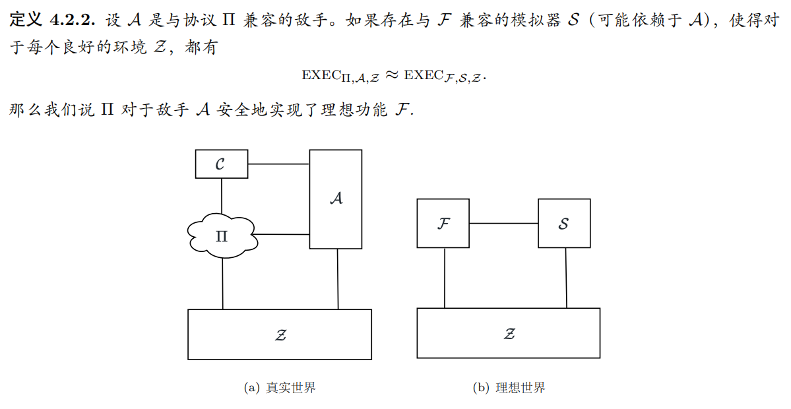
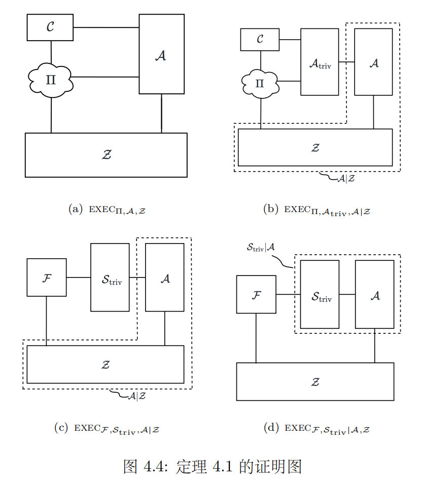
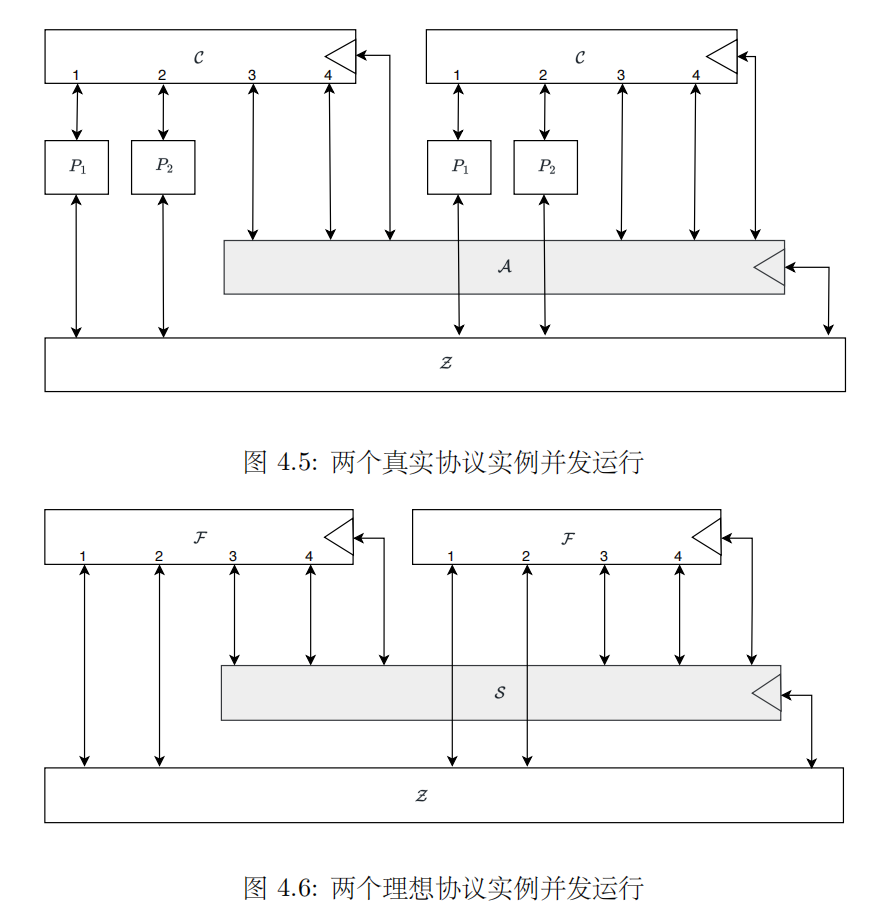
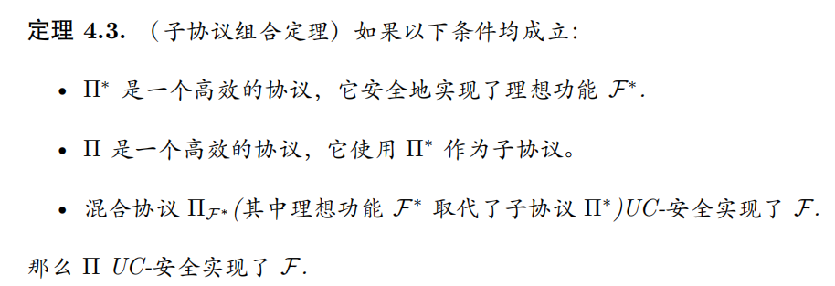

!!! abstract "Tips"
    本章介绍**通用可组合框架**这个密码学**安全模型**，这个模型中，被证明为安全的协议无论在什么运行环境下使用，都仍然能保持安全。并通过这个协议来对**恶意安全**进行**形式化的定义**。

## 1.隐私性

### 1.1 隐私性的定义
- 允许值：被攻陷方自己的输入和输出
    - ${x_i,y_i}_{P_j \in C}$

- 泄露值：被攻陷方在协议运行过程中看到的所有信息
    - ${view_j}_{P_j \in C}$

- 隐私性：一个协议总是满足**泄露值不包含比允许值更多的信息**

    - 如何定义一个值不包含比另一个值更多的信息？
    - 如果 V1 可以从 V2 高效地计算出来，我们就说 V1 不包含比 V2 更多的信息

- 所以隐私性的定义就可以变为：一个协议的**泄露值可以从允许值**中高效地计算出来。即：一个协议当中，任意一个被攻陷的参与方在协议运行过程中看到的所有信息都可以从被攻陷方自己的输入和输出中高效地计算出来。

- 如果参与方式随机算法，允许值和泄露值都是随机变量。所以隐私性的**形式化定义**可以变为：

### 1.2 关于隐私性的例子

- 一个例子：一个愚蠢的发送随机数的功能

- 那这个协议的隐私性如何呢？
    - 虽然 P1 生成的 b 是随机分布的，所以可以在 P2 端用一个模拟器来模拟从 P1 那里得到的 b。但是这种模拟没有体现出模拟值/泄露值与诚实方输出的**关系**。
    - 所以我们需要考虑的是两者间的**联合分布**

    

    - 如果理想功能是确定性的（没有随机性），那么联合分布退化为只需考虑模拟值/泄露值的分布

## 2.恶意安全性

### 2.1 恶意模型

- 半诚实模型
    - 严格遵守协议步骤
    - 但会记录视图，试图推断隐私

- 恶意模型
    - 可以任意偏离协议
    - 目标：破坏正确性、获取隐私等

- 恶意敌手关心的**不只是获得信息，而是产生影响**
    - 篡改结果的正确性（安全协议要求：要么最终输出正确的结果，要么协议直接报错退出）
    - 破坏输入的独立性（比如拍卖中，你出价 x，敌手永远出价 x+1）
    - 可以中止协议
    - 可以破坏参与者获取信息的公平性

!!! abstract "Tips"
    Q：什么样的影响会破坏协议的安全性
    A：哪些无法通过理想模型的框架来模拟的攻击所实现的影响

### 2.2 例子

- 第一个例子并不影响协议的安全性

- 接下来我们来看一个会影响协议安全性的例子

### 2.3 恶意安全性的定义

- **笼统地说**：如果敌手无法通过影响协议来获得任何好处，那么这个协议就是恶意安全的。

- **输入替换**：如果敌手能够接管某个参与方 Pi，那么有一种影响是不可避免的，就是“输入替换”。例如，如果敌手控制了参与方 P1，那么它当然可以强迫 P1 在协议中使用另一个值 x1' 作为输入，而不是 x1，于是协议将计算 $f(x_1',x_2,...,x_n)$ 而不是 $f(x_1,...,x_n)$。 
  - 这是函数计算协议中**唯一允许**的影响

- **理想功能**：完全可靠的第三方，只完成协议内容，对协议计算过程完全保密

- 允许影响：在理想功能中可能产生的影响（比如进行输入替换）
- 实际影响：具体协议实现中可能产生的影响（敌手可以代表被攻陷方发送任意消息）

- 恶意安全性：如果对于每个攻击协议的敌手，都存在一个模拟器 S 可以高效地计算出具有相同效果的**允许影响**，那么该协议是恶意安全的

!!! abstract "例子回顾"
  回到前面两个例子。
  - 在第一个例子中， $P_1$ 对协议的影响是始终得到 $x_2x_3$，这不是安全问题，因为被攻陷的 $P_1$ 可以通过**输入替换**使自己的输入永远是 1 来获得同样的结果，所以这是允许的影响。
  - 而在第二个例子当中，$P_1$ 对协议的影响是始终得到 $x_3$，这就是**安全问题**了，因为没有输入替换可以保证这个结果。
  - 后一种攻击不但是对**正确性**的攻击，$P_1$ 违背了协议使得协议出现了错误地结果，然而它实际上也是对**隐私性**的攻击，错误的结果对 $P_1$ 泄露了 $P_3$ 的输入。由此可以看出，正确性和隐私性实际上是**相互联系**的，我们不能孤立地考虑。
    
  
  
- **完整的安全性** = 隐私性 + 恶意安全性
    - 隐私性：被攻陷方只能学到允许值的信息
    - 恶意安全性：被攻陷方只能对输出产生允许范围内的影响
    - 即：存在一个**左右逢源**(bushi)的模拟器，同时保证**隐私性**和**恶意安全性**
        - 模拟器接收敌手**试图影响真实协议**的行为，并高效地将其**转化为允许的影响**（输入替换）
        - 模拟器**接收允许值**，并高效地向敌手**模拟泄露值**

- 形式化的定义需要用到**通用可组合 (Universal Composability, UC) 框架**
  - 通用可组合框架所采用的方法是将参与方视为计算实体。

## 2.通用可组合框架(UC)

### 2.1 UC 简介
- UC means **Universal Composability**

- Why UC?
    - Stand-alone model
        - 仅保证单次运行是安全的
        - 无法抵抗并发的攻击
    - UC 框架
        - 引入环境 $\mathcal{Z}$，$\mathcal{Z}$ 可与敌手实时交互
        - 任意环境/协议组合下仍然安全

- 在 UC 当中，每个参与方（实体）是一个**交互式图灵机**(interactive Turing machine, ITM)
  - ITM = TM + 输入输出纸带。保证几个 ITM 之间可以通信。
  - ITM1 在输出纸带上写好 msg + target，发送后，target 应该在自己的输入纸带上看到 msg 和发送方 ITM1。
  - ITM 并非无时无刻处于工作状态，每个 ITM 的生命周期由**激活纸带**(activation tape)控制。激活纸带长度为 1 比特，只有当收到消息且激活纸带被置 1 之后，这个 ITM 才会开始执行计算、改变状态、发送消息，最后结束激活状态。 

- UC 的大致流程
  - 在在协议开始时，一个称为**敌手 $\mathcal{A}$** 的特殊的 ITM 首先被激活。
  - 敌手 $\mathcal{A}$ 执行一系列操作后，发送消息给下一个 ITM $P_1$ 使其被激活。
  - 当 $P_1$ 被激活时，它读取在输入纸带上的消息，然后可能会执行一些计算、改变状态，最后它发送消息给下一个 ITM，并结束自己的激活
  - 信息就这样被传递下去。直到某个 $P_n$ 在结束激活之后还没有发送消息给下一个 ITM，那么**敌手就会再次被激活**

- 理想功能：在理想世界当中的**可信第三方**
- 理想敌手（模拟器 $\mathcal{S}$）
  - 问题：实际协议 $\Pi$ 当中不存在理想功能，只有**复杂的通信信道和真实敌手 $\mathcal{A}$**。理想世界和真实世界的接口和表现完全不一样，我们如何证明现实协议 $\Pi$ 达到了理想世界 $\mathcal{F}$ 的安全级别呢？
  - $\mathcal{S}$ 被引入就是来解决这个问题的
  - $\mathcal{S}$ 的具体操作就是：
    - 1.在理想世界当中，把真实敌手 $\mathcal{A}$ 放进自己的内部运行
    - 2.向内对敌手 $\mathcal{A}$：$\mathcal{S}$ 伪造出非常逼真的通信信息和加密数据，让 $\mathcal{A}$ 以为自己正处在现实世界当中
    - 3.向外面对理想功能 $\mathcal{F}$：$\mathcal{S}$ 只能通过 $\mathcal{F}$ 允许的合法接口交互
    - 4.当 $\mathcal{A}$ 企图产生影响的时候，$\mathcal{S}$ 就要在理想世界里，向 $\mathcal{F}$ 申请利用规则允许范围内的影响来达到同样的效果
- 环境（$\mathcal{Z}$）
  - 也被叫做**区分器**，用来检验 $\mathcal{S}$ 的效果
  - $\mathcal{Z}$ 只接受输入输出，如果 $\mathcal{Z}$ 无法区分现实世界（实际协议 $\Pi$ + $\mathcal{A}$）和理想世界（$\mathcal{F}$ + $\mathcal{S}$），那么我们就可以证明 $\Pi$ **至少和 $\mathcal{F}$ 一样安全**

- **不可区分性**：如果一个现实协议在任何可以想象的敌手面前都可以表现的和理想世界相似的不可区分，那这个协议就是安全的。

### 2.2 通用可组合定理

- 该定理允许我们将某个复杂协议 $\Pi_{CMPLX}$ 的一部分抽象成较为简单的子协议 $\Pi$。然后证明两个简化了的命题：
  - （1）当使用理想功能 F 作为资源时，$\Pi_{CMPLX}$ 是安全的；
  - （2）协议 $\Pi$ 安全地实现了 $\mathcal{F}$，然后根据通用可组合定理可知，当 $\Pi_{CMPLX}$ 使用 $\Pi$ 作为子协议而不是使用 F 时，它也是安全的。

### 2.3 真实协议及其运行

- 每台机器对应一个实体，在整个协议期间，机器是**串行**（交替执行）的
- **攻陷方**：在图中对应的是 $P_3, P_4$，是所有参与方的一个子集，$\mathcal{Z}$ 将这个信息记录在一条特殊的纸带上，该纸带**对 $\mathcal{A}$ 和 $\mathcal{C}$ 可见**，但是诚实的参与方看不见，即诚实的参与方并不知道哪些参与方是被攻陷了的

- 真实协议的运行结构

- $\mathcal{C}$：**异步通信网络**。抽象地提供安全地点对点通信道。
  - 任何参与方通过信道发送消息的时候，敌手会知道这一事实，以及**消息的长度、发送方和预定的接受方**
  - 敌手拥有决定消息**是否以及何时**被传递的能力（异步）。

- 可能出现的**消息类型**
    - 1.$\mathcal{Z}$ 可以沿着 $\mathcal{Z} - I/O$ 线向任何诚实方传递协议输入
    - 2.$\mathcal{Z}$ 可以沿着 $\mathcal{A}$ - 控制线向 $\mathcal{A}$ 传递控制消息
    - 3.所有参与方（**攻陷方则是 $\mathcal{A}$**）可以沿着对应的 $\mathcal{C} - I/O$ 线向 $\mathcal{C}$ 传递**发送消息请求**。请求格式为：$(SEND, (j_1,m_1), (j_2,m_2)...)$，其中 $j_k$ 是消息的**预期接受方**，$m_k$ 是消息内容
    - 4.$\mathcal{A}$ 可以沿着 $\mathcal{C}$ - 控制线发送**传递消息**的指令。指令格式为 $(DELIVER, k)$，k 是待传递消息的索引
    - 5.$\mathcal{A}$ 可以沿着 $\mathcal{A}$ - 控制线向 $\mathcal{Z}$ 传递泄露消息
    - 6.诚实方可以沿着 $\mathcal{Z} - I/O$ 线向 $\mathcal{Z}$ 传递协议输出
    - 7.当通信网络 $\mathcal{C}- I/O$ 线接收到参与方 $P_i$（诚实的/攻陷的）的发送消息请求后，会将 $(i, j_k, m_k)$ 的元组添加到内部列表 *buf* 中，并沿着 $\mathcal{C}$ - 控制线向 $\mathcal{A}$ 传递泄露消息 $(SEND, i, (j_1,m_1), (j_2,m_2)...)$
    - 8.在沿着 $\mathcal{C}$ - 控制线从 $\mathcal{A}$ 接收到传递消息请求 $(DELIVER, k)$ 后，通信网络 $\mathcal{C}$ 执行以下操作：如果 buf 中的第 k 个元组是 (i, j, m)，它会沿着对应于 $P_j$ 的 $\mathcal{C} - I/O$ 线传递消息 $(RESEIVE, i, m)$，这回将消息 m 传递给 $P_j$（如果 $P_j$ 是诚实的）或 $\mathcal{A}$（如果 $P_j$ 是被攻陷的）；如果没有第 k 个元组，$\mathcal{C}$ 会沿着 $\mathcal{C}$ - 控制线向 $\mathcal{A}$ 报告错误

!!! abstract "Definition"
    - $\mathcal{A}_{triv}$（**平凡敌手**）：仅充当了环境和其他机器之间的路由器：接受来自 $\mathcal{Z}$ 的控制消息，并忠实地遵循这些消息的指示，将特定消息沿指定的路线发送到特定机器。此外 $\mathcal{A}_{triv}$ 将接收到的其他机器的消息都转发给 $\mathcal{Z}$。
    - 平凡敌手可以看作一个最笨的攻击者，完全是环境 $\mathcal{Z}$ 的傀儡

- 运行时间考虑：定义在 UC 框架下，**什么是高效地协议、敌手和环境**
    - 环境 $\mathcal{Z}$ 是**良好的**：$\mathcal{Z}$ 的运行时间是关于安全参数的多项式
    - $\mathcal{A}$ 与 协议 $\Pi$ 兼容：在任何良好的环境 $\mathcal{Z}$ 下，诚实方 $P_i$ 和敌手 $\mathcal{A}$ 的总运行时间（以压倒性的概率）是关于安全参数和 $\mathcal{Z}$ 发送的消息长度的多项式
    - 协议 $\Pi$ 是高效的：**平凡敌手和协议 $\Pi$ 是兼容的**
- 一个高效的协议中所有机器的运行时间，是关于环境 $\mathcal{Z}$ 的输入长度的多项式。该定义有足够的灵活性，它允许协议处理来自环境的无限数量的请求

### 2.4 理想协议及其运行

- 理想协议运行结构

- 与真实协议的不同点：
  - 存在一个 $\mathcal{S}$，称其为模拟器
  - 引入理想功能 $\mathcal{F}$ 代替通信网络 $\mathcal{C}$。（根据任务来设计）
  - 诚实方本身在协议中没有任何主动的作用，只是充当 $\mathcal{Z}$ 和 $\mathcal{F}$ 之间的传话筒

- 可能存在的消息类型

- 运行时间考虑
  - 兼容：对每一个良好的环境 $\mathcal{Z}$，$\mathcal{F}$ 和 $\mathcal{S}$ 的总运行时间（以压倒性的概率）是关于安全参数和 $\mathcal{Z}$ 发送消息的长度的多项式，那么 $\mathcal{S}$ 和 $\mathcal{F}$ 是兼容的

- 理想功能 $\mathcal{F}_{sfe}$：可信第三方的具象化，接受所有输入，然后算出结果，发回各自输出

- 两个重要细节：
  - $\mathcal{F}_{sfe}$ 允许敌手控制诚实方收输出的时机和条件
  - 不保证所有诚实方都能收到输出

### 2.5 UC 安全实现

- UC 框架的主体其实是**环境 $\mathcal{Z}$**
    - $EXEC_{\Pi, \mathcal{A}, \mathcal{Z}}$：$\mathcal{Z}$ 在真实世界中与协议 $\Pi$，敌手 $\mathcal{A}$ 交互之后输出的随机变量
    - $EXEC_{\mathcal{F}, \mathcal{S}, \mathcal{Z}}$：$\mathcal{Z}$ 在**理想世界中**与理想功能 $\mathcal{F}$、模拟器 $\mathcal{S}$ 交互后输出的随机变量

- 定义：对每个与 $\Pi$ 兼容的敌手 $\mathcal{A}$，$\Pi$ 都对 $\mathcal{A}$ 安全实现了 $\mathcal{F}$，则称 $\Pi$ UC-安全地实现了 $\mathcal{F}$

- 那什么是：协议 $\Pi$ 对于敌手 $\mathcal{A}$ **UC-安全**地实现了理想功能 $\mathcal{F}$

- 直观含义是：无论 $\mathcal{A}$ 如何尝试攻击真实协议 $\Pi$，造成的损害都不会超过另一个模拟器敌手 $\mathcal{S}$（该敌手可能依赖于 $\mathcal{A}$）在理想模型中攻击理想功能所能造成的损害

!!! abstract "UC 安全"
    - 半诚实安全 < 单协议恶意安全 < UC 安全（多协议恶意安全）
    - 所以 UC 安全的要求是比较高的

!!! abstract "良好、兼容、高效"
    - 良好：描述环境 $\mathcal{Z}$。运行时间是安全参数的多项式（多项式可依赖 $\mathcal{Z}$）
    - 兼容：$\mathcal{A}$ 与协议 $\Pi$。在任何良好的 $\mathcal{Z}$ 下，诚实方与 $\mathcal{A}$ 的总运行时间（压倒性概率）是安全参数和 $\mathcal{Z}$ 发消息长度的多项式。（依赖 $\Pi$, $\mathcal{A}$, 不依赖 $\mathcal{Z}$）
    - 高效。形容协议。平凡敌手与协议 $\Pi$ 兼容。

## 3.四大定理

### 3.1 平凡敌手的完备性

- 定理描述：设 $\Pi$ 是一个高效的协议，如果 $\Pi$ 对于**平凡敌手**安全地实现了理想功能 $\mathcal{F}$，则 $\Pi$ UC-安全实现了 $\mathcal{Z}$。

- 定理证明：

  - a 到 b 由平凡敌手的平凡性保证
  - b 到 c 由定理的前提保证
  - c 到 d 由视图的一致性保证
  - 综上 a 就可以推到 d 了，那么对于任意敌手，协议都可以 UC-安全实现理想功能，协议也就是 UC 安全的了

!!! abstract "Tips"
    - 接下来的三个定理分别阐述了 UC-安全的性质，即：一个协议 $\Pi$ 如果是 UC-安全的，那么它还满足其他哪些特征？

### 3.2 并发组合定理
- 定理描述：如果 $\Pi$ 在单实例设置中是一个高效的协议，那么它在多实例设置中仍然是高效的。此外，如果 $\Pi$ 在单实例设置中 UC-安全地实现了 $\mathcal{F}$，那么它在多实例设置中也 UC-安全实现了 $\mathcal{F}$

 

### 3.3 子协议组合定理
- 定理描述：

### 3.4 传递性
- 定理描述：假设 $\Pi, \Pi', \Pi''$ 是高效的混合协议。如果 $\Pi$ UC-安全实现了 $\Pi'$ 且 $\Pi'$ UC-安全实现了 $\Pi''$，则 $\Pi$ UC-安全实现了 $\Pi''$

## 4.半诚实安全

### 4.1 形式化定义
- 我们说一个协议 $\Pi$ 是半诚实安全的，当且仅当：存在一个**多项式时间**模拟器 $\mathcal{S}$ 使得 $\mathcal{S}_i(x_i, f(x,y))$ 生成的分布与真实执行被攻陷方的视图中的 $View_i^{\Pi}(x,y)$ 计算不可区分。
- 直觉：被攻陷的参与方在真实协议中看到输入 x、结果 z 以及所有通信记录；模拟器 $\mathcal{S}$ 只知道输入 x 和输出 z，就能伪造出不可区分的通信记录，**这就能反过来说明，协议的通信过程没有泄露除了输入输出之外的任何信息**

### 4.2 UC 框架下的定义
- **受限框架**：要在 UC 框架下定义半诚实安全性的时候，需要对真实世界中的 $\mathcal{A}$ 和理想世界中的模拟器 $\mathcal{S}$ 的行为增加一些限制，修改后的框架我们称之为受限框架。

- 真实世界的改动：
  - 1.被攻陷方不再并入敌手，而是独立实体，像诚实方一样和 $\mathcal{Z}$ 进行输入输出交互，完全照协议走，但是向敌手报告：（1）从 $\mathcal{C}$ 中收到的所有消息；（2）自己生成的所有随机比特串
  - 2.报告后，合法敌手只能：（1）立即交还控制权给报告这；（2）先向 $\mathcal{Z}$ 发送若干报告，再交还控制权
    - 本质上：受限框架里敌手（和环境）只能监控被攻陷方内部状态，不能打断正常协议流程。
  - 3.敌手与 $\mathcal{C}$ 的交互只能走 $\mathcal{C}$ - 控制线，而不能走 $\mathcal{C}- I/O$ 线。它仍能决定是否/何时传消息，但不能知道或改两个诚实方之间的消息内容，也不能改被攻陷方发出的消息内容。

- 理想世界的改动：
  - 所有 $\mathcal{F} - I/O$ 线直连 $\mathcal{Z}$ 和 $\mathcal{F}$。模拟器 $\mathcal{S}$ 不能改动被攻陷方的输入输出，而只是接受被攻陷方泄露的消息。 

## 5.攻陷方式

### 5.1 静态攻陷(static)

- 环境 $\mathcal{Z}$ 在协议开始之前就确定一组被攻陷方

### 5.2 适应性攻陷(adaptive)

- 可以在协议运行过程当中，环境 $\mathcal{Z}$ 可以指示敌手 $\mathcal{A}$ 发送一条 CORRUPT 指令，把原本诚实的参与方被攻陷，受 $\mathcal{A}$ 控制。
- 这个攻陷信息会被记录在一个特殊的纸带上，该纸带对 $\mathcal{A}$ 和通信网络 $\mathcal{C}$ 可见。

### 5.3 可移动攻陷(mobile)

- 前两种攻陷方式都是**永久的**攻陷
- 可移动攻陷允许参与方从被攻陷状态恢复并重新获得安全性
- 能抵御“可移动攻陷”的安全性通常被称为**主动安全**