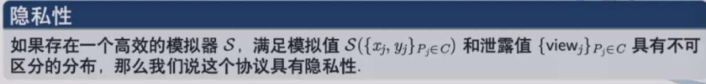
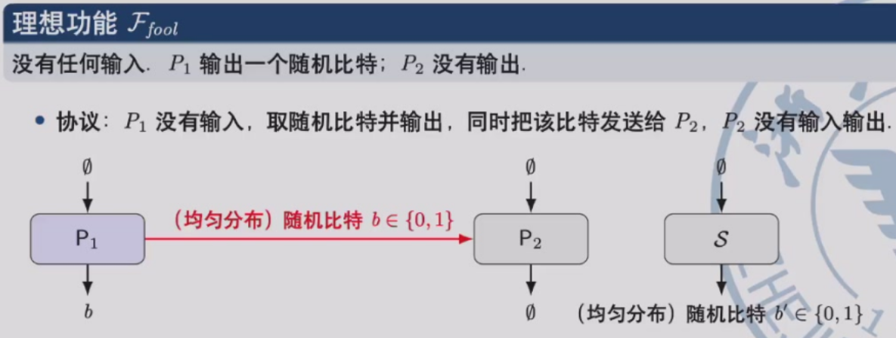
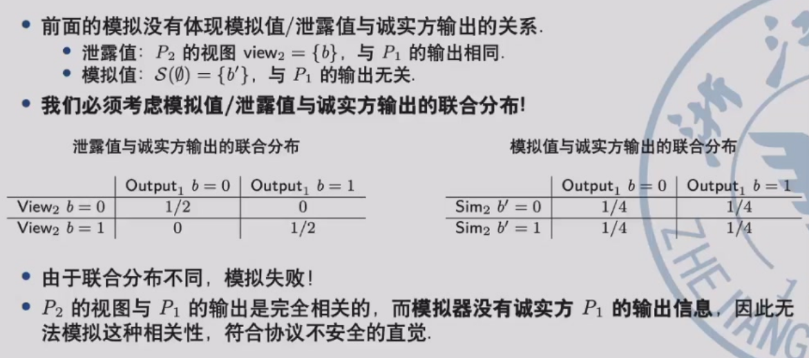
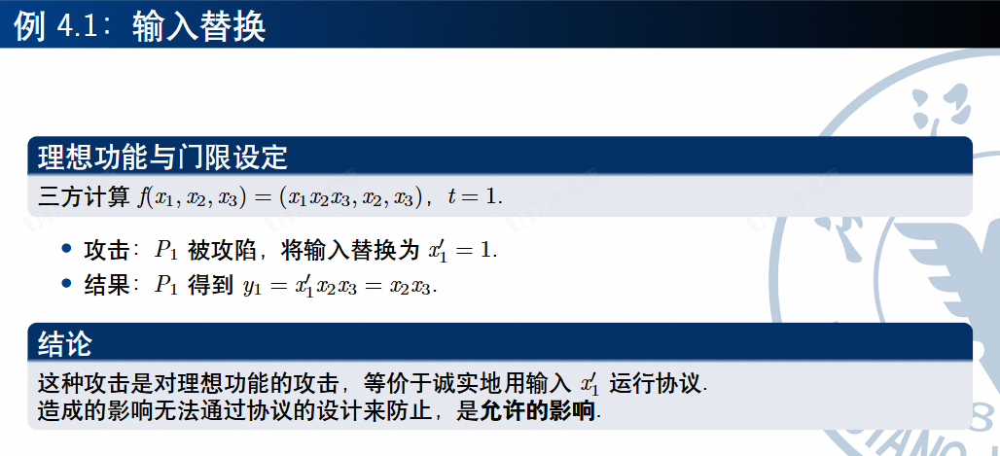
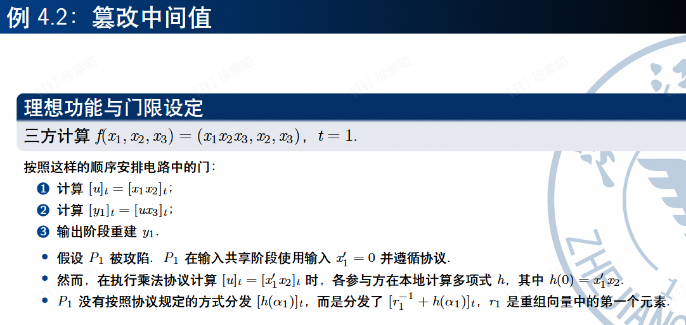
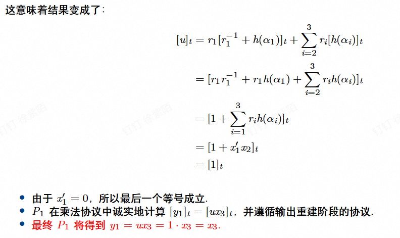
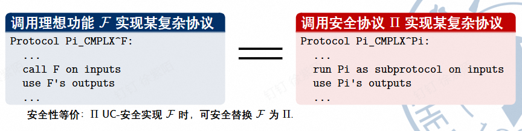
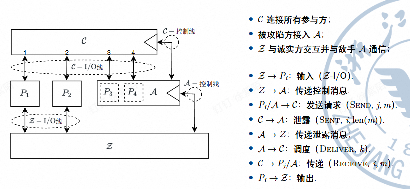
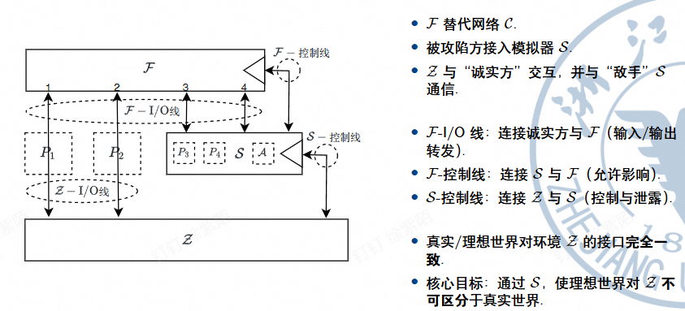
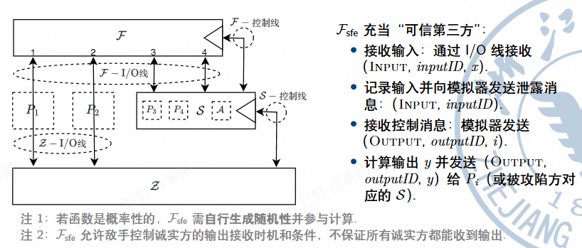

!!! abstract "Tips"
    本章介绍**通用可组合框架**这个密码学**安全模型**，这个模型中，被证明为安全的协议无论在什么运行环境下使用，都仍然能保持安全。并通过这个协议来对**恶意安全**进行**形式化的定义**。

## 1.隐私性

### 1.1 隐私性的定义
- 允许值：被攻陷方自己的输入和输出
    - ${x_i,y_i}_{P_j \in C}$

- 泄露值：被攻陷方在协议运行过程中看到的所有信息
    - ${view_j}_{P_j \in C}$

- 隐私性：一个协议总是满足**泄露值不包含比允许值更多的信息**

    - 如何定义一个值不包含比另一个值更多的信息？
    - 如果 V1 可以从 V2 高效地计算出来，我们就说 V1 不包含比 V2 更多的信息

- 所以隐私性的定义就可以变为：一个协议的**泄露值可以从允许值**中高效地计算出来

- 如果参与方式随机算法，允许值和泄露值都是随机变量。所以隐私性的**形式化定义**可以变为：

### 1.2 关于隐私性的例子

- 一个例子：一个愚蠢的发送随机数的功能

- 那这个协议的隐私性如何呢？
    - 虽然 P1 生成的 b 是随机分布的，所以可以在 P2 端用一个模拟器来模拟从 P1 那里得到的 b。但是这种模拟没有体现出模拟值/泄露值与诚实方输出的**关系**。
    - 所以我们需要考虑的是两者间的**联合分布**

    

    - 如果理想功能是确定性的（没有随机性），那么联合分布退化为只需考虑模拟值/泄露值的分布

## 2.恶意安全性

### 2.1 恶意模型

- 半诚实模型
    - 严格遵守协议步骤
    - 但会记录视图，试图推断隐私

- 恶意模型
    - 可以任意偏离协议
    - 目标：破坏正确性、获取隐私等

- 恶意敌手关心的**不只是获得信息，而是产生影响**
    - 篡改结果的正确性（安全协议要求：要么最终输出正确的结果，要么协议直接报错退出）
    - 破坏输入的独立性（比如拍卖中，你出价 x，敌手永远出价 x+1）
    - 可以中止协议
    - 可以破坏参与者获取信息的公平性

!!! abstract "Tips"
    Q：什么样的影响会破坏协议的安全性
    A：哪些无法通过理想模型的框架来模拟的攻击所实现的影响

### 2.2 例子

- 第一个例子并不影响协议的安全性

- 接下来我们来看一个会影响协议安全性的例子

### 2.3 恶意安全性的定义

- 允许影响：在理想功能中可能产生的影响（比如进行输入替换）
- 实际影响：具体协议实现中可能产生的影响（敌手可以代表被攻陷方发送任意消息）

- 恶意安全性：如果对于每个攻击协议的敌手，都存在一个模拟器 S 可以高效地计算出具有相同效果的**允许影响**，那么该协议是恶意安全的

- 完整的安全性 = 隐私性 + 恶意安全性
    - 隐私性：被攻陷方只能学到允许值的信息
    - 恶意安全性：被攻陷方只能对输出产生允许范围内的影响
    - 存在一个单一的模拟器，同时保证**隐私性**和**恶意安全性**
        - 模拟器接收敌手试图影响真实协议的行为，并高效地将其转化为允许的影响（输入替换）
        - 模拟器接收允许值，并高效地向敌手模拟泄露值

- 形式化的定义需要用到**通用可组合 (Universal Composability, UC) 框架**

## 2.通用可组合框架(UC)

### 2.1 UC 简介
- UC means **Universal Composability**

- Why UC?
    - Stand-alone model
        - 仅保证单次运行是安全的
        - 无法抵抗并发的攻击
    - UC 框架
        - 引入环境 $\mathcal{Z}$，$\mathcal{Z}$ 可与敌手实时交互
        - 任意环境/协议组合下仍然安全

### 2.2 通用可组合定理

### 2.3 真实协议及其运行

- 真实协议的运行结构

- 真实协议中敌手的能力
    - **观察和控制通信**
        - 知道**谁**向**谁**发送消息，以及**消息长度**
        - 决定消息**是否/何时**被传递（调度顺序）
        - **不能**读取内容、篡改或改写发送方
    - **控制参与方**
        - 被攻陷方的全部行为由敌手 $\mathcal{A}$ 决定

### 2.4 理想协议及其运行

- 理想协议运行结构

- 理想功能

- 运行时间考虑

