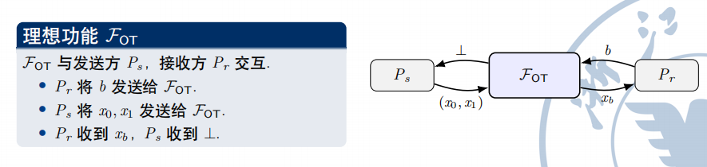
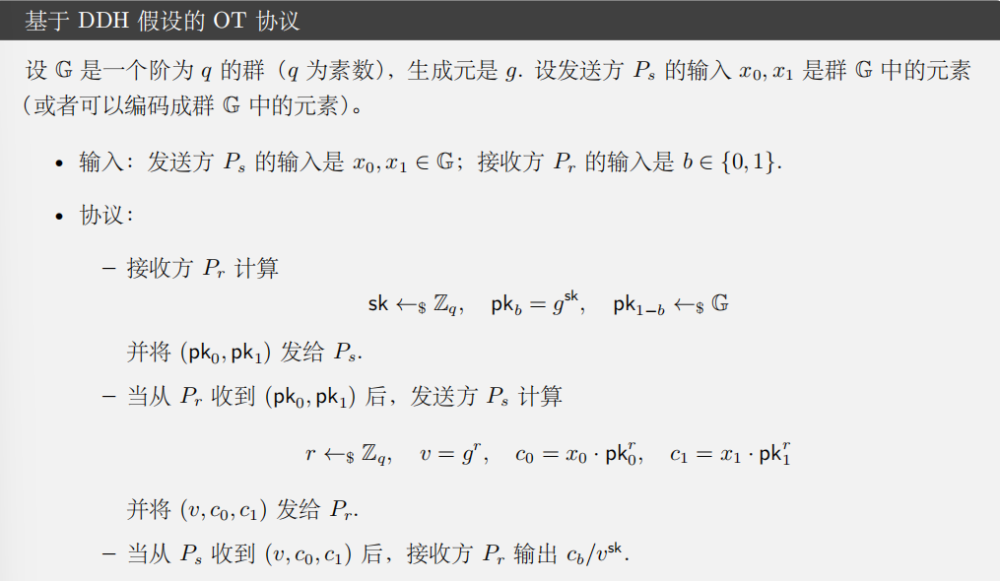
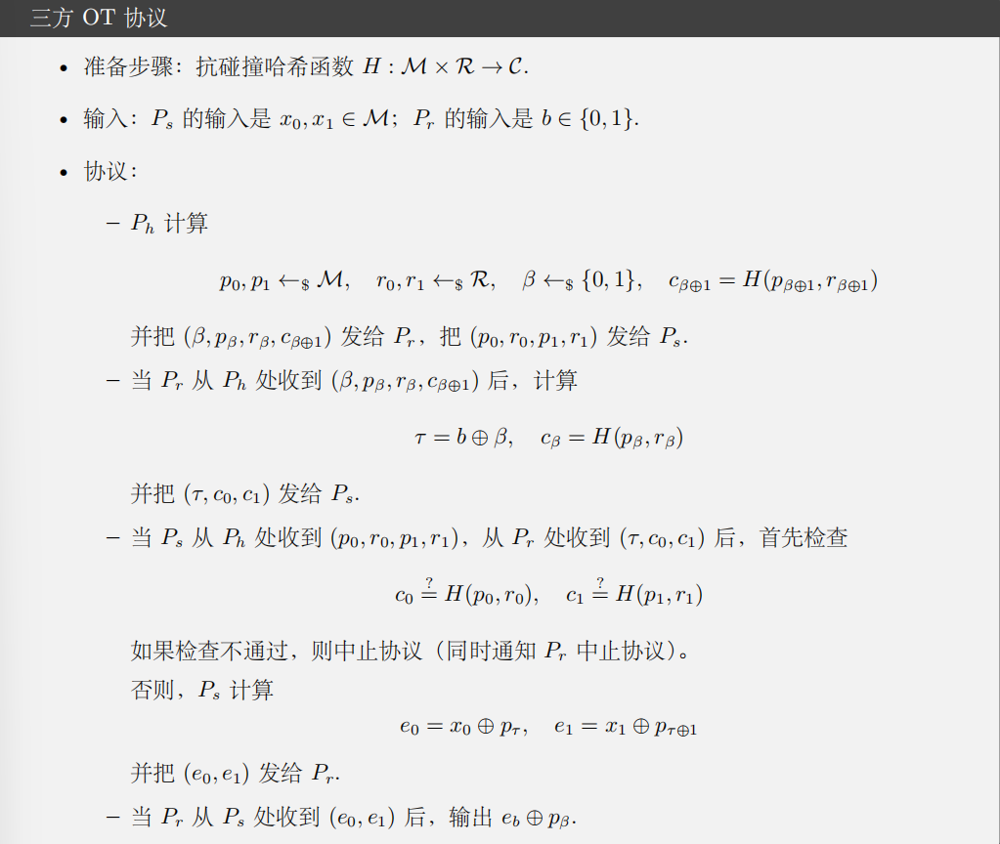

!!! abstract Summary
    章节介绍：
    1.OT 简介及关于 OT 重要的已知结论
    2.介绍两个基础的 OT 构造，分别可以抵御**半诚实敌手**和**恶意敌手**
    3.IKNP 提出的茫然传输扩展协议

## 1.茫然传输简介

- 茫然传输(Oblivious Transfer, 下称OT)：现代密码学**最基础且最重要的**原语(Promitive)之一。是构建 MPC 的基石。

### 1.1 核心定义

- OT 是一个两方协议，包含接收方和发送方两个参与方。

- 解决场景：接收方希望从发送方的**多条消息**当中选择一条读取，但**双方都有保护隐私的需求**

- 举例：1-out-of-2 OT
    - 输入：
        - 发送方 S 拥有两条消息 $M_0$ 和 $M_1$
        - 接受方 R 拥有一个选择位：$c \in {0,1}$
    - 目标：
        - 接收方 R 最终获得 $M_c$ 

    - 安全约束
        - 发送方隐私：发送方 S 无法知道接收方选择了哪一条消息
        - 接收方隐私：接收方 R 只能获得 $M_c$，而不能获得 $M_{1-c}$

### 1.2 理想功能

!!! abstract "理想功能"
    - 在密码学中，我们经常使用理想功能(Ideal Functionality)来定义原语
    - 一个理想功能**刻画了协议所希望实现的效果**
    - 它类似于一个**可信第三方**的角色：它接受所有参与方的输入，执行正确的计算，并
    将输出私密地发给参与方
    - 一个功能描述了协议所期望达到的**正确性**和**隐私性**

## 2.重要结论

### 2.1 不存在信息论安全的两方 AND 协议

- 信息论安全：安全性**不依赖计算困难假设**
    - 即使攻击者有**无限算力**，也不能破坏安全性
    - 比如 one-time-pad 就是信息论安全的，因为密文没有邪路铭文的任何信息

- 计算安全：理论上可破解，但是现实当中没有这么强大的算力
    - 恢复秘密需要极大的计算量

!!! abstract "两方 AND 协议"
    - Aice 有一个比特 a $\in {0,1}$
    - Bob 有一个比特 b $\in {0,1}$
    - 协议结束之后，双方收到 $a \land b$ 的结果
    - 安全性要求：Alice 和 Bob 都不能知道更多关于对方选取的比特的信息 

- 证明：
    - 1.假设存在两方 AND 协议 $\prod 2AND$ 满足**完美隐私性**和**完美正确性**。
        - 设 $\prod 2AND$ 有 s 轮通信，其中 $s \geq 1$，将参与方记作 $P_0$ 和 $P_1$，他们的输入记作 $b_0$ 和 $b_1$，$\prod 2AND$ xuu要完美的正确性，即协议总是输出 $y = b_0 \land b_1$；$\prod 2AND$ 还需要完美隐私性，也就是说，当 $P_i$ 被攻陷的时候，他的视图 $view_i$ 只依赖于 $b_i$ 和 y，而与另一方的输入无关。
        - 用 $\mathcal{T}(c,d)$ 表示当 $b_0 = c$, $b_1 = d$ 时，$\prod 2AND$ 执行过程中可能产生的消息集合.常见格式是 $\mathcal{T} = (m_{01}​,m_{11}​,…,m_{0s}​,m_{1s}​,y)$，**包含 s 轮的每一轮中 $P_0$ 和 $P_1$ 发送的消息**。
    
    !!! abstract "Background"
        - 你可能会有一个疑问：为什么在输入相同，比如 (1,0) 的时候，会有不同的 $\mathcal{T}$，即不同的通信信息出现呢？
        - 原因在于大部分的协议都是**随机化协议**。也就是说，参与方除了输入之外，还会使用自己私有的随机数（random coins）来决定发送什么消息。如果协议是完全确定性的，那么显然无法做到隐私性。

    - 2.证明断言：$\mathcal{T}(0,0)$ = $\mathcal{T}(0,1)$
        - 我们考虑的是信息论安全，所以敌手具有无限的计算能力可以遍历随机空间来计算 $\mathcal{T}(0,0)$ 和 $\mathcal{T}(0,1)$，假设存在 $\mathcal{T}'$ 满足 $\mathcal{T}' \in \mathcal{T}(0,0)$ 且 $\mathcal{T}' \notin \mathcal{T}(0,1)$
        - 那么当两个参与方以 $b_0 = 0, b_1 = 0$ 执行协议的时候，$P_0$ 就有可能看到消息集合 $\mathcal{T}'$。
        - 如果 $P_0$ 被攻陷，那攻击者就可以判断 $\mathcal{T}'$ 不是 $\mathcal{T}(0,1)$ 当中的元素，从而断定 $b_1 = 0$，这违背了 $\prod 2AND$ 完美隐私性。
        - 所以 $\mathcal{T}(0,0)$ = $\mathcal{T}(0,1)$ 在此前提下成立
    - 3.同样的，我们可以证明 $\mathcal{T}(0,0)$ = $\mathcal{T}(1,0)$
    - 4.证明断言：$\mathcal{T}(0,0) \cap \mathcal{T}(0,1) \subset \mathcal{T}(1,1)$
        - 这是一个比较抽象的证明。
        - 令 $\mathcal{T} = (m_{01},m_{11},...,m_{0s},m_{1s},y)$，如果 $\mathcal{T} \in \mathcal{T}(0,1) \cap \mathcal{T}(1,0)$
        - 首先，根据 $\mathcal{T} \in \mathcal{T}(0,1)$ 可知，存在随机数 $r_1$ 使得 $P_1$ 以 $b_1$ 和 $r_1$ 作为输入运行协议且收到的消息是 ${m_{0i}}_{i \in [s]}$ 时，会得到 $\mathcal{T}$；
        - 又因为 $\mathcal{T} \in \mathcal{T}(1,0)$，存在随机数 $r_0$ 使得 $P_0$ 以 $b_0$ 和 $r_0$ 作为输入运行协议且收到的消息是 ${m_{1i}}_{i \in [s]}$ 时，会得到 $\mathcal{T}$。
        - 那么，当** $P_0$ 和 $P_1$ 以 $b_0 = 1$，$b_1 = 1$ 以及 $r_0, r_1$ 作为输入运行协议时，也会得到 $\mathcal{T}$，即 $\mathcal{T} \in \mathcal{T}(1,1)$**
        - 因此 $\mathcal{T}(0,0) \cap \mathcal{T}(0,1) \subset \mathcal{T}(1,1)$
    - 5.基于前两个断言，我们有：$\mathcal{T}(0,0) \cap \mathcal{T}(0,1) = \mathcal{T}(0,0)$，在结合断言 3，我们可以得到 $\mathcal{T}(0,0) \subset \mathcal{T}(1,1)$。但是在两方 AND 协议当中，(0,0) 会得到 0，(1,1) 会得到 1，因此 $\mathcal{T}(0,0) \cap \mathcal{T}(0,1) = \mathcal{T}(0,0)$ 是不可能成立的，所以假设错误，不可能存在两方 AND 协议满足**完美隐私性和完美正确性**
    - 6.如果 $\prod 2AND$ 的隐私性和正确性有可忽略的失败概率，那么在断言 1 和 2 当中，$\mathcal{T}(0,0)$ 和 $\mathcal{T}(0,1)$ 以及 $\mathcal{T}(0,0)$ 和 $\mathcal{T}(1,0)$ 都有可忽略的统计距离，断言 3 依然成立，依然可以推出矛盾。因此不存在信息论安全的两方 AND 协议。
        

### 2.2 不存在信息论安全的两方 OT 协议

- 证明思路：
    - 1.通过两方 OT 构造一个两方 AND 协议
    - 2.证明不存在信息论安全的两方 AND 协议
    - 本质上是一个**归约法**：如果存在信息论安全的两方 OT，那么就存在信息论安全的两方 AND。但因为不存在信息论安全的两方 AND，所以也不存在信息论安全的两方 OT。 

- 证明：
    - 1.首先我们通过两方 OT 协议构造一个两方 AND 协议。
        - 在两方 OT 协议当中，$P_s$ 输入为 $x_0,x_1$，$P_r$ 输入为 $b \in {0,1}$，receiver 会得到 $x_b$，观察可得：$x_b = (1 \oplus b)x_b \oplus bx_1$
        - 在两方 AND 协议当中，两个参与方执行两方 OT 协议，分别充当 $P_s$ 和 $P_r$。令 $P_s$ 的输入为：$x_0 = 0,x_1 = a$，接收方 $P_r$ 的输入为 b，根据 $x_b = (1 \oplus b)x_b \oplus bx_1$ 可知协议的输出为 ab，即 $a \land b$。
    
    - 2.如果存在信息论安全的两方 OT 协议，那么这个构造出来的两方 AND 协议也是信息论安全的。
        - 发送方被攻陷：根据 OT 协议中接收方的隐私性，发送方不知道 b 的值
        - 接收方被攻陷：接收方不知道 $x_{1-b}$ 的信息

    - 3.因为不存在信息论安全的两方 AND 协议，使用归约法可知，不存在信息论安全的两方 OT 协议，故得证。

### 2.3 小结
- 综上，我们可以通过两方 OT 协议构造两方 AND 协议。而引理证明了不存在信息论安全的两
方 AND 协议。因此，通过归约法定理得证。
- 需要注意的是，这里我们证明了不存在**对发送方和接收方均满足信息论安全**的 OT 协议。但是，构造一个当接收方被攻陷时满足信息论安全，当发送方被攻陷时满足计算安全的 OT 协议，或者当发送方被攻陷时满足信息论安全，当接收方被攻陷时满足计算安全的 OT 协议，都是已经被实现的。

### 2.4 一些其他结论

- 1.OT 是**完备**的，即基于 OT 可以安全地计算任何函数。
- 2.OT 是**对称**的，即基于 OT 可以构造 OT′，其中 OT′ 的发送方是 OT 的接收方，OT′ 的接收方是 OT 的发送方。
- 3.不能以黑盒的方式基于公钥加密 (Public Key Encryption, PKE) 构造 OT
- 4.OT 可以基于增强陷门置换 (enhanced trapdoor permutation)、DDH 假设、RSA 假设、格密码构造。

## 3.OT 变种

### 3.1 Rabin OT

- Rabin OT 也被称为 **all-or-nothing OT**

- 参与者设定
    - 发送方 S 拥有一条消息 m
    - 接收方 R 没有选择位

- 协议目标
    - 接收方 R 以 $\frac{1}{2}$ 的概率得到 m
    - 接收方 R 以 $\frac{1}{2}$ 的概率什么都得不到，记作 $\perp$
    - 发送方 S 不知道 R 最后到底有没有成功得到 m

- 安全性要求
    - 接收方隐私：S 不知道 R 的接收结果
    - 发送方隐私：如果 R 没有收到 m，那么 R 不能获得关于 m 的信息

!!! abstract "直觉"
    - Rabin OT 的重点不在于“接收方选择哪一条消息”
    - 它更像是发送方把一条消息发出去，但是消息会以某个概率丢失，而且发送方不知道是否丢失
    - 所以它刻画的是一种**发送成功与否对发送方茫然**的传输过程

### 3.2 Random OT

- Random OT 通常指 Random 1-out-of-2 OT，也可以记作 ROT

- 与标准 1-out-of-2 OT 的区别
    - 标准 OT：发送方自己选择两条消息 $M_0,M_1$
    - Random OT：两条消息不是由发送方指定的，而是由协议随机生成

- 参与者设定
    - 接收方 R 拥有选择位 $c \in {0,1}$
    - 协议随机生成两条消息 $R_0,R_1$

- 协议目标
    - 发送方 S 得到两条随机消息 $R_0,R_1$
    - 接收方 R 得到其中一条 $R_c$
    - S 不知道 R 选择了哪一条
    - R 不知道 $R_{1-c}$

- Random OT 的意义
    - 可以看作是一种 **OT preprocessing**
    - 在线阶段真正要传输消息时，只需要把随机 OT 产生的随机串当成 one-time-pad 使用
    - 这也是 OT extension 中很常见的思路：先生成大量随机相关性，再把它们转换成真正需要的 OT

### 3.3 OT 变种的等价性

- Rabin OT、Random OT 和标准 1-out-of-2 OT 在多项式开销下是**等价**的
    - 这里的等价不是说三个功能完全一样
    - 而是说：如果我们有其中一种 OT 功能，就可以通过协议构造出另一种 OT 功能

#### 3.3.1 标准 OT $\Rightarrow$ Rabin OT

- 构造思路：
    - S 在标准 OT 中输入两条消息：$M_0 = m, M_1 = \perp$
    - R 随机选择一个比特 $c \in {0,1}$
    - 如果 $c = 0$，R 得到 m
    - 如果 $c = 1$，R 得到 $\perp$

- 安全性直觉
    - 因为标准 OT 保护接收方的选择位，所以 S 不知道 R 选的是 0 还是 1
    - 因此 S 不知道 R 是否成功得到 m
    - 如果 R 选到 $\perp$，它也不能推出 m 的内容

#### 3.3.2 标准 OT $\Rightarrow$ Random OT

- 构造思路：
    - S 随机采样两条消息 $R_0,R_1$
    - S 和 R 执行一次标准 OT
    - R 输入选择位 c，并最终得到 $R_c$

- 观察
    - 因为 $R_0,R_1$ 本身就是随机采样的，所以这就实现了 Random OT
    - 标准 OT 的安全性直接保证 S 不知道 c，R 不知道 $R_{1-c}$

#### 3.3.3 Random OT $\Rightarrow$ 标准 OT

- 假设我们已经有一次 Random OT
    - S 得到随机串 $R_0,R_1$
    - R 根据选择位 c 得到 $R_c$

- 现在 S 想通过标准 OT 发送真正的消息 $M_0,M_1$

- 构造：
    - S 计算两个密文
        - $C_0 = M_0 \oplus R_0$
        - $C_1 = M_1 \oplus R_1$
    - S 将 $C_0,C_1$ 公开发送给 R
    - R 使用自己拥有的 $R_c$ 解密
        - $M_c = C_c \oplus R_c$

- 安全性直觉
    - R 只知道 $R_c$，不知道 $R_{1-c}$，所以只能解出 $M_c$
    - $C_{1-c}$ 对 R 来说相当于是 one-time-pad 加密后的密文
    - S 在 Random OT 阶段不知道 c，因此在转换成标准 OT 后也不知道 R 选择了哪条消息

#### 3.3.4 Rabin OT $\Rightarrow$ 标准 OT

- 构造直觉：
    - 多次调用 Rabin OT，让 S 发送一批随机密钥 $K_1,K_2,...,K_n$
    - R 会随机得到其中一部分密钥，而 S 不知道 R 具体拿到了哪些
    - R 根据自己的选择位 c，把这些密钥下标分成两组 $I_0,I_1$
        - $I_c$：R 知道这一组里所有密钥
        - $I_{1-c}$：R 至少缺少这一组里的一个密钥
        - 两组大小保持一致，避免通过集合大小泄露 c
    - R 将 $I_0,I_1$ 发给 S

- S 使用这两组密钥分别加密 $M_0,M_1$

$$
C_0 = M_0 \oplus \bigoplus_{i \in I_0}K_i
$$

$$
C_1 = M_1 \oplus \bigoplus_{i \in I_1}K_i
$$

- 安全性直觉
    - R 知道 $I_c$ 中所有密钥，因此可以解出 $M_c$
    - R 缺少 $I_{1-c}$ 中至少一个密钥，因此无法解出 $M_{1-c}$
    - 因为 Rabin OT 保证 S 不知道 R 到底收到了哪些密钥，所以 S 无法判断哪一组是 R 能解开的，也就不知道 c

!!! abstract Tips
    - Rabin OT 到标准 OT 的转换通常需要多次 Rabin OT 调用
    - 调用次数越多，R 恰好无法构造合适下标集合的失败概率就越低
    - 所以这里的等价性一般理解为**多项式开销下的可构造等价**

!!! abstract Summary
    - Rabin OT：接收方以一定概率得到一条消息，发送方不知道是否成功
    - Random OT：协议先随机生成 OT 消息，常用于预处理
    - 标准 OT：发送方指定两条消息，接收方选择其中一条
    - 这些变种在构造能力上基本等价，因此研究某一种 OT 的构造时，通常也可以转化为其他 OT 形式

## 4.基于 DDH 假设的半诚实安全 OT 协议

### 4.1 DDH 假设回顾

### 4.2 协议描述

### 4.3 安全性

#### 4.3.1 安全性直观说明

#### 4.3.2 安全性证明

## 5.恶意安全的三方 OT 协议（了解即可）

## 5.IKNP OT 扩展协议