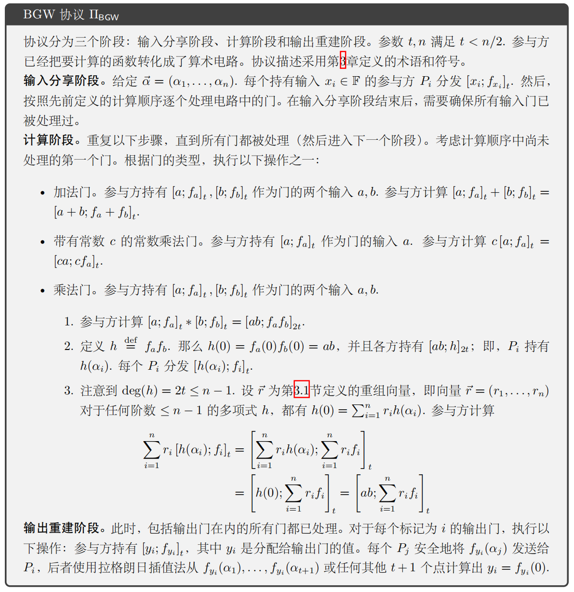
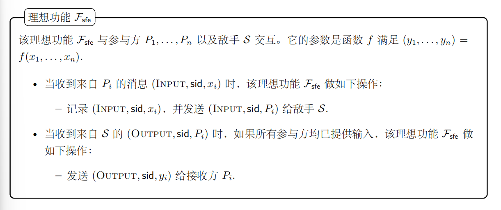

!!! abstract Summary
    - 现在我们已经拥有了框架（UC）和传输工具（OT），在笔记的 7，8，9 课（对应教材的6，7，8 章）中介绍 3 种半诚实安全的安全多方计算协议，在教材的第 9 章中我们使用零知识证明、切分选择、可验证秘密分享、MAC 把这三个协议分别打造成可以抵御恶意安全的协议，这也是整本教材的大致思路 
    - 本课主要关注两类基于线性秘密分享的协议：BGW 使用 Shamir 秘密分享，GMW 使用加法秘密分享；两者的共同点是线性门本地计算，难点都集中在乘法门 / 与门。

## 1.BGW 协议（半诚实安全）

### 1.1 协议描述

- 由 Ben-Or，Goldwasser，Wigderson 提出的著名 BGW 协议的**半诚实安全版本**

### 1.2 协议功能
- 正确、安全、秘密地计算一个函数：$f(x_1,x_2,...,x_n) = (y_1,y_2,...y_n)$
- 每个参与方都只提供自己的输入，得到自己的输出，并且在过程中对其他参与方的输入和输出不可见
  
### 1.3 理想功能 $\mathcal{F}_{sfe}$

### 1.4 安全性证明
- 此前我们已经做了一个很接近于形式化证明的安全性分析，假设被攻陷方的数量为 t. 安全性分析基于两个观察：
    - (1) 在输入分享阶段和计算乘法门时，被攻陷方收到的 t 个份额只是均匀随机值。
    - (2) 在输出重建阶段，被攻陷方收到的诚实方份额可以根据已有的份额和输出值计算出来
- 接下来给出在 UC 框架下的形式化证明

- 定理：假设参与方之间存在点对点安全信道。假设被攻陷方数量不超过 t, t < n/2，$\Pi_{BGW}$ 对于**静态半诚实敌手** UC-安全实现了理想功能 $\mathcal{F}_{sfe}$

- 证明：（完成的证明步骤可以参考教材 Chapter 6 相关内容）
    - 基本思路：我们可以把环境 $\mathcal{Z}$ 看成一个**挑战者**，挑战在于区分真实世界和理想世界的协议运行。在真实世界当中，n 个参与方跑 BGW 协议，$\mathcal{Z}$ 可以看到被攻陷方所能看到的一切；在理想世界中，计算过程全部交给理想功能 $\mathcal{F}_{sfe}$，$\mathcal{S}$ 伪造 $\mathcal{Z}$ 本应该接收到的来自被攻陷方的视图。$\mathcal{Z}$ 需要在协议运行结束之后分辨理想世界和现实世界，如果优势可忽略，那么就说明 BGW 协议是 UC-安全的。
    - 其中的关键是 $\mathcal{S}$ 的行为，在理想世界当中，$\mathcal{S}$ 并不知道诚实参与者的真实输入（这些输入只存在于 $\mathcal{Z}$ 和理想功能 $\mathcal{F}$ 当中），但需要让被攻陷方相信**协议正在运行**。实现的方式就是通过 Shamir 秘密分享的性质：小于等于 t 个份额不会透露关于秘密的任何信息，下面是 $\mathcal{S}$ 的具体操作：
        - （1）输入分享阶段：对于诚实方的输入，因为 $\mathcal{S}$ 并不知道诚实方的输入，所以被攻陷方收到的都是 秘密等于 0 的秘密份额，因为被攻陷方数量被限制在小于等于 t，所以；被攻陷方的输入 $\mathcal{S}$ 本身就知道，照实分享就可以
        - （2）加法门、常数乘法门：被攻陷方用自己手上的份额在本地计算就行
        - （3）乘法门：此时需要交互，所以 $\mathcal{S}$ 只要模仿诚实方分发 0 的份额就可以，被攻陷方依然分辨不出
        - （4）输出重建：要是按照 $\mathcal{S}$ 之前无脑分发 0 的份额的逻辑进行到最后，会重建出来很多 0，会被识破。此时 $\mathcal{S}$ 会向理想功能 $\mathcal{F}_{sfe}$ 请求真正的输出 $y_i$，然后 $\mathcal{S}$ 确定一条满足以下两个条件的多项式 $f_{y_i}$：a.在 0 点的取值正好是真正的秘密 $y_i$；b.和被攻陷方手里已有的份额匹配。最后把诚实方在真实世界当中需要分发的份额 $f_{y_i}(\alpha_j)$（诚实方 $P_j$ 持有的 $P_i$ 所需要的秘密 $y_i$ 的份额）根据算出的多项式补好、分发，就完整地模仿了真实世界当中的行为。
    - 然后问题就是证明 $\mathcal{Z}$ 在真实世界和理想世界的视图存在**不可区分性**。我们通过两个函数和两个引理来证明：

### 1.5 Strip(), Dress() 与两个关键引理

!!! abstract "证明目标"
    - 真实世界中，被攻陷方看到的是自己在 BGW 协议里的真实视图。
    - 理想世界中，模拟器 $\mathcal{S}$ 不知道诚实方输入，只能用 0 来模拟协议过程，然后在输出重建时把结果“补”成真实输出。
    - Strip 和 Dress 的作用，就是把这件事拆成两个好证明的小步骤。

#### 1.5.1 Strip 函数

- 设 $C$ 是被攻陷方集合，$P_i \in C$。

- $Strip(view_i)$ 的输入是被攻陷方 $P_i$ 的完整视图，输出是一个“删减后的视图”。

- 它会**移除**：
    - 输出重建阶段中，来自诚实方的输出份额。

- 它会**保留**：
    - $P_i$ 自己的输入 $x_i$。
    - $P_i$ 自己做出的随机选择。
    - 输入分享阶段收到的份额。
    - 计算乘法门时收到的份额。
    - 输出重建阶段中来自其他被攻陷方的份额。

!!! abstract 直觉
    - Strip 就是先把最敏感、最容易和真实输出发生关系的那部分删掉。
    - 删掉之后，剩下的东西基本都是 Shamir 秘密分享给出的随机份额，所以更容易证明“和诚实方真实输入无关”。

#### 1.5.2 引理 1：Strip 后的视图与诚实方输入无关

- 引理 1：令 $C \subset \{P_1,\dots,P_n\}$ 是被攻陷方集合，且 $|C|\le t$。考虑两个输入向量：

$$
\vec{x}^{(0)}=(x_1^{(0)},\dots,x_n^{(0)})
$$

$$
\vec{x}^{(1)}=(x_1^{(1)},\dots,x_n^{(1)})
$$

- 如果它们在所有被攻陷方的输入上相同，即对于所有 $P_i\in C$：

$$
x_i^{(0)}=x_i^{(1)}
$$

- 令 $view_i^{(b)}$ 表示以输入 $\vec{x}^{(b)}$ 运行 BGW 协议时，$P_i$ 得到的视图，其中 $b\in\{0,1\}$。那么：

$$
\{Strip(view_i^{(0)})\}_{P_i\in C}
\overset{perf}{=}
\{Strip(view_i^{(1)})\}_{P_i\in C}
$$

- 证明思路：
    - 输入分享阶段：被攻陷方自己的输入相同；诚实方输入即使不同，被攻陷方最多只拿到 $t$ 个 Shamir 份额，这些份额是均匀随机的。
    - 加法门、常数乘法门：不需要交互，不产生新的消息。
    - 乘法门：诚实方重新分发的份额对被攻陷方来说仍然是均匀随机的，且数量不超过 $t$。
    - 输出重建阶段：Strip 已经删掉了来自诚实方的输出份额，所以这一阶段不会影响 Strip 后的分布。

- 所以，Strip 后的视图只和被攻陷方自己的输入有关，和诚实方的真实输入无关。

#### 1.5.3 Dress 函数

- $Dress_{\vec{y}_C}$ 用来把 Strip 删掉的部分重新补回来。

- 其中：

$$
\vec{y}_C=\{y_i\}_{P_i\in C}
$$

表示被攻陷方应该获得的真实输出。

- $Dress_{\vec{y}_C}$ 的输入是：

$$
\{Strip(view_i)\}_{P_i\in C}
$$

- 它要补回的是：输出重建阶段中，诚实方发给被攻陷方的那些份额。

- 对每个被攻陷方 $P_i\in C$ 的输出 $y_i$，Dress 构造一个 $t$ 阶多项式 $f_{y_i}$，满足：
    - $f_{y_i}(0)=y_i$。
    - $f_{y_i}$ 与被攻陷方已有的输出份额一致。

- 构造方式：
    - 如果 $|C|=t$：用 $y_i$ 和 $t$ 个被攻陷方已知份额，通过拉格朗日插值唯一确定 $f_{y_i}$。
    - 如果 $|C|<t$：先随机选择 $t-|C|$ 个诚实方份额，再用这些点、被攻陷方已有份额和 $y_i$ 插值得到 $f_{y_i}$。

- 最后，对每个诚实方 $P_j\notin C$，把：

$$
f_{y_i}(\alpha_j)
$$

作为 $P_j$ 在输出重建阶段发给 $P_i$ 的份额补回去。

!!! abstract 直觉
    - Dress 就像模拟器在输出阶段做的“补妆”：前面可以全用 0 来假装协议在运行，最后只要根据真实输出补出一条合适的多项式，被攻陷方就看不出破绽。

#### 1.5.4 引理 2：Dress 能恢复真实视图的分布

- 引理 2：令 $C$ 是被攻陷方集合，$|C|\le t$。设真实输入为 $\vec{x}$，真实输出为：

$$
(y_1,\dots,y_n)=f(\vec{x})
$$

- 令：

$$
\vec{y}_C=\{y_i\}_{P_i\in C}
$$

- 如果 $view_i$ 是真实运行 BGW 协议时 $P_i$ 的视图，那么：

$$
Dress_{\vec{y}_C}(\{Strip(view_i)\}_{P_i\in C})
\overset{perf}{=}
\{view_i\}_{P_i\in C}
$$

- 证明思路：
    - 根据 BGW 正确性，输出重建阶段确实是在重建真实输出 $y_i$。
    - 如果 $|C|=t$，那么 $y_i$ 加上被攻陷方已知的 $t$ 个份额已经唯一确定 $t$ 阶多项式，所以 Dress 补出的份额和真实份额一致。
    - 如果 $|C|<t$，Dress 随机补的 $t-|C|$ 个诚实方份额，与真实协议中这些份额一样都是均匀随机的。
    - 一旦补足 $t+1$ 个点，剩余份额就由拉格朗日插值唯一确定，因此 Dress 补出的完整分布和真实输出重建阶段一致。

#### 1.5.5 联合证明

- 真实世界：诚实方使用真实输入 $\vec{x}$ 执行 BGW，得到真实视图：

$$
\{view_i\}_{P_i\in C}
$$

- 理想世界：模拟器把诚实方输入替换成 0，记这个输入向量为 $\vec{x}^{(0)}$：
    - 被攻陷方输入保持不变。
    - 诚实方输入全部设为 0。

- 根据引理 1：

$$
\{Strip(view_i^{(0)})\}_{P_i\in C}
\overset{perf}{=}
\{Strip(view_i)\}_{P_i\in C}
$$

- 因为对两个分布应用同一个算法 Dress，不会增加它们的统计距离，所以：

$$
Dress_{\vec{y}_C}(\{Strip(view_i^{(0)})\}_{P_i\in C})
\overset{perf}{=}
Dress_{\vec{y}_C}(\{Strip(view_i)\}_{P_i\in C})
$$

- 根据引理 2：

$$
Dress_{\vec{y}_C}(\{Strip(view_i)\}_{P_i\in C})
\overset{perf}{=}
\{view_i\}_{P_i\in C}
$$

- 所以理想世界中模拟出来的视图和真实世界的视图**完全同分布**。

!!! abstract "最终结论"
    - Strip 证明：前半段协议视图和诚实方输入无关。
    - Dress 证明：只要知道被攻陷方输出，就能把输出重建阶段补得和真实世界一样。
    - 两者合起来说明：环境 $\mathcal{Z}$ 无法区分真实世界和理想世界，因此 BGW 在该模型下 UC-安全。

## 2.GMW 协议（半诚实安全）

### 2.1 协议概览

- GMW 协议由 Goldreich、Micali、Wigderson 提出，是一个基于**加法秘密分享**的通用 MPC 协议。

- 和 BGW 的区别：
    - BGW：使用 Shamir 秘密分享，可以做到信息论安全，但要求 $t < n/2$。
    - GMW：使用加法秘密分享，可以容忍最多 $n-1$ 个被攻陷方，但需要调用 OT / OLE，所以安全性依赖底层工具。

- GMW 可以用于：
    - 布尔电路：导线值是比特，线性运算是 $\oplus$，非线性门是 AND。
    - 算术电路：导线值是有限域 $\mathbb{F}$ 上的元素，线性运算是 $+$，非线性门是乘法。

!!! abstract 直觉
    - GMW 的核心思路非常朴素：每根导线上的值都被拆成若干个份额，参与方永远只拿着自己的那一片。
    - 线性门可以直接在份额上计算；非线性门会产生“交叉项”，这时就需要 OT 或 OLE 帮忙安全地算出这些交叉项的份额。

## 3.布尔电路 GMW 协议

### 3.1 加法秘密分享

- 对一个比特 $x \in \{0,1\}$，GMW 使用异或意义下的加法秘密分享：

$$
x = s_1 \oplus s_2 \oplus \cdots \oplus s_n
$$

- 参与方 $P_\ell$ 持有自己的份额 $s_\ell$。

- 如果任意缺少一个份额，那么剩下的 $n-1$ 个份额看起来都是随机的，所以这种分享方式可以抵抗最多 $n-1$ 个半诚实被攻陷方。

### 3.2 输入分享

- 对于参与方 $P_i$ 的输入比特 $x_{i,k}$：
    - $P_i$ 随机选择 $r^1_{i,k},...,r^n_{i,k}$，使得：

$$
r^1_{i,k} \oplus \cdots \oplus r^n_{i,k} = x_{i,k}
$$

- 然后把 $r^\ell_{i,k}$ 发给 $P_\ell$。

- 此后每根输入导线上的值都以秘密份额的形式存在。

### 3.3 NOT 门和 XOR 门

- 假设导线 $w_i$ 的份额为：

$$
w_i = s^1_i \oplus \cdots \oplus s^n_i
$$

- NOT 门：只需要让一个参与方翻转自己的份额，例如：

$$
s^1_k = s^1_i \oplus 1,\quad s^\ell_k = s^\ell_i,\ \ell \neq 1
$$

- XOR 门：每个参与方本地异或自己的份额：

$$
s^\ell_k = s^\ell_i \oplus s^\ell_j
$$

!!! abstract 为什么线性门简单
    - 异或秘密分享本质上就是线性结构。
    - 只要目标运算能拆到每个参与方自己的份额上做，协议就不需要交互。

### 3.4 AND 门

- AND 门是布尔 GMW 的核心难点。

- 两方情况下，设：

$$
w_i = s^1_i \oplus s^2_i,\quad w_j = s^1_j \oplus s^2_j
$$

- 输出为：

$$
w_k = w_i \land w_j
$$

- 从 $P_1$ 的角度看，$P_2$ 的两个输入份额 $(s^2_i,s^2_j)$ 有 4 种可能。

- 协议做法：
    - $P_1$ 为这 4 种可能分别准备一个输出份额。
    - $P_1$ 选择随机掩码 $r$。
    - $P_1$ 和 $P_2$ 运行 1-out-of-4 OT，让 $P_2$ 只拿到自己输入份额对应的那一项。
    - 最后 $P_1$ 持有 $r$，$P_2$ 持有 $r \oplus (w_i \land w_j)$，两者异或起来就是 AND 门输出。

- 多方情况下也是同一个思想，只是要把：

$$
(s^1_i \oplus \cdots \oplus s^n_i)\land(s^1_j \oplus \cdots \oplus s^n_j)
$$

展开成很多本地项和交叉项：
    - $s^\ell_i \land s^\ell_j$：参与方 $P_\ell$ 可以本地计算。
    - $s^{\ell_1}_i \land s^{\ell_2}_j$：需要 $P_{\ell_1}$ 和 $P_{\ell_2}$ 通过 OT 安全计算。

!!! abstract "AND 门的重点"
    - AND 门不是直接重建输入，而是用 OT 让参与方拿到“正确的输出份额”。
    - OT 的选择隐私保护接收方的份额，OT 的消息隐私保护发送方准备的其他情况。

### 3.5 输出重建

- 对于要输出给 $P_i$ 的输出比特 $y_{i,k}$：
    - 其他参与方把自己对应的输出份额发给 $P_i$。
    - $P_i$ 计算：

$$
y_{i,k}=s^1_{i,k}\oplus \cdots \oplus s^n_{i,k}
$$

## 4.算术电路 GMW 协议

### 4.1 从 OT 到 OLE

- OLE(Oblivious Linear Evaluation)：茫然线性运算

- 算术电路中，导线值不再是比特，而是有限域 $\mathbb{F}$ 上的元素。

- 此时秘密分享变成：

$$
x = s_1 + s_2 + \cdots + s_n
$$

- 线性门依然可以本地计算；乘法门需要处理有限域上的交叉项，因此用 OLE 替代 OT。

- OLE（Oblivious Linear Evaluation）的理想功能：
    - 发送方输入 $\alpha,\beta \in \mathbb{F}$。
    - 接收方输入 $x \in \mathbb{F}$。
    - 接收方得到：

$$
\gamma = \alpha x + \beta
$$

- 发送方没有输出。

!!! abstract OLE
    - OT 是“从几条消息里茫然地选一条”。
    - OLE 是“茫然地算一次线性函数”：接收方拿到 $\alpha x+\beta$，但发送方不知道 $x$，接收方也不知道 $\alpha,\beta$。

### 4.2 线性门

- 假设：

$$
w_i=s^1_i+\cdots+s^n_i,\quad w_j=s^1_j+\cdots+s^n_j
$$

- 加法门：

$$
s^\ell_k=s^\ell_i+s^\ell_j
$$

- 常数乘法门：

$$
s^\ell_k=\alpha s^\ell_i
$$

- 常数加法门：只让一个参与方加常数，例如：

$$
s^1_k=s^1_i+\alpha,\quad s^\ell_k=s^\ell_i,\ \ell \neq 1
$$

### 4.3 乘法门

- 乘法门输入为 $w_i,w_j$，输出为：

$$
w_k=w_iw_j
$$

- 展开：

$$
w_iw_j=(s^1_i+\cdots+s^n_i)(s^1_j+\cdots+s^n_j)
$$

- 其中：
    - 本地项 $s^\ell_i s^\ell_j$ 可以由 $P_\ell$ 自己计算。
    - 交叉项 $s^{\ell_1}_i s^{\ell_2}_j$ 需要 $P_{\ell_1}$ 和 $P_{\ell_2}$ 通过 OLE 生成秘密份额。

- 对一个交叉项，$P_{\ell_1}$ 随机选择 $r_{\ell_1,\ell_2}$，然后作为 OLE 发送方输入：

$$
\alpha=s^{\ell_1}_i,\quad \beta=-r_{\ell_1,\ell_2}
$$

- $P_{\ell_2}$ 作为接收方输入：

$$
x=s^{\ell_2}_j
$$

- OLE 输出给 $P_{\ell_2}$：

$$
\gamma_{\ell_1,\ell_2}=s^{\ell_1}_i s^{\ell_2}_j-r_{\ell_1,\ell_2}
$$

- 于是 $r_{\ell_1,\ell_2}$ 和 $\gamma_{\ell_1,\ell_2}$ 构成了这个交叉项的加法秘密分享。

- 最后每个参与方把自己负责的本地项和交叉项份额加起来，得到乘法门输出份额。

!!! abstract "乘法门的重点"
    - GMW 不是让大家知道交叉项的值，而是让交叉项继续保持“被分享”的状态。
    - 这样每计算完一个门，输出仍然是一组秘密份额，可以继续进入下一层电路。

## 5.GMW 的安全性

### 5.1 布尔电路版本

- 定理：假设被攻陷方数量不超过 $n-1$，布尔电路 GMW 协议在 $\mathcal{F}_{OT}^{1\text{-}4}$-混合模型下，对于**静态半诚实敌手** UC-安全实现 $\mathcal{F}_{sfe}$。

- 证明思路和 BGW 类似：
    - 输入分享阶段：被攻陷方看到的诚实方份额是均匀随机值。
    - NOT / XOR 门：全是本地计算，不产生新泄露。
    - AND 门：OT 中加入随机掩码，被攻陷方拿到的仍然是随机份额；OT 的安全性保证选择和未选消息不泄露。
    - 输出重建阶段：模拟器可以根据真实输出和被攻陷方已有份额，补出诚实方份额。

### 5.2 算术电路版本

- 定理：假设被攻陷方数量不超过 $n-1$，算术电路 GMW 协议在 $\mathcal{F}_{OLE}$-混合模型下，对于**静态半诚实敌手** UC-安全实现 $\mathcal{F}_{sfe}$。

- 证明思路：
    - 输入分享依赖加法秘密分享的随机性。
    - 加法门、常数乘法门、常数加法门都是本地线性计算。
    - 乘法门中，OLE 只让接收方拿到被随机数 $r$ 掩码后的交叉项份额。
    - 输出重建时，诚实方份额可以由输出值和被攻陷方份额模拟出来。

### 5.3 和 BGW 的区别

- BGW：
    - 基于 Shamir 秘密分享。
    - 可以做到信息论安全。
    - 需要诚实多数，典型条件是 $t<n/2$。

- GMW：
    - 基于加法秘密分享。
    - 可以容忍最多 $n-1$ 个被攻陷方。
    - 依赖 OT / OLE，因此一般是计算安全，而不是信息论安全。

!!! abstract 小结
    - 用一句话来总结 GMW：用加法秘密分享保存每根导线，用本地计算处理线性门，用 OT/OLE 处理非线性门。
    - 它和下一课 Beaver 三元组的关系也很自然：GMW 直接在线处理乘法门，而 Beaver 三元组把乘法门的大量工作提前放到离线阶段。
