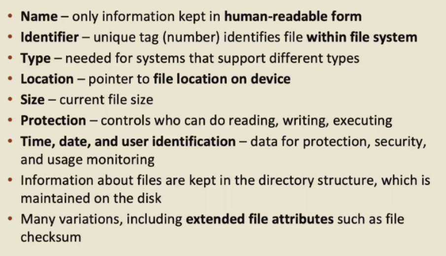
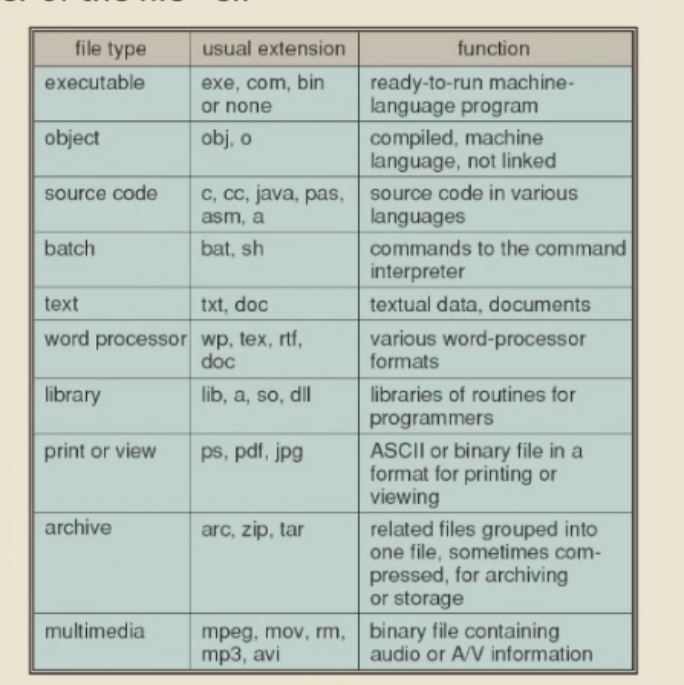
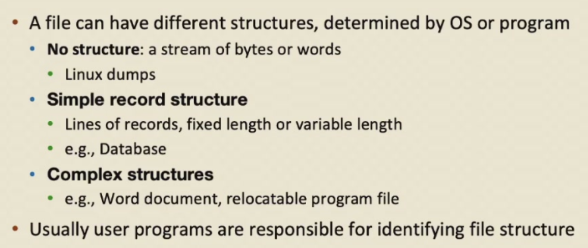
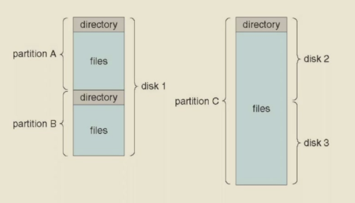
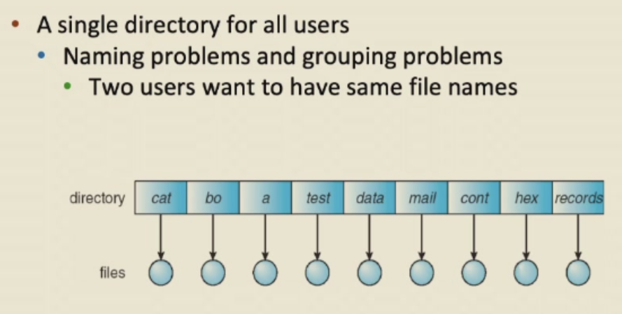
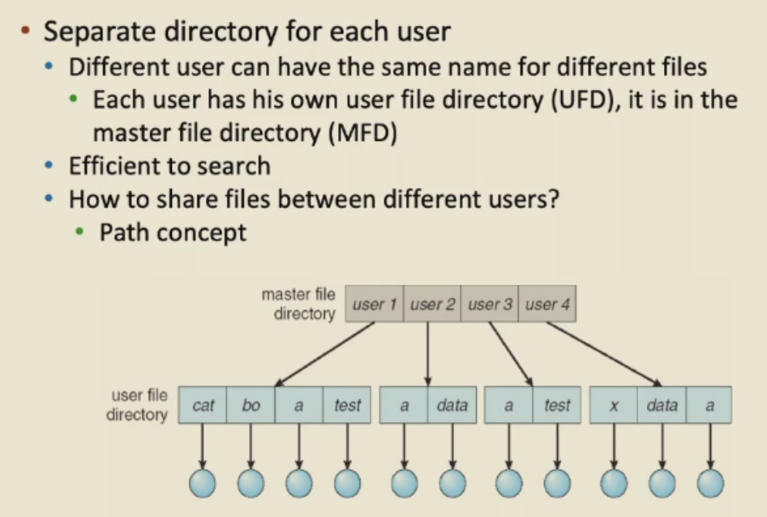
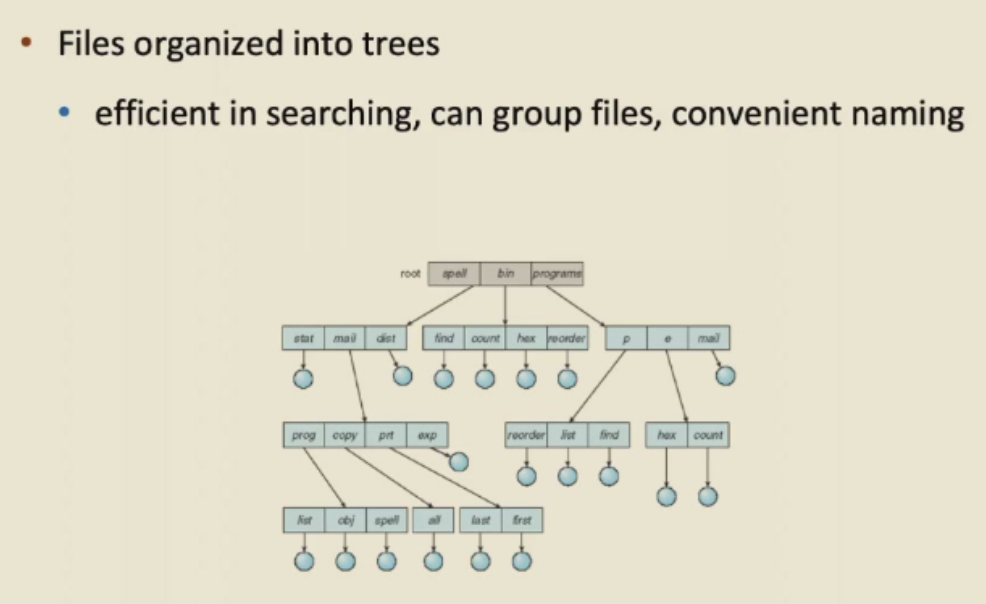
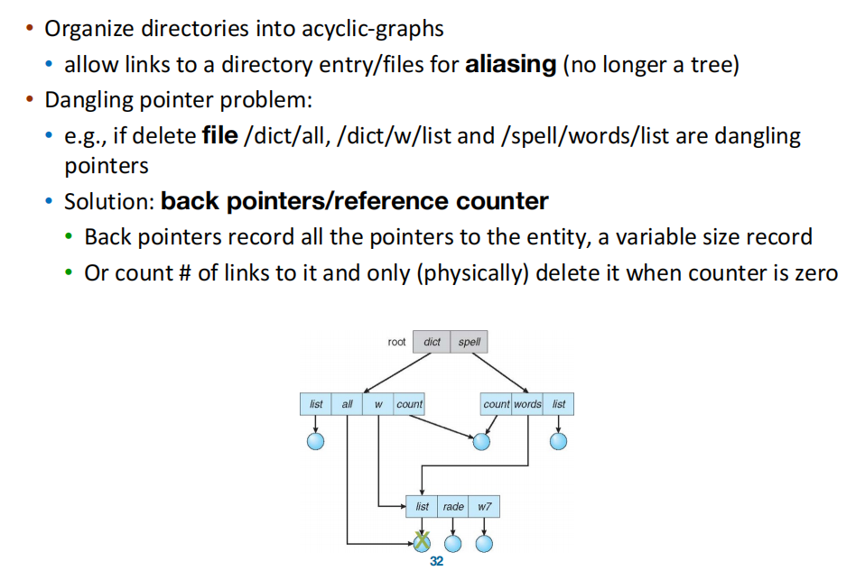
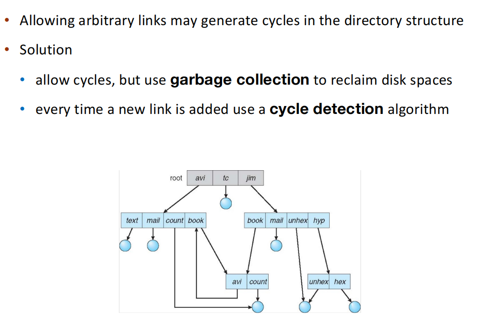
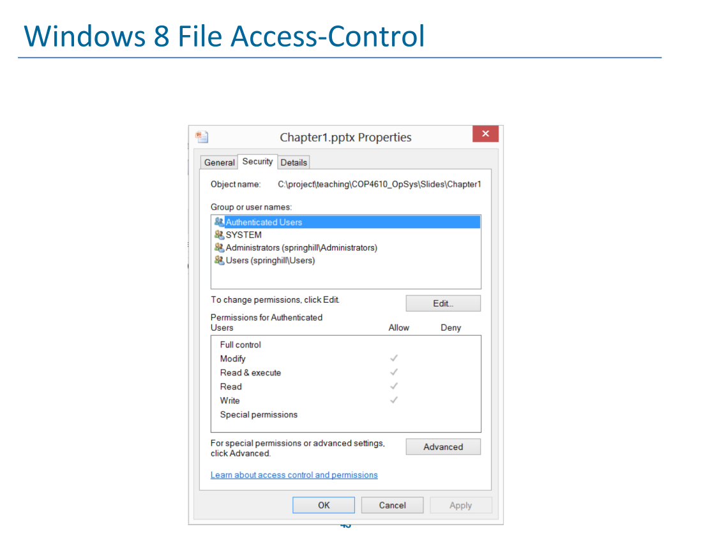

## 1.文件概念

> 在拥有了一定规模的存储空间以及 IO 手段之后，该如何使用它们？

### 1.1 文件系统(FS)

- 1.直接使用硬盘

- 2.文件系统
    - 文件系统是**对硬盘的抽象**
    - 文件实际上就相当于硬盘当中的**轨道和分区共同表达的一块存储位置**
    - 对于**用户程序**来说：
        - FS 为一组文件提供连续的**视图**
        - 是一个连续的字节块(Unix)
    - 文件系统还提供**保护**

!!! abstract 抽象
    - **进程和线程**是对 CPU 的抽象
    - **虚拟地址空间**是对 Memory 的抽象
    - **文件**是对 Storage 的抽象

### 1.2 文件定义和分类

- 文件是存储信息的**连续逻辑地址**
    - databse, audio, video, web pages...

- 不同的文件种类
    - 数据：character, binary, application-specific
    - 程序
    - 特殊的：proc file system(procfs): 使用 FS interface 来获取系统信息。在 linux 当中这个 file system 位于 ~/proc。

### 1.3 文件属性

### 1.3 文件操作(File Operations)

#### 1.3.1 文件操作的种类

- create：关键在于 **space** 和 **entry**
- open：大部分文件操作都需要文件首先是被打开的
- read/write：需要维护一个**文件位置指针**，记录读写的位置
- repostion within file - seek（文件内重定位）：可以手动修改上面提到的 file position pointer
- close
- delete：
    - 释放空间
    - Linux 支持 Hardlink，即多个文件名指向同一个真实文件。
    - OS 内部有一个**引用 counter**，每删掉一个文件名计数器就减 1，只有指向某个文件 counter 变成 0 的时候这个文件的数据才会真正地从磁盘上抹去。
- truncate（截断文件）：清空文件内容，保留文件 attributes。
- 其他的操作都可以通过上述操作**组合**来达成。

#### 1.3.2 Open File

- Open-file Table：记录当前系统所有被打开的文件
- File pointer：指向上一次读写的位置。**每个进程不同**
- File-open count：记录一个文件被多少进程打开。只有这个 count 变为 0 的时候该文件才会被注销。
- Disk location of the file：数据访问信息的缓存
- Access rights

- 有些 FS 会提供**文件锁**来控制对文件的访问

- 文件锁的两种类型：
    - **Shared lock**：多进程
    - **Exclusive lock**：单进程

- 两种锁的机制：
    - mandatory lock（强制锁）：如果锁存在，访问就会被拒绝
    - advisory lock：进程**找到锁的当前状态**，然后决定是否可以访问

### 1.4 文件种类

### 1.5 文件结构

## 2.访问方式

### 2.1 分类

- Sequential access：
    - 对象只能**线性地**去访问
    - e.g. 磁带
- Direct access：
    - 可以**同时访问**处于队列的**不同位置**的对象

### 2.2 磁带和文件系统

- Disk 可以被划分成 **Partitions**，也可以称作 **minidisks** 或 **slices**
- 不同的 Partition 可以拥有不同的文件系统，一个有文件系统的 Partition 被称为 **Volume**（卷）
- 每个卷都会在它的特定区域内维护一张 **Table of Contents** 来追踪文件系统的信息
- 一个文件系统既可以是**通用的**，也可以有一个特殊的用处
- Disk 或者 Partition 可以被**裸露地**使用（RAW），即没有文件系统
    - 比如数据库就比较喜欢 raw disks

## 3.目录结构

### 3.1 例子

### 3.2 目录概念

- 目录是一个包含**所有文件信息**的节点集合

### 3.3 目录上的操作

- create a file：新文件创建并加入目录
- delete a file
- list a directory
- search for a file：模式配对(pattern matching)
- traverse the file system（遍历）

### 3.4 目录组织

- 目标：
    - 1.Efficiency：快速定位文件
    - 2.Naming：让 user 使用起来更加方便，比如：
        - 两个 users 可以给不同的文件起相同的名字
        - 相同的文件可以有不同的名字 

- **Single-Level Directory**

- **Two-Level Directory**

- **Tree-Structured Directories**

    - Linux 使用的就是树型的文件系统
        - 文件可以使用**绝对/相对**路径来访问
        - touch, rm, mkdir...

- **Acyclic-Graph Directories**
    - 为了方便文件共享，OS 允许创建链接(Links)。这样同一个真实的文件或目录就可能拥有多个别名(Aliases)，同时出现在不同文件夹里。
    - 核心挑战：悬空指针问题(Dangling pointer)。即，一个文件被删除了，到那时其他地方还保留着指向它的指针，那么访问那个指针的时候就会导致系统错误或文件损坏。
    - 解决方法：
        - Back pointers：让文件自身记录有哪些文件指向它，删除的时候把引用它的文件也删除。很 naive 的想法，但是维护成本比较高。
        - Reference count（引用计数）：每个文件内部都维护一个 count，有一个文件/目录链接它，count 就 +1。用户删除的时候 OS 不直接抹去物理数据，而是让 count - 1，只有 count = 0 的时候才会真正从物理磁盘上删除。 
    - 硬链接(Hard Link)和软链接(Soft Link)的区别在于：
    

- **General Graph Directory**

### 3.5 目录挂载(Mounting)

- 一个文件系统只有在**挂载之后**才可以被访问到
    - 挂载把一个 FS 链接到整个 OS 的目录树当中，从而形成一个**统一的命名空间(single name space)。
    - 挂载点(mounting point)：文件系统被挂载的地址
    - 挂载点的旧目录在挂载之后就**不可见**了

### 3.5 文件共享(File Sharing)

- **多用户**操作系统
- 共享需要遵循 **Protecing Scheme**：
    - User IDs：用来区分用户，提供用户之间的保护
    - Group IDs：允许用户组织成组，从而共享组内的权限

- 分布式操作系统(Distributed systems)
    - 文件不一定在本地磁盘，还可以通过**网络共享**，让你像访问本地文件那样去访问远程文件

- NFS(Network File System)
    - Unix/Linux 常用的网络文件共享协议
    - 允许把远程服务器目录挂载到本地，然后就变得像本地目录那样了

- 远程共享文件的方式：
    - FTP(File Thransfer Protocol)：手动方式
        - 连接服务器
        - 登录
        - 上传或下载文件
    - Distributed File Systems：自动、透明的方式
        - 分布式文件系统，像访问本地文件一样访问远程目录
        - seamless
        - NFS, AFS, SMB...
    - WWW：半自动
        - 通过 Web 浏览器进行某种程度的文件访问
        - google drive...

- 透明(Transparency)指的是本地文件操作会自动转化成网络请求，但程序自己并不知道这一点。

- client-server model
    - client-server 模型允许客户端挂载远程文件系统

- 一个服务器可以给很多机器提供文件

- 问题：
    - 服务器很难**准确识别远程用户身份**（分布式系统中的经典安全问题）
    - 服务器不能完全信任客户端

- NFS 和 CIFS
    - NFS：Network File System。Unix/Linux 文件共享的标准协议
    - CIFS：Common Internet File System。Windows 文件共享协议

## 4.保护

### 4.1 Protection 的概念

- 文件的 owner/creator 应该可以控制：**谁**可以对文件**做什么**

- 访问的种类
    - read, write, append(增补), execute, delete, list...

### 4.2 ACL

- Assign each file and directory with an **A**ccess **C**ontrol **L**ist
- 优点：权限控制更加精细
- 缺点：list 如何组织和存储？

- 看一个例子：

- 第一个字符：d 表示 directory；- 表示普通文件
- 后面 3+3+3 个字符分别标记了 owner、group、others 对这个文件的 rwx 权限。