!!! abstract "Tips"
    第一个比较有难度的知识点，但实际上理解原理再做一遍例题就能掌握个大概了

## 1.Dynamic Scheduling

- 简单的流水线技术存在的局限
    - 1.指令和执行操作是顺序的
    - 2.当流水线因为冲突stall的时候，后续无关指令实际上可以在stall期间执行，但顺序流水线只能把stall的时钟周期浪费了

    e.g. 下图的FADD指令会因为FSUB对FDIV指令的依赖而被卡住
    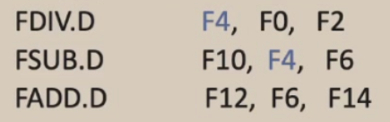

- Idea：动态调度

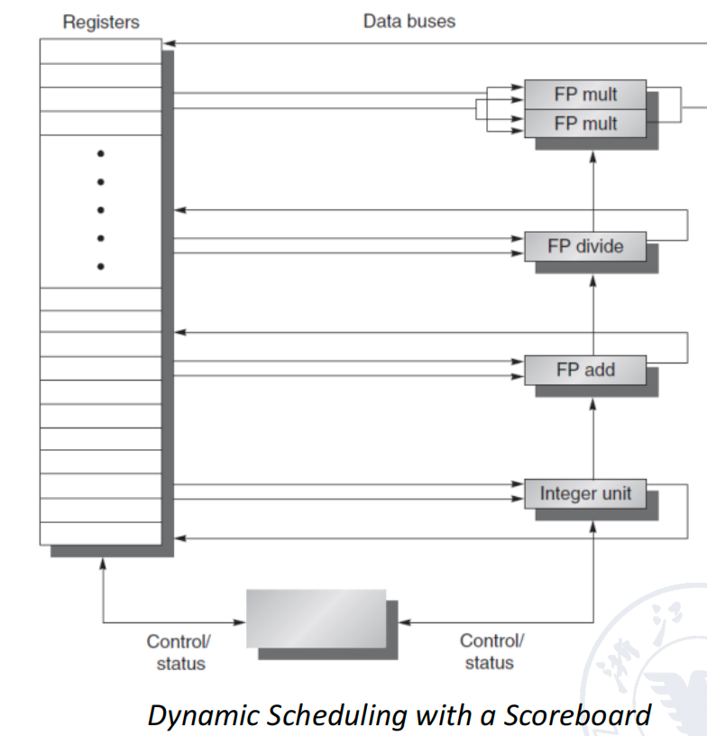

- Method：乱序执行(Out-of-order execution)
    - 引入了WAW、WAR两种新的冲突
    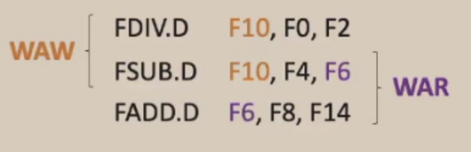
    - 可以使用[scoreboard algorithm](https://en.wikipedia.org/wiki/Scoreboarding)和[Tomasulo's algorithm](https://en.wikipedia.org/wiki/Tomasulo%27s_algorithm)两种方法来解决乱序执行的冲突问题

## 2.Scoreboard Algorithm

### 2.1 直觉与概念 
- 在ID阶段检测structural hazards（结构依赖）和data hazards（数据依赖）

- 于是ID阶段被分成两个部分：
    
    - IS(Issue)：1）指令解码；2）检查结构冲突（对应结构有没有被占用）
    - RO(Read Operands)：直到没有数据冲突的时候菜读入操作数
        - 乱序执行从RO开始就是乱序的

### 2.2 基本结构：
    - FP Mult：乘法组件有两个是因为，乘法相比于加法所需要的时钟周期较长，相对于除法来说出现的概率又比较高（硬件代价小于整体节省的时间）。
    - SCOREBOARD：记录各个计算单元空闲情况和操作数依赖情况的表格
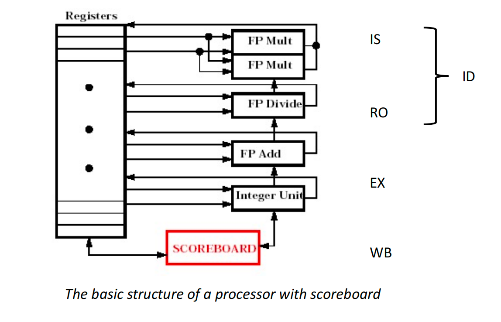

### 2.3 例子

- 用下面这六条指令来举个例子：
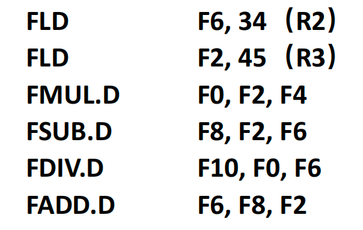

- 一种做法是通过维护**三张表**，来figure out如何用scoreboard alg来进行动态调度
    - step1：
        - 指令状态表
        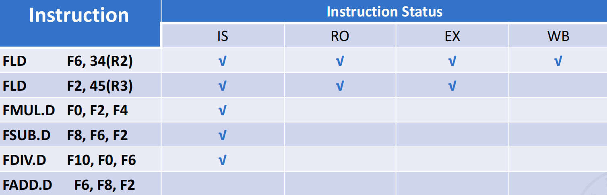
            - 第3、4、5跳指令因为存在数据依赖，所以卡在RO
            - 第6条因为ADD部件被SUB占了，存在结构冲突，所以IS就进不去
        - 寄存器状态表（存访结果寄存器的状态）
        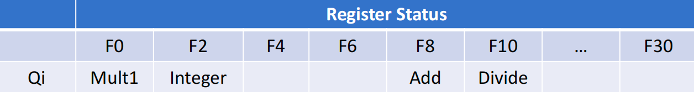
            - 填入的是需要等待的部件
        - 功能部件状态表
        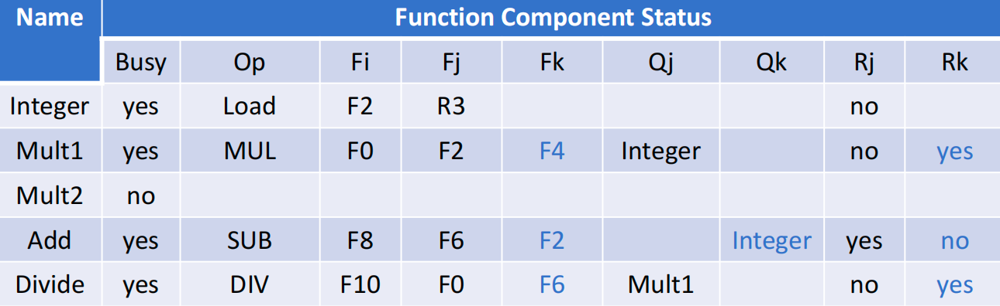
            - Fi代表目的操作数，Fj和Fk代表着源操作数
            - Qj/Qk：Fj/Fk（如果有）在等待哪个部件的结果
            - R：yes表示要等待另一个源操作数ready
        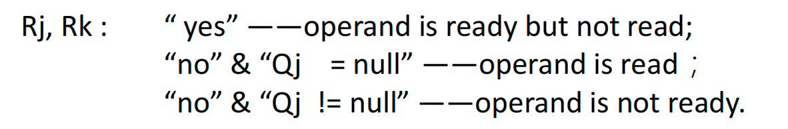
    
    - step2：
        - 指令状态表（假设乘法需要很多拍，还没有写结果） 
        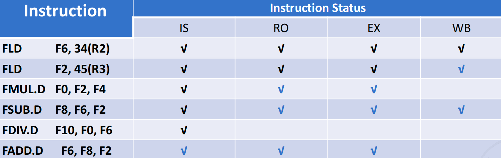
            - 因为F0没有算出来，FMUL把FDIV卡在IS处
            - 因为FDIV还没有读F6，所以FADD无法写回F6

        - 寄存器状态表
        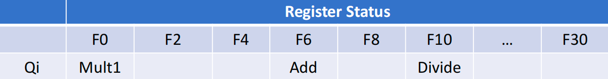

        - 功能部件状态表
        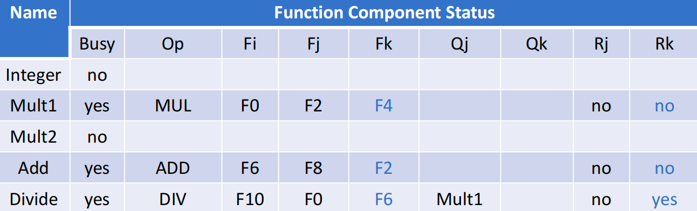

    - step3：
        - 指令状态表（假设除法还没有写结果）
        

        - 寄存器状态表
        

        - 功能部件状态表
        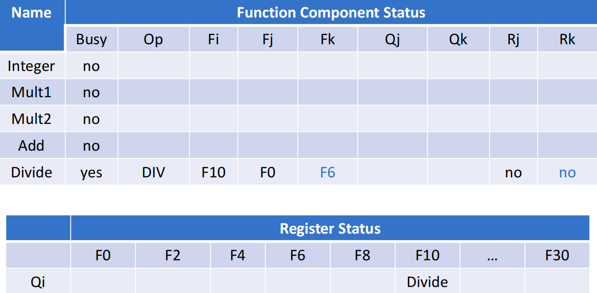

- 另一种做法是利用规律直接填一张表，用来展示每条指令执行每个stage的步骤

- 维护三张表比较复杂，徒手做的时候，我们可以按照以下规律调度：
    - 1.若组件空闲，指令进入IS
    - 2.对IS后的指令，检查源操作数在这个周期是否存在依赖，没有依赖就进入RO
    - 3.RO之后就直接EX，不会有间隔
    - 4.EX结束后检查本指令的目的操作数有没有WAR冲突，没有则WB

- 对上面的例子我们可以画出表格和时空图：

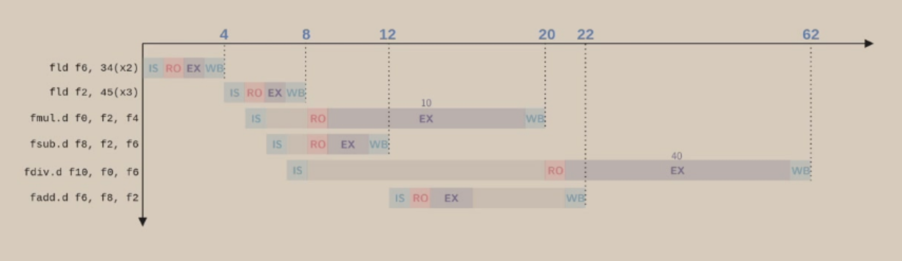

## 3.Tomasulo's Approach

### 3.1 作用

- 动态调度存在WAR和WAW两种新的冲突

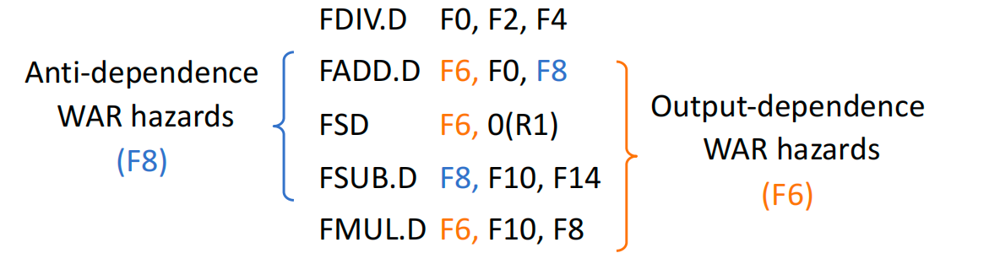

- WAR
    - FADD指令的F0依赖FDIV
    - FSUB指令要修改F8
    - 因为FDIV指令比较慢，所以FADD一直卡在IS
    - 若FSUB率先执行，FADD指令会在读入F8的时候出错、
    
- WAW
    - 若FMUL比FADD先执行完，FADD的旧值会覆盖F6，导致FMUL之后有关F6的指令会出错

- Scoreboard algorithm在解决上述两个问题的时候不够优雅，依然有较多的时钟浪费。因此，
[Robert Tomasulo](https://en.wikipedia.org/wiki/Robert_Tomasulo)提出了Tomasulo算法来进一步优化乱序执行的动态调度。

### 3.2 基本结构

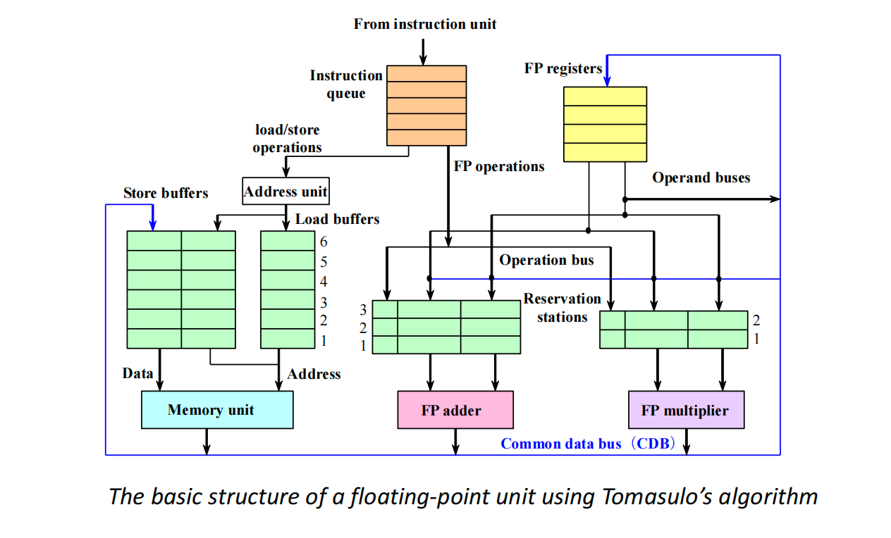

- 一些观察
    - 增加了每种操作的buffer（保留站 Reservation Station）
    - 运算组件结束后，蓝线（旁路）连到所有的部件，相当于广播某一个操作数的更新
    - 保留站是实现乱序的主要结构，源操作数先ready的先计算
    - 检测结构冲突变为**检测对应保留站是否还有空位**
    - **重命名也在保留站**中完成，只要之前没有真实的数据依赖，那么进入了保留站就相当于重命名

### 3.3 主要思想
    - 1.追踪每条指令的操作数可用的时间来最小化RAW冲突
    - 2.引入硬件级的寄存器重命名来最小化WAW和WAR冲突

### 3.4 过程

一条指令的执行过程变成3步

- Issue（重命名寄存器，消除WAR和WAW的影响）
    - 从指令队列拿出指令（FIFO）
    - 如果保留栈有空位，那么将指令放进去
    - 如果没空位，则结构冲突，等待直到有空位
    - 如果操作数不在寄存器里，就要追踪那些会产生这些操作数的功能部件

- Execute
    - 所有操作数都可用了，就进入对应功能部件执行
    - 注意：load和store需要两个步骤
        - 1.判断base register是否就绪，并计算地址
        - 2.把计算后的有效地址放到load/stroe的buffer里

- Write results
    - 结果计算完成后，通过CDB(Common Data Bus)传输到所有需要这个结果的保留站和寄存器中（包括store buffer）
    - store指令在store buffer中等待，直到要存储的值和存储地址都可用，等待内存空闲时立刻写入结果

### 3.5 例子

#### eg1：两条指令的例子

- step1：
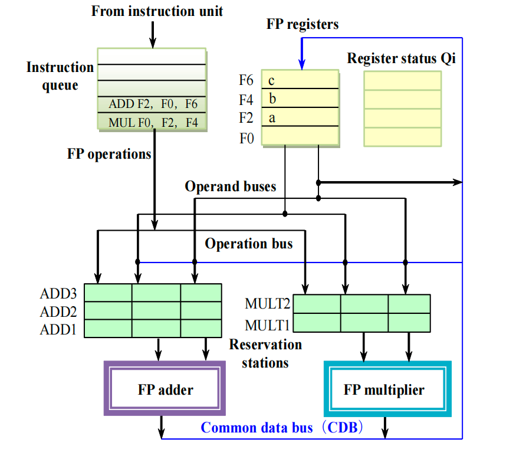
    - MUL指令直接从寄存器表中复制F2和F4的值a，b到保留站
    - 将F0指向MULT1（相当于重命名）

- step2：
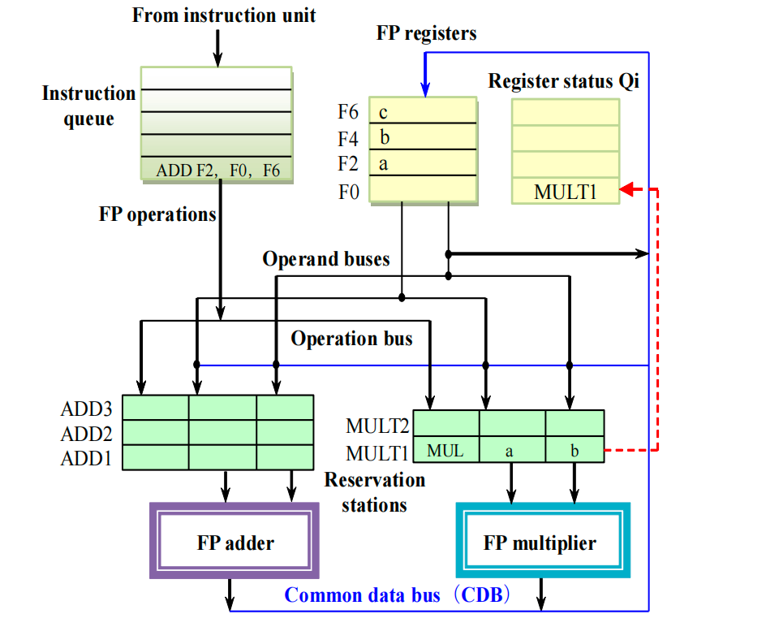
    - F2寄存器指向ADD1，但是因为旧值a已经被拷贝到MULT1中，因此消除了WAR冲突
    - ADD指令在拷贝F0寄存器的值的时候，因为寄存器状态指向MULT1，所以直接拷贝MULT1到保留站

- step3：
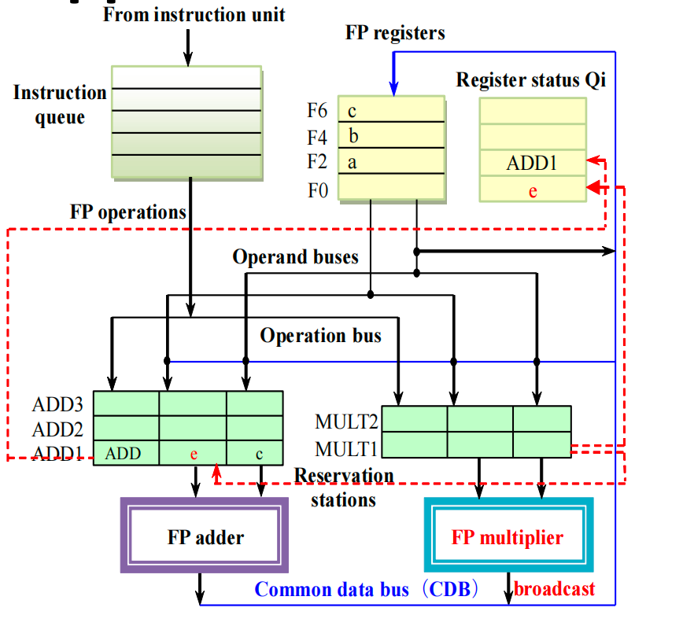
    - MULT协会之后，同时广播到寄存器状态表和ADD保留站，F0寄存器的值同步变成计算结果e

#### eg2：[六条指令](#eg)的例子

- 使用Tomasulo算法可以画出下面这样的时空图

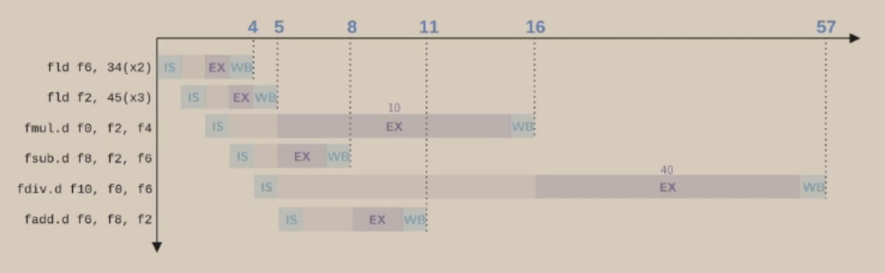

## 4.总结

- Scoreboard Algorithm：使用详细的表格来管理所有的状态
    - 优点
        - 硬件逻辑相对精简
    - 缺点
        - WAR和WAW冲突会导致算法效率下降

- Tomasulo Algorithm：通过reg renaming和CDB广播进一步加深并行水平
    - 优点
        - 通过保留站，把寄存器名重命名为临时标签，在硬件层面解决了WAR和WAW，因为，哪怕后面的指令想要修改之前的
    - 缺点
        - 硬件设计比较复杂
        - CDB总线的复杂度随着计算单元数量增加会指数级上升
