[参考](https://note.howjul.com/%E7%B3%BB%E7%BB%9F%E4%B8%89)

## 1.Introduction

### 1.1 Memory

- Register：位于CPU内部，速度最快，容量最小
- Cache：位于CPU和主存之间
- Memory：主存(RAM)，是程序运行时存放数据的地方
- Storage（外存）：硬盘、U盘等外部设备

### 1.2 存储器分类

- Mechanical memory（机械式存储）

    - Acoustic wave（声波）/torque wave（扭转波） delay line memory
        - 通过水银或金属丝中的波动循环来保存信息
    - Magnetic Drum Memory（磁鼓存储器）
        - 现代硬盘的前身。利用旋转的金属圆柱体表面的磁性来记录数据
    - Magnetic core memory（磁芯存储器）
        - 1950-1970的主流内存。利用小磁环的磁化方向来存储二进制位

- Electronic memory（电子存储）
    - 目前最主流，基于**半导体电路**
    - SRAM（静态随机存取存储器）：速度快，常用于Cache
    - DRAM（动态随机存取存储器）：密度高，成本较低，常用于内存
        - SDRAM（同步动态随机存取存储器）：时钟与CPU同步。现代内存的鼻祖
    - Flash（闪存）：断电不丢失数据。SSD、U盘
    - ROM：数据写入后通常不再更改
        - PROM（可编程）：只能编程（熔断熔丝的物理编程）一次
        - EPROM（可擦除、可编程）

### 1.3 局部性

- Temporal locality（时间局部性）
    - 一个item被访问之后，程序会倾向于在**短时间**再次访问

- Spatial locality（空间局部性）
    - 一个item被访问之后，其**地址附近**的item会更容易被访问

### 1.4 层级结构

- 根据局部性原理，为了让**处理器更高效地获取数据**，在简单的冯诺依曼架构上设计了**内存的层级结构**

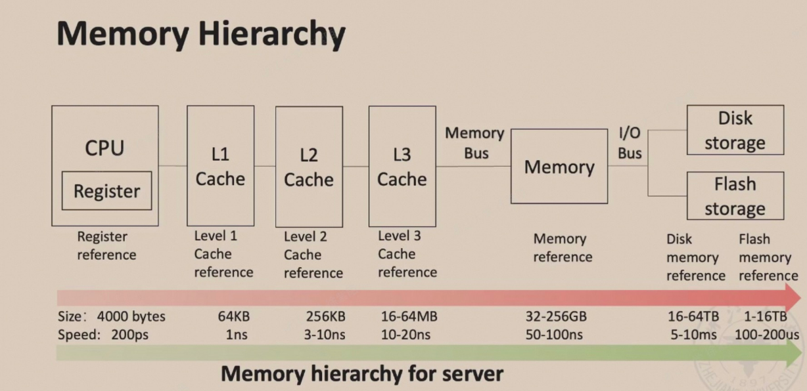

### 1.5 Cache预备

- 定义：a safe place for **hiding** or ** storing** things

- 特点
    - memory hierachy的最高层。addr一离开处理器就会进入cache
    - 使用buffering来重用常用的items

- hit/miss
    - 处理器可以/不可以在cache中找到需要的数据项

- Cache Miss：检索这个块第一个词的时间和检索这个块剩余所有词的时间
    - 取决于：
        - Latency：检索块中第一个词的时间
        - Bandwidth：检索块中所有剩余部分的时间
    
    - 产生原因：
        - Compulsory Miss（强制未命中）
            - 第一次访问一个clock的时候，因为此时程序刚开始运行，数据还没有被加载进cache，所以肯定会miss
        - Capacity Miss（容量未命中）
            - 因为cache的容量有限，为了给新数据腾出空间，cache将旧数据删除之后又需要用到旧数据，会导致miss
        - Conflict Miss（冲突未命中）
            - 程序重复引用一些不同块中的不同数据，但这些不同的数据映射到cache的同一个槽位。所以这些冲突的数据就会不断覆盖，导致miss。

- Cache局部性
    - Temporal locality: need the requested word again **soon**
        - 越经常使用的数据要越靠近处理器
    - Spatial locality: likely need other data **within the same block** soon
        - 把最近访问过的word所在的block移动到更接近处理器的位置

- 命中时间（hit time）：访问本层存储的时间，包括判断hit/miss的时间

- 失效损失（miss penalty）：将相应的块从下层存储替换到上层存储中的时间，加上该数据块返回给处理器的时间

- Block/Line Run
    - 调度的单位是包含目标数据的块或者行

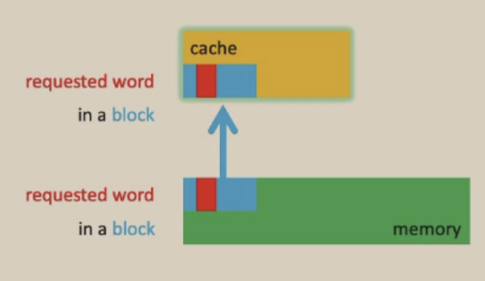

## 2.Tech trend and Memory Hierachy

### 2.1 performance曲线

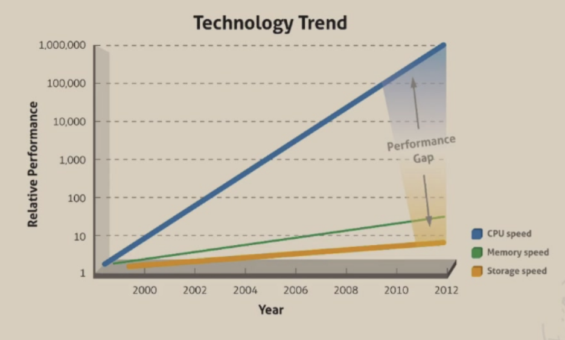

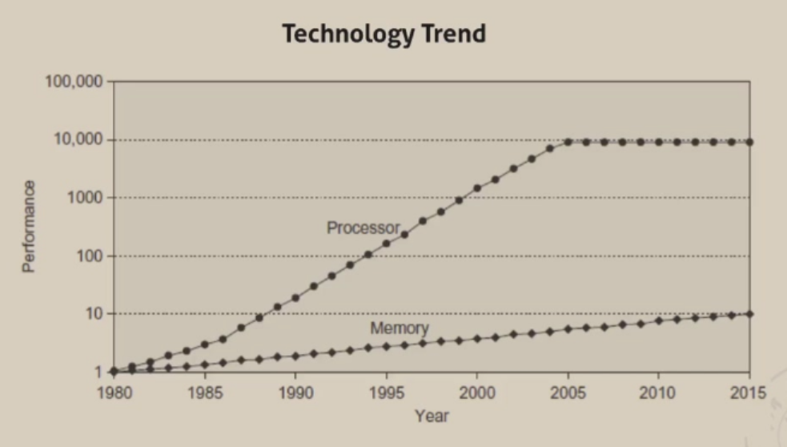

### 2.2 结构

- 结构发展

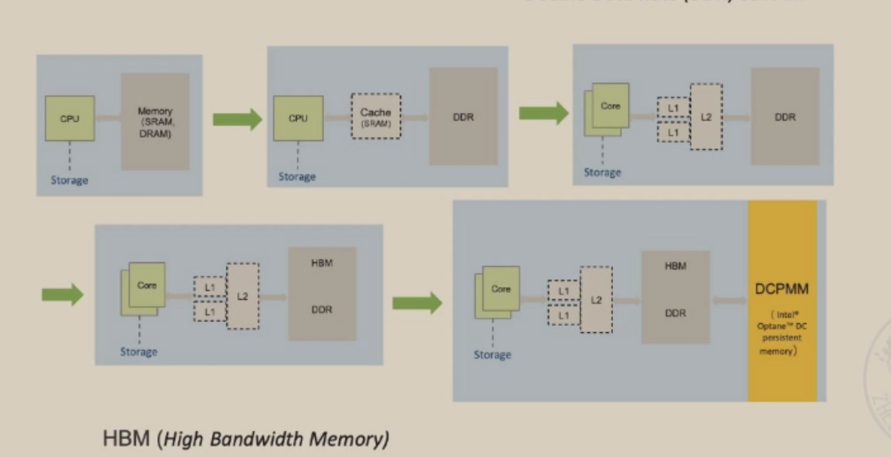

- Memory/Storage

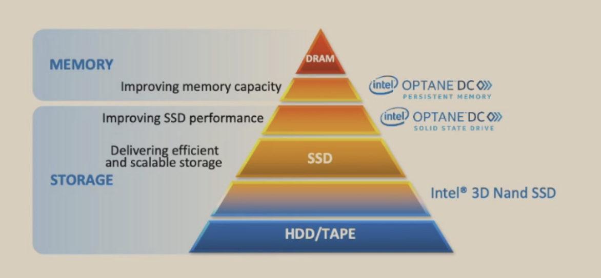

- 最经典的结构
    - Register
    - on-chip Cache
    - Second-level Cache(SRAM)
    - Main memory(DRAM)
    - Storage(Disk)

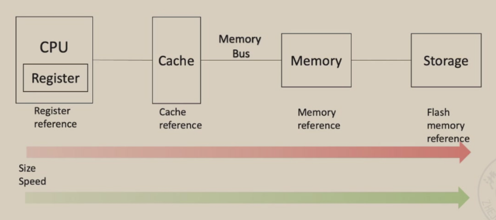

### 2.3 三种计算机对内存结构的不同考虑

- 桌面电脑：单用户、单任务。最关心响应时间
- 服务器电脑：多用户、多任务。最关心内存带宽
- 嵌入式电脑：实时任务，用简化的OS运行单个app，主存很小。最关心能源和电池续航

### 2.4 Cache

- 在电脑中，什么都可以是cache

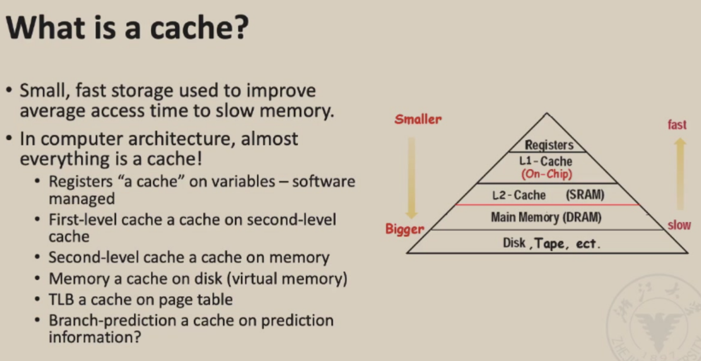

- 分离缓存和统一缓存
    - Split cache
        - I-cache for instruction, D-cache for data
    
    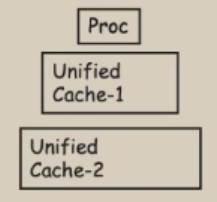

    - Unified cache
        - 更简单的硬件，稍差一些的性能

    

## 3 cache和memory hierachy设计的4个问题

- Q1：一个数据块应该被放在高层存储器/主存的什么位置？
    - Direct Mapped（直接映射）：每个块放在固定的一个位置。
        - 查找快，但是容易产生冲突
    - Fully Asscoiative（全相联）：可以放在任何空闲的位置
        - 利用率高，但是查找慢
    - Set Assocaitive（组相联）：折中。数据块映射到一个特定的组，可以在组中任意选择空闲的位置。现代CPU的常用方案

- Q2：如果一个数据块存在于高层存储器/主存中，如何找到它？
    - 查index位置是否有item
    - 检查valid是否为1
    - 检查tag是否匹配

- Q3：当miss发生，但cache已满，应该剔除哪一个块来存放新的块？
    - Random
    - LRU(Least Recently Used)：高效，但硬件记录成本比较高
    - FIFO：删除最早进来的块

- Q4：CPU执行写操作时，只修改cache，还是连带着内存一起修改？
    - Write Through：同时更新cache和下层的内存。
        - 优点：保持内存数据更新
        - 缺点：速度受限于内存速度，比较慢，通常配合write buffer来缓解等待时间

    - Write Back：只更新cache，并给这个块打上一个dirty bit。只有当这个块离开cache的时候才会更新内存
        - 优点：速度非常快
        - 缺点：内存数据无法实时更新，而且逻辑比较复杂

### 3.1 Block Placement

- 怎么找到对应块的位置

- Direct mapped：内存上的一个位置只会映射到cache上的一个特定位置
    - 一般直接取模当作索引

    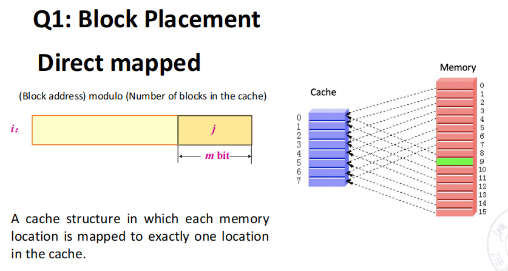

    - 地址低位的 m bit 是 index 用来确定内存该位置应该映射到 cache 的哪个位置，从中可以看出 cache 有 $2^m$ 个位置

    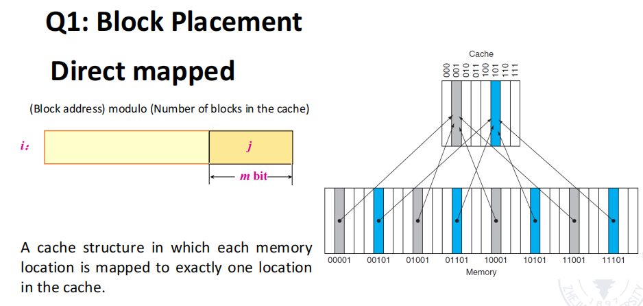

    - 好处是寻找速度很快
    - 缺点在于当映射冲突出现的时候，cache的空间利用率可能不够高

- Fully-associative（全相连）
    - 主存当中的任何一个块都可以放到 cache 的任何一个位置
    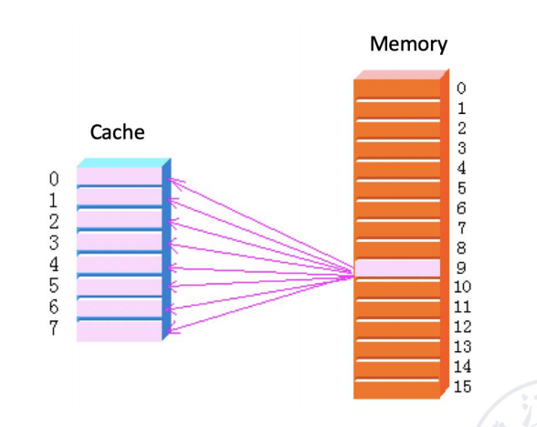

    - 好处是空间利用率很高
    - 缺点在于寻找的开销很大，并且实现的算法比较复杂

- Set-associative（组相连）

    - n-way set associative（n路组相连）：每 n 个 clock 为一组，主存中的每个位置映射到一个具体的组中，但是在组中可以放置在任意一个位置

    - 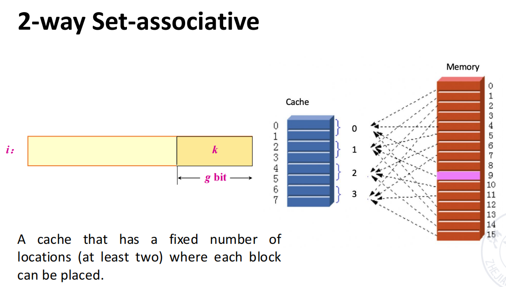

!!! abstract "Tips"
    - 为什么不使用 high-order bits 作为 index？
    - some contiguous memory blocks will map to the same cache set.

- 直接映射可以看作是 1-way set association；全相连可以看作是 cache 的所有位置共同组成一个组

- 一个 set 内的 block 越多，cache 的空间利用率越高，块冲突和 cahce miss 的概率就越低。但相应的，在 cache 中寻找所花费的时间也越多。

- 现代大部分的cache都使用组相连，每组的元素数量 n 一般不大于4。

### 3.2 Block Identification

- 如何定位一个block

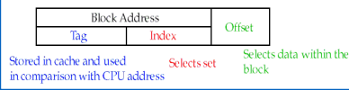

- Index
    - 在**组相联**中用来选择**组**
    - 在**直接映射中**中用来选择**块**
    - 数量是组/块的数量对 2 取对数

- Byte Offset
    - 用来在定位到的数据块中精准定位你想要的字节
    - 位数取决于 Block Size

- Tag
    - 在 index 找到对应 cache 中的行或者组之后具体比对 tag 部分的地址 

- Valid Bit
    - 有时候会有，用来指示 cache block 里的数据是不是有效的

- 一个直接映射的例子
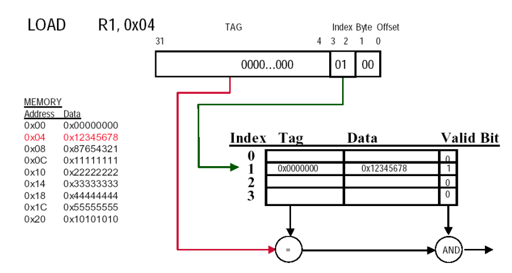

- 一个二路组相连的例子
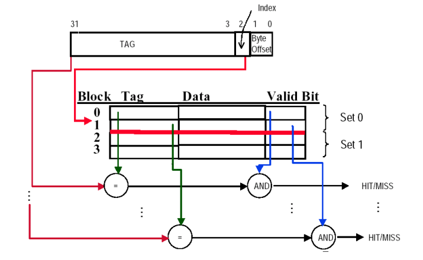

- 一个全相连的例子（1-word Block）
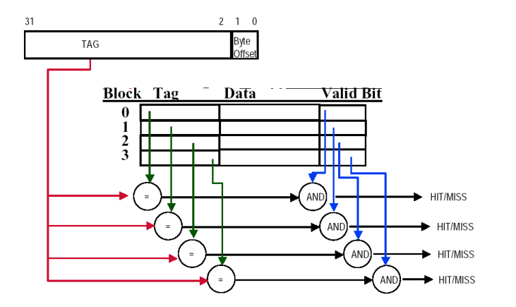

