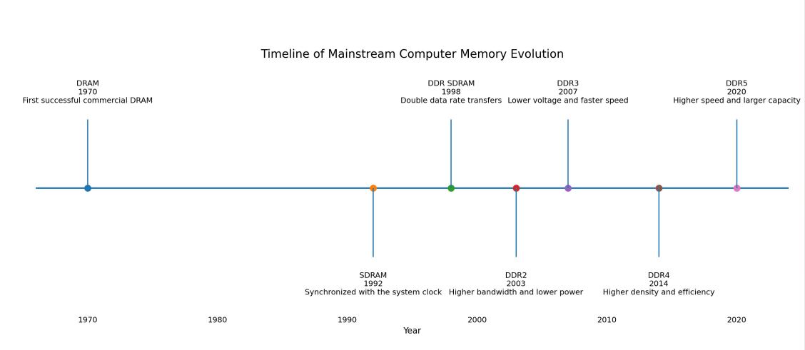
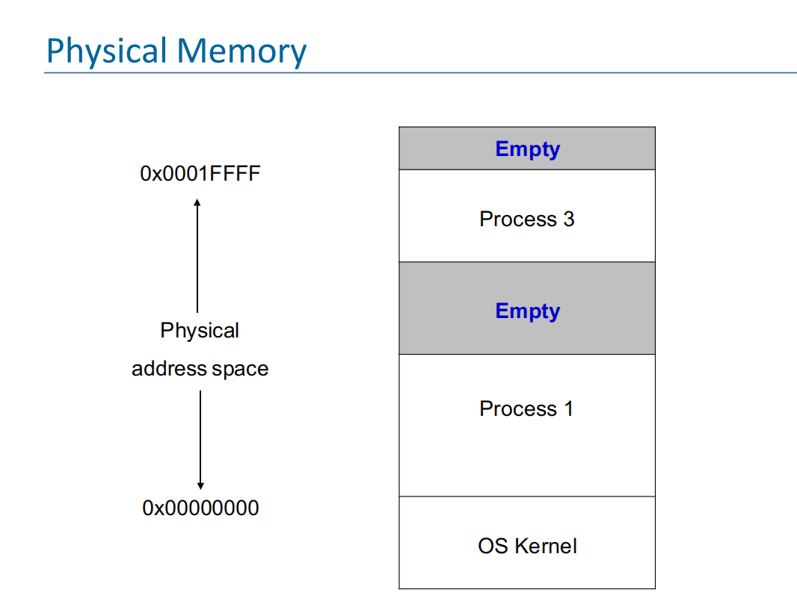
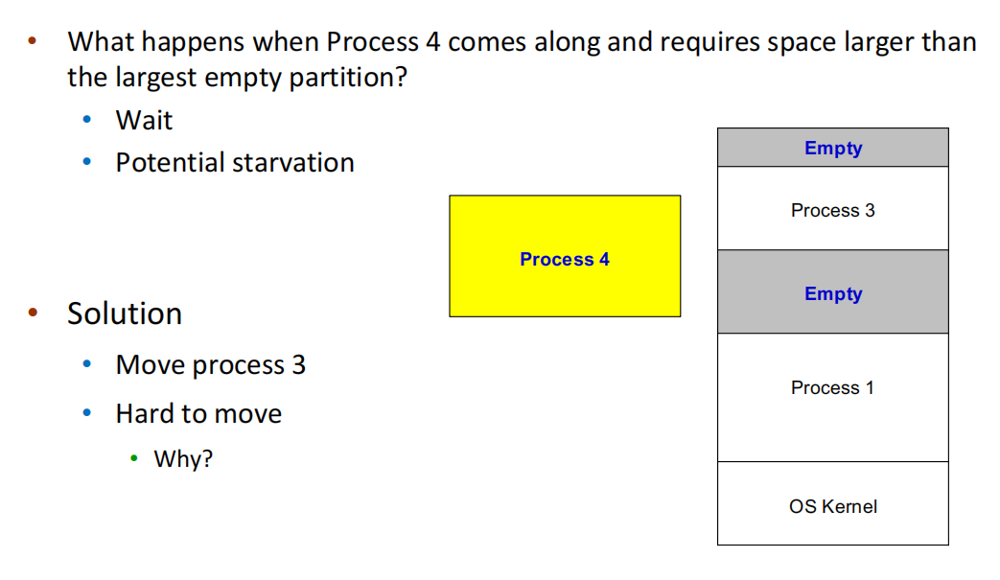
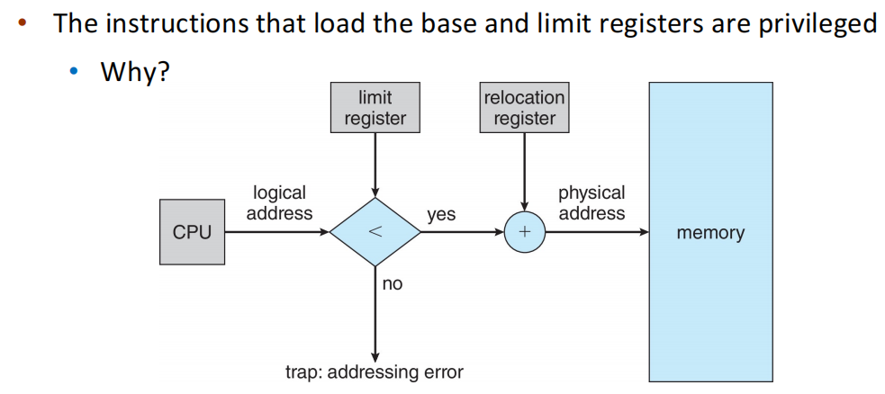
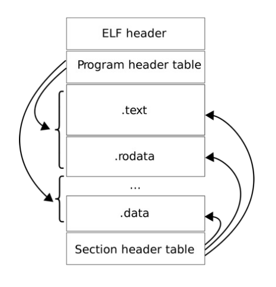
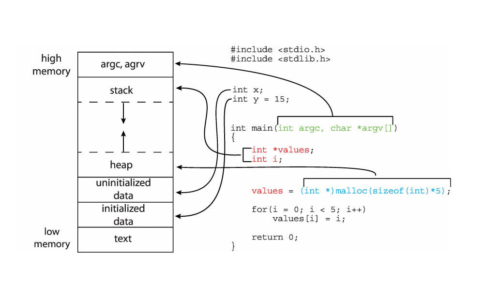
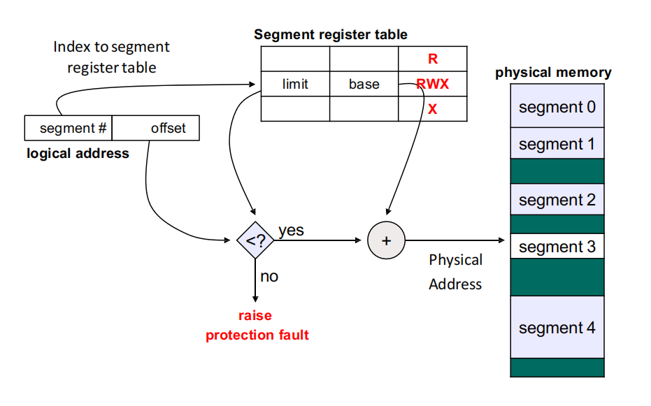
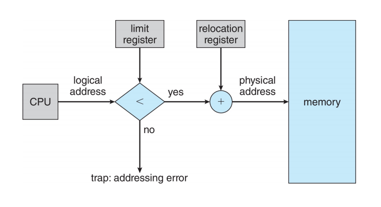
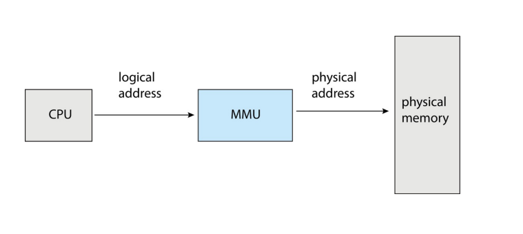
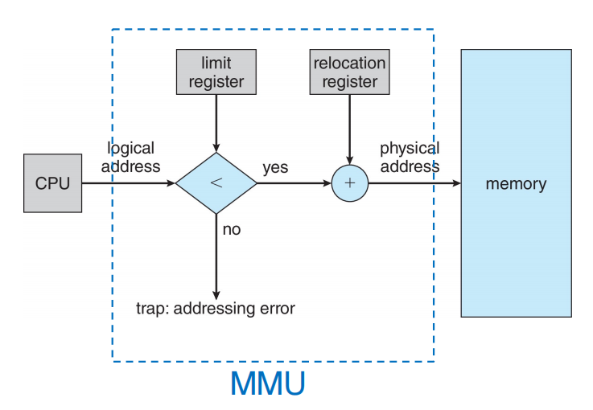

## 1.内存硬件

### 1.1 发展历史

## 2 内存使用

### 2.1 背景知识

- 程序在运行之前需要将其从 disk 中加载到 memory 中

- Memory only seea a stream of
    - addresses + read requests
    - addresses + data + write requests

- Register 可以在一个 clock 内被访问

- 主存访问可能要花费很多周期,导致 stall

- Cache 存在于主存和 CPU registers 之间

### 2.2 内存加载

- 批处理系统(Batch):一个程序被加载到物理内存中,直到跑完

- 如果程序的大小比物理内存更大怎么办?
    - Divide and Conquer,分成程序段
    - 识别程序段
        - 哪些可以跑出结果
        - 哪些可以 fit into 内存
    - 在每次得到的结果之后添加一些语句将新的 section 加载进来

- Multi-Programming(多进程)
    - 每个进程可以更快地切换到 ready 状态
    - Partitioning: 将物理内存分为多个 pieces
    - Partition 需要:
        - 保护机制: 进程需要隔离
        - 执行速度: 内存访问不能因为保护机制变得更慢
        - 快速的上下文切换

     - 如何加载一个进程(相对地址重定位)
        - 在程序编译或链接时，生成的地址通常是从 0 开始的逻辑地址
        - 当进程被加载到某一个 partition 的时候, 根据 partition 的起始位置将所有地址重定位
        - 进程开始运行之后,就**不能移动**了

- 接下来我们介绍一下动态重定位的方式

    - 问题: 
    
    - 我们可不可以移动进程,把新的进程放进来

    - 解决方法
        - 使用逻辑地址而不是物理地址
            - 在运行的时候自动转换成物理地址
        - 逻辑地址的定义: the offset within the partition

    - 实现方式:引入 Base register 和 Limit register
        - 基址 reg: 存储当前运行进程在物理内存中的起始地址
        - 界限 reg: 存储该进程可以使用的内存大小（长度）
        - 进程尝试访问一个逻辑地址时:
            - 1.首先根据 limit reg 进行越界检查, 越界了就报一个段错误
            - 2.若地址合法就进行物理映射
        - **每次上下文切换**的时候由** OS **加载
            - 进程隔离: 每个进程的 Base 和 Limit 都是不同的
            - 单套硬件: CPU 中只有一组 Base 和 Limit 寄存器
            - 安全性: 可以通过这对寄存器来保证每个进程只能访问自己的地址

    - 物理地址保护
    

    !!! abstract "Question"
        -

    - 所以我们现在就可以通过调整 base 和 limit 两个寄存器的值来解决"移动进程块"的问题了

    - 这种动态内存分配方法的优点
        - 通过 limit reg 内嵌了安全保护机制.无需额外的物理开销
        - 执行速度快: limit 检查在硬件时间内就可以完成
        - 快速的上下文切换: 只需要更改两个寄存器
        - 程序在加载的时候不需要重定位了
        - Partition 在任何时候都可以被延长和移动

### 2.3 内存加载策略

- Fixed Partitions
    - 操作系统在系统启动的时候,将可用的物理内存划分为若干个**大小固定**的连续区域(Partitions)
    - 分配规则: 每个 partition 只能装入 1 个进程
    - 管理方式: 操作系统那个维护一个 Partition Table, 记录每个分区的 base, limit 以及是否被占用

- 固定分区分配的问题: Internal Fragmentation
    - 在每个分片放入进程之后分片内可能会有没有使用的内存, 但因为已经被占用了, 所以这些未被使用的内存就变成了内部碎片

- Variable Partitions
    - 内存动态分配: 根据进程所需要的内存空间
    - 核心概念: 分区的**大小**和**数量**是动态变化的
    - 步骤：
        - 系统启动的时候，除了 OS 占用的空间外，整个用户空间是一个巨大的空闲块
        - 当一个新进程到达的时候，OS 会从现有的孔洞中找出一个足够大的分配给它
        - 当一个进程退出后，它所留下的空洞会和其他空洞联结在一起 
        - 随着进程的进入和退出，内存会被切割成许多**大小不一的孔洞(holes)**
    - 存在更复杂的调度问题:
        - 需要数据结构来跟踪空闲内存和已用内存
        - 新的进程需要将自己加入一个足够大的内存区间
        - 当一个进程退出后，出现的空闲区域需要**动态整合

- 动态分区分配的问题: External Fragmentation
    - Partitions 之间未使用的内存可能对所有进程来说都太小了，所以就变成了 partition 外部的碎片
    - 解决方法：
        - 这里的假设是每一个单独的外部碎片的大小都没有办法放入新的进程，但是**碎片的总量**大于新进程请求的内存大小
        - Compaction（紧凑）：可以通过把已有的进程靠拢，合并成一个更大的可用内存空间
    - Compaction 的问题：overhead、timing

- 动态分区分配的策略：如果一个 size 为 n 的进程进入一个存在许多空闲内存块的内存当中，我们应该将其放在什么位置
    - first-fit：放进第一个足够大的 block 当中
    - best-fit：放进所有足够大的 blcok 当中最小的那个
        - 需要 **search entire list** 或者**排序**
        - 会创造出最小的碎片
    - worst-fit：放进最大的洞中
    - first-fit 和 best-fit 一般表现更好

## 3 段(Segmentation)

### 3.1 ELF 介绍
- ELF: Executable and Linkable Format
    - Program header table
    - Section header table
    - .text: 代码
    - .rodata: 初始化的 read-only 数据
    - .data: 初始化的数据
    - .bss: 未初始化的数据

### 3.2 段的映射

- 逻辑地址：<segment-number, offset>。这里的 offset 是段内的地址偏移

- Segment table 每一行都有
    - Base：起始物理地址
    - Limit：段的长度

### 3.3 段的查找

## 4 内存映射

### 4.1 地址绑定(Address binding)

- 把**程序里的地址**逐步转换为**真实内存地址**的过程

- 一个程序的地址在该程序的不同阶段通过不同的方式呈现
    - 源代码：符号地址（变量名）
    - 编译：编译器将符号绑定到一个**可重定位地址**（偏移）
    - Linker/Loader：将重定位地址绑定到**绝对地址**

- **Each bingding maps one address space to another**

- Binding 发生的三个时间点
    - 编译时绑定 Compile Time：如果编译时就知道程序将驻留在内存的哪个位只，编译器会产生**绝对地址代码**。程序中的变量如果换了位置就需要重新编译。
    - 加载时绑定 Load Time：编译时不直到具体位置，所以会在编译的时候生成一个**可重定位的**地址编码，然后 loader 会执行 base+offset。变量可以放到程序的任何位置，不需要重编译 
    - 执行时绑定 Execution Time：地址转换**延迟到程序运行时**。程序运行过程中真实的物理地址还可以移动。**需要额外的硬件支持**（这种移动从程序端来说是不可知的）

!!! abstract "Tips"
    - Segmentation：把一个进程的内存分成很多段
    - Partitioning：把整个物理内存分成很多长度不同的段，每一段放一个进程进去

### 4.2 物理地址与逻辑地址

- **a logical address space that is bound to a separate physical address space**。本质上是一段地址(logical)到另一段地址的映射(physical)

### 4.3 Memory-Management Unit

- 在程序**运行时**将逻辑地址映射到物理地址的**硬件设备**

- 最简单的例子
    - base reg 现在命名为 relocation reg
    - 每次访问内存的时候：physical address = logical address + relocation register
    - 这种方式是**运行时绑定**。每次访问才会动态计算出准确的物理地址，所以可以在运行的时候动态改变

- MMU也可以是对几个设备的抽象

 